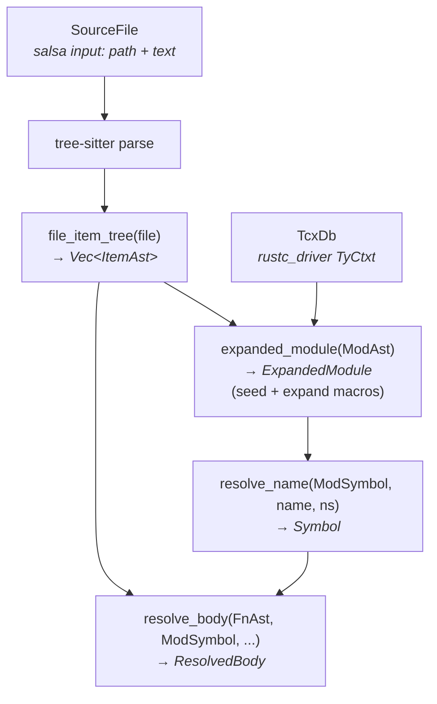

# Architecture

## Pipeline

Sage processes Rust source code through demand-driven salsa queries.
The pipeline has four stages: **lowering** (tree-sitter CST → IR),
**expanded-module construction** (macro expansion, use redirects,
glob imports), **module-level resolution** (flattened name lookup),
and **body resolution** (paths and locals inside function bodies).



All queries are demand-driven. Resolving `Get::apply` only parses
`cmd/get.rs` and its imports — it never touches `cmd/set.rs`.
`expanded_module` uses salsa cycle recovery (`cycle_initial` = empty
expanded module) to handle cross-module glob/redirect cycles, and
`expand_macro` creates synthetic `SourceFile` inputs so each unique
`(macro_def, input_tokens)` pair is parsed once.

## Crates

- **`sage`** (`src/`) — the `cargo-sage` binary. `driver.rs` runs
  `rustc_driver` on a stub crate to get `TyCtxt`, then serves
  `TcxDb` requests via channels. `metadata.rs` discovers workspace
  crates and their dependency rlibs.
- **`sage-ir`** (`crates/sage-ir/`) — the salsa-based IR. All tracked
  structs, lowering, resolution, body resolution, display.
- **`sage-stash`** (`crates/sage-stash/`) — type-erased `Copy`-only
  storage with `Ptr<T>` and `Slice<T>` handles. Used for function
  bodies (syntactic and resolved).
- **`sage-stash-macros`** — derive macros for `sage-stash` traits.

## TcxDb — external crate metadata

External crate metadata comes from `rustc_driver`. Sage runs a stub
program through `rustc` with `--extern` flags for all dependency
rlibs. The `TyCtxt` stays on a background thread; the salsa thread
communicates via typed channels (`TcxRequest` enum in `tcx/proxy.rs`).

```rust
// crates/sage-ir/src/tcx/mod.rs
pub trait TcxDb: Send + Sync {
    fn extern_crate(&self, name: &str) -> Option<CrateNum>;
    fn module_children(&self, crate_num: CrateNum, def_index: DefIndex) -> Vec<RawChild>;
    fn is_module(&self, crate_num: CrateNum, def_index: DefIndex) -> bool;
    fn is_builtin_derive(&self, crate_num: CrateNum, def_index: DefIndex) -> bool;
    fn def_path(&self, crate_num: CrateNum, def_index: DefIndex) -> Option<String>;
    fn expand_proc_macro_derive(&self, crate_num: CrateNum, def_index: DefIndex, item_source: &str) -> Option<String>;
}
```

`def_path` returns human-readable paths like `"std::prelude::v1::Ok"`
(backed by `tcx.def_path_str`). Used for display only.

`expand_proc_macro_derive` invokes a proc-macro derive dylib on the
rustc thread. It loads the macro via `CStore::load_macro_untracked`,
extracts the `Client` from `DeriveProcMacro`, and calls it through
`proc_macro::bridge` with a `SageServer` implementation
(`src/proc_macro_srv.rs`). The expanded source text is returned to
the salsa thread, which lowers it through tree-sitter into
`Vec<ItemAst>`.

The `TcxDb` is accessed via `Arc<dyn TcxDb>` on the salsa `Database`.
It's immutable within a session — dependency metadata doesn't change.

## Tree-sitter

Sage uses tree-sitter-rust for parsing. The CST is not stored —
`file_item_tree` re-parses source text and lowers to tracked structs
in one pass. Tree-sitter is fast enough that this is cheap, and the
salsa tracked structs provide the real incrementality boundary.

## Testing

Integration tests use [mini-redis](https://github.com/tokio-rs/mini-redis)
as a fixture (git submodule in `test-fixtures/`). Tests exercise the
full pipeline: workspace loading → dep building → `rustc_driver` →
`TcxDb` → salsa queries.

- `tests/body_resolve_tests.rs` — resolved body snapshots + query log
- `tests/expand_tests.rs` — module resolution, use imports, derives,
  proc-macro expansion (clap `Parser` on mini-redis `Cli`)
- `crates/sage-ir/tests/snapshot_tests.rs` — signature + body snapshots (no TcxDb)
- `crates/sage-ir/tests/expand_tests.rs` — resolution unit tests (noop TcxDb)
- `crates/sage-ir/tests/dump_expanded_module_tests.rs` — `dump_expanded_module` end-to-end

Snapshot tests use `expect-test` with inline expectations.
