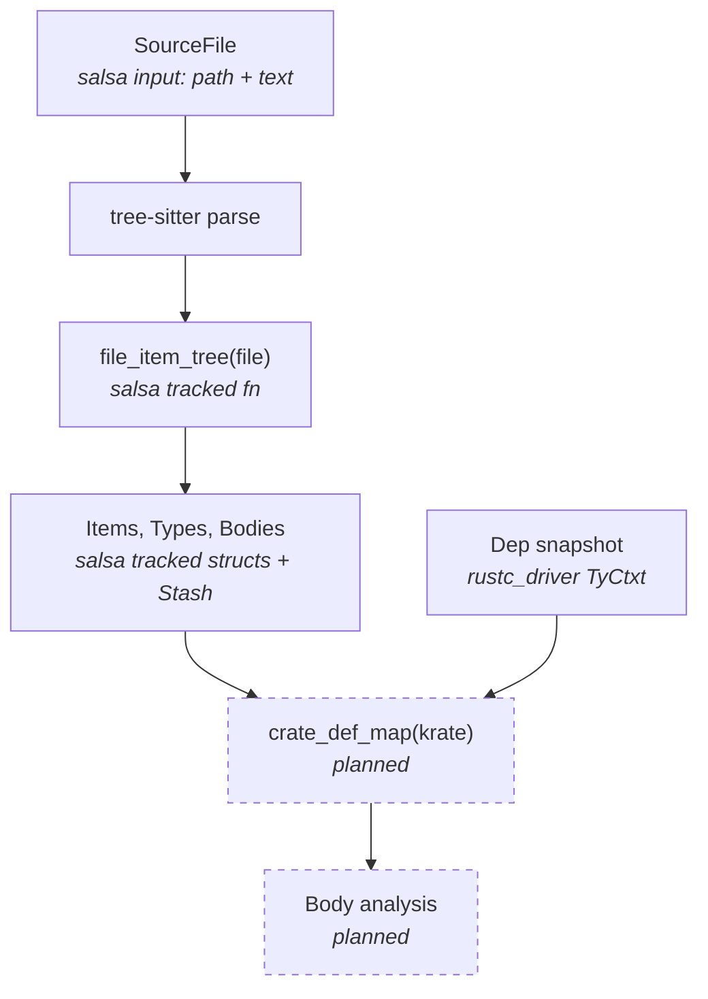

# Architecture

## Pipeline

Sage processes Rust source code through a series of demand-driven queries,
each built as a salsa tracked function. The pipeline looks like this:

## Crates

- **`sage`** — the `cargo-sage` binary. Drives `rustc_driver` to build
  dependencies and load their metadata, then parses workspace source files
  with tree-sitter.
- **`sage-ir`** — the salsa-based IR. Contains the database, all tracked
  structs (items, types, bodies), the lowering from tree-sitter CST, and
  display/pretty-printing.
- **`sage-stash`** — type-erased heterogeneous storage for `Copy`-only data.
  Used for function bodies where salsa per-node tracking would be too expensive.
- **`sage-stash-macros`** — derive macros for `sage-stash` traits.

## Dependency metadata

External crate metadata comes from `rustc_driver`. Sage runs a stub Rust
program through `rustc` with `--extern` flags pointing at the workspace's
dependency `.rlib` files. This gives us a `TyCtxt` with full access to types,
traits, impls, and other metadata for all dependencies.

This metadata is kept as an immutable side table on the database — it doesn't
change within a session, so it doesn't need salsa incrementality.

## Tree-sitter

Sage uses [tree-sitter-rust](https://github.com/tree-sitter/tree-sitter-rust)
for parsing. Tree-sitter provides:

- **Incremental re-parsing.** On edit, only the changed region is re-parsed.
- **Error recovery.** Partial parses still produce a usable CST.
- **Speed.** Parsing is fast enough to run on every keystroke.

The CST is not stored in salsa. Instead, `file_item_tree` re-parses the source
text (which *is* a salsa input) and lowers the CST into tracked structs in a
single pass. This is cheap because tree-sitter parsing is fast, and the
lowering creates salsa tracked structs that provide the real incrementality
boundary.

## Testing

Sage uses [mini-redis](https://github.com/tokio-rs/mini-redis) as a test
fixture (git submodule). Snapshot tests parse all 20 source files, lower them
to IR, and dump signatures and bodies as text. The snapshots are checked with
[expect-test](https://docs.rs/expect-test) and assertions verify zero
`{error}` or `{missing}` nodes in the output.
