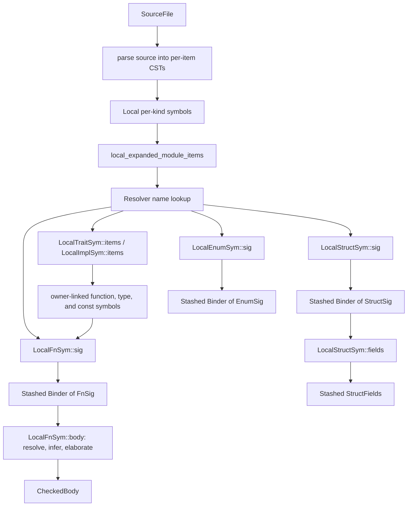
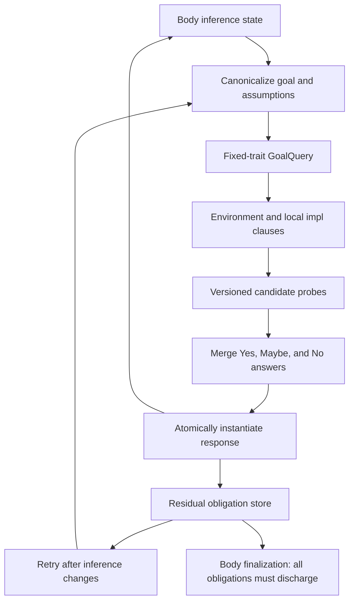

# Architecture

## Crate layout

| Crate | Role |
|-------|------|
| `sage-ir` | Main crate: CST, symbols, macro expansion, type representation, checking, resolution |
| `sage-stash` | Arena allocator: `Stash`, `Ptr<T>`, `Slice<T>`, `Stashed<T>`, derive macros |

`sage-ir` defines the salsa database trait (`sage_ir::Db`) and all
tracked structs/functions. `sage-stash` is a pure data-structure crate
with no salsa dependency (salsa integration is behind a feature flag).

## Module map

Paths below exist today unless marked **planned**.

```
crates/sage-ir/src/
  lib.rs              — module declarations and public re-exports
  db.rs               — concrete database support
  symbol/mod.rs       — Symbol wrappers and external symbol handles
  scope.rs            — ScopeSymbol and LocalCrateSymbol
  ty.rs               — Ty, Binder<T>, signatures, lifetime and const leaves
  ty_fold.rs          — type substitution/folding
  span.rs             — AbsoluteSpan and RelativeSpan
  name.rs             — Name (salsa-interned string)
  generic_param.rs    — local, external, and alpha-equivalent generic params
  source.rs           — SourceFile input
  parse/              — tree-sitter source parsing into per-item CSTs

  cst/              — Concrete Syntax Tree (per-item stash-allocated)
    fns.rs          — FnCstData, ParamCst
    structs.rs      — StructCstData, FieldCst
    ty.rs           — TypeCst, TypeCstKind, TypeCst::check
    paths.rs        — paths and path segments
    generics.rs     — GenericParamCst, CheckGenerics trait
    expr.rs         — ExprCst (body expressions)
    attrs.rs        — AttrCst

  local_syms/       — per-kind tracked structs and item queries
    associated.rs   — stable trait/impl item symbols linked to their owner
    fns.rs          — LocalFnSym (sig, body)
    structs.rs      — LocalStructSym (sig, fields)
    enums.rs        — LocalEnumSym
    mods.rs         — LocalModSym and expanded local module items
    traits.rs       — LocalTraitSym
    impls.rs        — LocalImplSym
    ...

  check/              — checking infrastructure
    sig.rs            — Check context for signature lowering
    infer_ctx.rs      — body inference context and finalization
    expr.rs           — expression checking
    resolve/
      mod.rs          — Resolver and namespaces
      ribs.rs         — lexical ribs
    infer/            — type inference engine
      egraph.rs       — VersionedEGraph
      skeleton.rs     — type decomposition/recomposition
      version.rs      — version tree, Universe, and VarInfo
      runtime.rs      — wake/sleep runtime for deferred constraints
      bound.rs        — Bound (None, AtLeast, Exactly)
      unify.rs        — transactional structural equality
      obligations.rs  — body trait-obligation records and staged batches
    solve/            — positive type-only trait solver
      goal.rs         — canonical goals, assumptions, and query identity
      canonical.rs    — caller-to-query canonicalization and reverse mappings
      boundary.rs     — query import, response extraction, and caller application
      result.rs       — response binders and validated substitutions
      clauses.rs      — environment/local-impl candidate assembly
      prove.rs        — structural proving and per-query proof frames
      merge.rs        — order-independent answer reduction and subsumption
      anti_unify.rs   — hard-hint intersection

  tytree/           — Typed tree (output of body checking; elaboration is planned)
    mod.rs          — CheckedBody, TyBody, TyExpr, TyStmt, TyPat, Res

  tcx/              — TcxDb trait (interface to rustc metadata)
```

## Data flow



`CheckedBody` is intended to contain the fully resolved, elaborated tree
specified by [Typed IR](./typed-ir.md). The current tree still preserves some
source forms such as method calls and implicit adjustments; completing that
transition is planned work. Temporary checking state remains inside the
single-keyed body query rather than becoming a public incremental boundary.

## The salsa layer

**Inputs:**

- `SourceFile` — path + content string

**Tracked structs (stable identity):**

- `LocalCrateSymbol`
- `LocalFnSym`, `LocalStructSym`, `LocalEnumSym`, `LocalModSym`, ...
- `AstGenericParam`

**Tracked functions (memoized queries):**

- `LocalFnSym::sig`, `LocalFnSym::body`
- `LocalStructSym::sig`, `LocalStructSym::fields`
- `LocalTraitSym::items`, `LocalImplSym::items`
- `unexpanded_items`, `local_expanded_module_items` (with cycle recovery)

**Interned:**

- `Name` — string interning
- `SymExt` — external symbol handle (CrateNum + DefIndex)

## Trait-system and solver flow

The positive, inductive, type-only solver and its body-obligation integration
exist. A conservative trait-method path discovers represented external
trait items, proves one fixed-trait goal, and elaborates a selected call. The
common named, associated, and opaque alias type family is represented through
inference and solver boundaries, but reveal and normalization are not yet
operational. Complete method resolution, external impl discovery,
normalization, higher-ranked reasoning, and the other explicitly deferred
extensions remain planned; their status is tracked in the [Build-Out
Roadmap](../implementation/roadmap.md).
The destination-level soundness, completeness, candidate-discovery, progress,
scheduling, and resource contract is recorded in
[Trait Solver Design](./trait-solver.md).

Checked local trait and impl signatures live on their owning symbols.
`local_impls(LocalCrateSymbol)` remains deterministic per-crate enumeration for
consumers such as inherent-method discovery. The solver consumes the narrower
`local_impl_candidates(LocalCrateSymbol, TraitSymbol)` query. Its current
implementation still scans the expanded local module tree internally, but the
fixed trait is part of the semantic query key and the result carries whether
unresolved macros, unsupported derives, active item attributes, or unresolved
trait impl headers could still change the relevant impl set. Attributed impls
whose transformation is not represented are excluded from definite candidates.
The same exclusion applies to an attributed module subtree or macro expansion,
and an item's attached derives are not published while another active
attribute on that item remains unexpanded. A uniquely resolved, successfully
parsed item macro remains complete. Failed,
ambiguous, or depth-limited expansion is omitted and makes the source
incomplete. A `use` with an unrepresented active attribute does not participate
in name resolution. Unsupported or malformed item nodes are retained as error
items and make discovery incomplete rather than disappearing before the
completeness audit. Known lint-only inner module attributes (`allow`, `deny`,
`warn`, and `forbid`) do not affect completeness; other inner attributes remain
incomplete until module-attribute semantics are represented.
An incomplete source cannot justify logical `No`. The backing scan still reads
all expanded local impls, so unrelated-trait edits can reexecute this query;
trait-partitioned source dependencies and their query-trace test remain required.
Method-name discovery remains in method resolution and submits one fixed-trait
goal per candidate trait.

External trait signatures, associated-item lists, function signatures, and
structural `Sized` facts cross `TcxDb` as owned raw metadata and are lowered by
separate tracked queries. Name discovery reads associated-item metadata first;
it does not load every trait signature speculatively. The selected candidate
then reads only its function and defining-trait signatures. The current lookup
scope is deliberately narrow: traits in the current module plus candidates
from every supported standard-prelude edition. Until the crate edition is
represented, only traits common to every prelude are definitely in scope;
an applicable edition-specific trait makes lookup uncertain. A completeness audit prevents selection
when ordinary imports, unresolved/failed macros, active attributes, or a
matching unhandled inherent provider could contribute another candidate.
Complete import/glob enumeration, visibility, inherent-method selection,
explicit-bound provider discovery, edition-specific prelude selection, and generic-method behavior remains in the
Method Resolution RFD. Missing or unrepresented metadata contributes
uncertainty rather than a false `NotFound`.

Structured external definition paths also cross `TcxDb` as owned metadata.
Every named segment retains its actual `SymExtKind`; type/value namespace alone
is insufficient because modules, traits, and types share the type namespace.
The Sage emitter maps each segment kind independently into the shared reference
IR instead of deriving ancestor kinds from the leaf definition.

`LocalTraitSym::items` and `LocalImplSym::items` lazily mint stable function,
type, and const symbols linked to their owner. Associated function signatures
open the owner binder and reuse its generic identities; their independent body
queries inherit the same owner predicates and `Self` type without depending on
another associated body.

Function and ADT signatures use the same checked type-predicate representation.
A body solver environment opens the function predicates together with any
owning trait/impl predicates; ADT predicates remain available for
well-formedness obligations. Ordinary calls, selected methods, and ADT use
instantiate their callee/type predicate environments into the body obligation
store rather than dropping declared bounds after generic substitution.
Free-function uses and struct/enum construction or explicit type use are wired
today. The represented external trait-method slice submits the selected
method's parameter environment. General selected-method submission remains
owned by the Method Resolution RFD.

Canonicalization preserves the logical role and scope of every input variable:

- caller generic parameters become rigid placeholders;
- caller inference variables become flexible canonical inputs;
- canonical variable metadata records kind and the relative current universe
  ceiling (distinct from immutable creation universe);
- the cached query records the relative current universe, while the caller
  mapping retains the absolute base (including for an input-free query);
- only flexible inputs may be constrained by a response;
- response existentials preserve sharing across substitutions and residual goals.

Inference-variable IDs are globally unique within an egraph and record their
owning version. Explicit-version operations reject access from sibling
branches, so a branch-local type cannot be reinterpreted with another branch's
variable identity.

Per-version writes are leaf-only. Creating a child freezes the parent's sparse
state until its children are discarded or its sole child is collapsed, giving
every speculative branch a stable ancestor snapshot without copying maps.

Proof alternatives run in independent proof contexts and perform speculative
matching in a local child egraph version. Nested transactional operations may
collapse an exclusive successful probe within that context, but candidate
state is never collapsed into a requester. Each candidate instead extracts a
canonical response and drops its context. After answer merging, applying the
aggregate response is a separate transaction against the caller: it commits
only after the entire substitution, occurs check, and universe-leak check
succeeds. Failed, cancelled, and losing candidates therefore publish none of
their alternative-specific state. An ambiguous aggregate may still publish a
merged hard hint: only equalities necessary for every still-possible
alternative, never a candidate-specific near miss.

Each actual tracked proof execution owns a parent-sensitive active frame table.
Its canonical keys include the local crate, environment, variable metadata,
and remaining depth; ancestor repeats are inductive `No`, while depth
exhaustion is `Maybe`. In-progress duplicates share a producer through
creation-time subscriptions and real wakers. Every producer and candidate owns
an isolated proof context (D8); only validated branch-independent responses are
shared, and completed responses are reusable only inside that execution.



A successful answer with residual goals is conditional. Body checking may continue after
registering those residuals, but `CheckedBody` finalization cannot silently accept a
remaining `Maybe`, failed residual, or unsupported predicate. The detailed contracts live
in the [Trait System](../rfds/trait-system/README.md),
[Trait Solving](../rfds/trait-solving/README.md), and
[Method Resolution](../rfds/method-resolution/README.md) RFDs.

## Symbol system

`Symbol<'db>` is a `Copy` wrapper-of-enum generated by the
`define_kind_symbols!` macro. Each variant holds either a local
tracked struct (`LocalFnSym`, `LocalStructSym`, ...) or an external
handle (`SymExt`). The macro also generates per-kind enums
(`FnSymbol`, `StructSymbol`) with `Local`/`Ext` variants.

```rust
define_kind_symbols! {
    pub struct Symbol<'db> { data: SymbolDataPriv<'db> }
    pub enum SymbolData<'db> { .. }

    pub enum FnSymbol<'db> { Local(LocalFnSym<'db>), Ext(SymExtKind::Fn) }
    pub enum StructSymbol<'db> { Local(LocalStructSym<'db>), Ext(SymExtKind::Struct) }
    ...
}
```

## Testing strategy

Tests live in `crates/sage-ir/tests/`. They construct a `salsa::Database`
with a noop `TcxDb` implementation, create `SourceFile` inputs, run
queries, and assert on the output. The noop tcx returns empty results
for all external-crate queries, allowing signature and body tests to
run without real rustc metadata.
