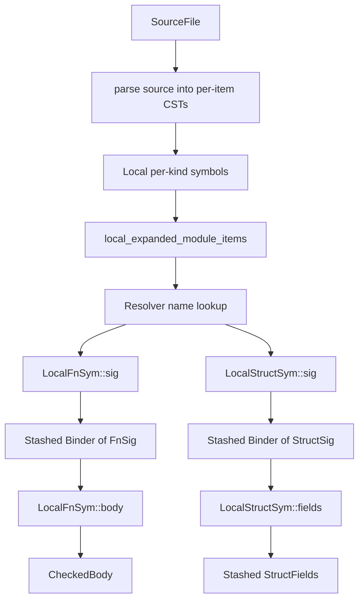
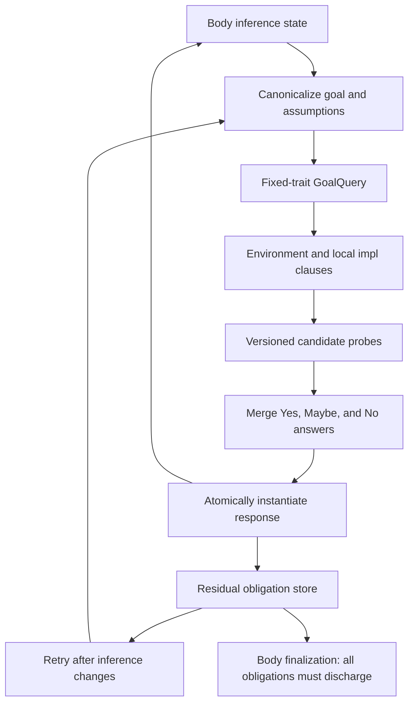

# Architecture

## Crate layout

| Crate | Role |
|-------|------|
| `sage-ir` | Main crate: CST, symbols, macro expansion, type representation, checking, resolution |
| `sage-stash` | Arena allocator: `Stash`, `Ptr<T>`, `Slice<T>`, `Stashed<T>`, derive macros |

`sage-ir` defines the salsa database trait (`sage_ir::Db`) and all
tracked structs/functions. `sage-stash` is a pure data-structure crate
with no salsa dependency (salsa integration is behind a feature flag).

## Module map

Paths below exist today unless marked **planned**.

```
crates/sage-ir/src/
  lib.rs              — module declarations and public re-exports
  db.rs               — concrete database support
  symbol/mod.rs       — Symbol wrappers and external symbol handles
  scope.rs            — ScopeSymbol and LocalCrateSymbol
  ty.rs               — Ty, Binder<T>, signatures, lifetime and const leaves
  ty_fold.rs          — type substitution/folding
  span.rs             — AbsoluteSpan and RelativeSpan
  name.rs             — Name (salsa-interned string)
  generic_param.rs    — local, external, and alpha-equivalent generic params
  source.rs           — SourceFile input
  parse/              — tree-sitter source parsing into per-item CSTs

  cst/              — Concrete Syntax Tree (per-item stash-allocated)
    fns.rs          — FnCstData, ParamCst
    structs.rs      — StructCstData, FieldCst
    ty.rs           — TypeCst, TypeCstKind, TypeCst::check
    paths.rs        — paths and path segments
    generics.rs     — GenericParamCst, CheckGenerics trait
    expr.rs         — ExprCst (body expressions)
    attrs.rs        — AttrCst

  local_syms/       — per-kind tracked structs and item queries
    fns.rs          — LocalFnSym (sig, body)
    structs.rs      — LocalStructSym (sig, fields)
    enums.rs        — LocalEnumSym
    mods.rs         — LocalModSym and expanded local module items
    traits.rs       — LocalTraitSym
    impls.rs        — LocalImplSym
    ...

  check/              — checking infrastructure
    sig.rs            — Check context for signature lowering
    infer_ctx.rs      — body inference context and finalization
    expr.rs           — expression checking
    resolve/
      mod.rs          — Resolver and namespaces
      ribs.rs         — lexical ribs
    infer/            — type inference engine
      egraph.rs       — VersionedEGraph
      skeleton.rs     — type decomposition/recomposition
      version.rs      — version tree, Universe, and VarInfo
      runtime.rs      — wake/sleep runtime for deferred constraints
      bound.rs        — Bound (None, AtLeast, Exactly)
    solve/            — trait goals, canonicalization, proof search (**planned**)

  tytree/           — Typed tree (output of body checking)
    mod.rs          — CheckedBody, TyBody, TyExpr, TyStmt, TyPat, Res

  tcx/              — TcxDb trait (interface to rustc metadata)
```

## Data flow



## The salsa layer

**Inputs:**

- `SourceFile` — path + content string

**Tracked structs (stable identity):**

- `LocalCrateSymbol`
- `LocalFnSym`, `LocalStructSym`, `LocalEnumSym`, `LocalModSym`, ...
- `AstGenericParam`

**Tracked functions (memoized queries):**

- `LocalFnSym::sig`, `LocalFnSym::body`
- `LocalStructSym::sig`, `LocalStructSym::fields`
- `unexpanded_items`, `local_expanded_module_items` (with cycle recovery)

**Interned:**

- `Name` — string interning
- `SymExt` — external symbol handle (CrateNum + DefIndex)

## Planned trait-system and solver flow

This section describes the intended destination. The trait signature queries,
`check/solve/`, method integration, and obligation store are not implemented yet; their
status is tracked in the [Build-Out Roadmap](../implementation/roadmap.md).

Checked local trait and impl signatures live on their owning symbols. A
`local_impls(LocalCrateSymbol)` query provides deterministic per-crate enumeration; the
first solver implementation linearly scans it for impls of a fixed trait. Method-name
discovery remains in method resolution and submits one fixed-trait goal per candidate
trait.

Function and ADT signatures use the same checked type-predicate representation.
A body solver environment opens the function predicates together with any
owning trait/impl predicates; ADT predicates remain available for
well-formedness obligations. Ordinary calls, selected methods, and ADT use
instantiate their callee/type predicate environments into the body obligation
store rather than dropping declared bounds after generic substitution.

Canonicalization preserves the logical role and scope of every input variable:

- caller generic parameters become rigid placeholders;
- caller inference variables become flexible canonical inputs;
- canonical variable metadata records kind and the relative current universe
  ceiling (distinct from immutable creation universe);
- the cached query records the relative current universe, while the caller
  mapping retains the absolute base (including for an input-free query);
- only flexible inputs may be constrained by a response;
- response existentials preserve sharing across substitutions and residual goals.

Inference-variable IDs are globally unique within an egraph and record their
owning version. Explicit-version operations reject access from sibling
branches, so a branch-local type cannot be reinterpreted with another branch's
variable identity.

Per-version writes are leaf-only. Creating a child freezes the parent's sparse
state until its children are discarded or its sole child is collapsed, giving
every speculative branch a stable ancestor snapshot without copying maps.

Proof alternatives run in isolated sibling egraph versions. Nested transactional
operations may collapse a successful child probe into its owning candidate version, but a
candidate version is never collapsed into the alternatives' common parent. Each candidate
extracts a canonical response and is then discarded. After answer merging, applying the
aggregate response is a separate transaction against the caller: it commits only after the
entire substitution, occurs check, and universe-leak check succeeds. Failed, cancelled, and
losing candidates therefore publish none of their alternative-specific state. An ambiguous
aggregate may still publish a merged hard hint: only equalities necessary for every
still-possible alternative, never a candidate-specific near miss.



A successful answer with residual goals is conditional. Body checking may continue after
registering those residuals, but `CheckedBody` finalization cannot silently accept a
remaining `Maybe`, failed residual, or unsupported predicate. The detailed contracts live
in the [Trait System](../rfds/trait-system/README.md),
[Trait Solving](../rfds/trait-solving/README.md), and
[Method Resolution](../rfds/method-resolution/README.md) RFDs.

## Symbol system

`Symbol<'db>` is a `Copy` wrapper-of-enum generated by the
`define_kind_symbols!` macro. Each variant holds either a local
tracked struct (`LocalFnSym`, `LocalStructSym`, ...) or an external
handle (`SymExt`). The macro also generates per-kind enums
(`FnSymbol`, `StructSymbol`) with `Local`/`Ext` variants.

```rust
define_kind_symbols! {
    pub struct Symbol<'db> { data: SymbolDataPriv<'db> }
    pub enum SymbolData<'db> { .. }

    pub enum FnSymbol<'db> { Local(LocalFnSym<'db>), Ext(SymExtKind::Fn) }
    pub enum StructSymbol<'db> { Local(LocalStructSym<'db>), Ext(SymExtKind::Struct) }
    ...
}
```

## Testing strategy

Tests live in `crates/sage-ir/tests/`. They construct a `salsa::Database`
with a noop `TcxDb` implementation, create `SourceFile` inputs, run
queries, and assert on the output. The noop tcx returns empty results
for all external-crate queries, allowing signature and body tests to
run without real rustc metadata.
