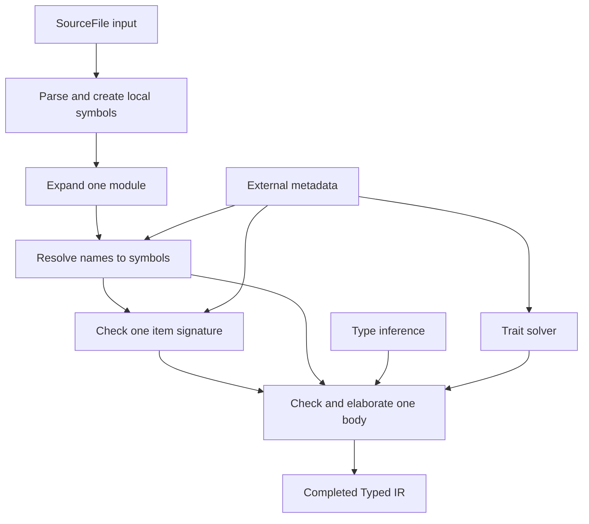

# Architecture

Sage is a demand-driven Rust semantic frontend. Its architecture is rooted in
**symbols**: stable identities for definitions. Parsing and expansion create
local symbols, resolution discovers symbols, checked types and Typed IR refer
to symbols, and symbol-keyed Salsa queries compute semantic details only when
a consumer asks for them.

This page is the maximally zoomed-out map. Follow a phase chapter to understand
a source-to-output transformation, or a subsystem/representation chapter to
understand a facility shared across transformations.

## Design tenets

The complete list is in [Tenets](./tenets.md). The architectural consequences
most visible in the pipeline are:

- **Stable semantic identity comes before semantic detail.** A symbol identifies
  a definition; signatures, members, fields, and bodies are separate lazy
  queries keyed by that identity.
- **Queries expose semantic boundaries.** A consumer requests the narrowest
  stable result it needs, such as one signature or one body, rather than an
  eagerly checked crate.
- **Bodies depend on interfaces, not other bodies.** Checking a call may read a
  callee signature and trait metadata but must not read the callee body.
- **Completed bodies are elaborated.** The body-checking output is the
  tree-structured [Typed IR](./typed-ir.md), not source syntax plus adjustment
  side tables.
- **Incremental dependencies are architectural.** The key and fields of each
  query determine which edits may cause downstream work to execute again.
- **Conformance is exact.** Sage and rustc independently emit a shared oracle
  representation; the adapters are thin and comparison is textual identity.

## Symbols connect the pipeline

A path such as `crate::parse::Parse::next` is a way to *find* a definition. It
is not the definition's identity. Resolution maps syntax, names, and namespaces
to a symbol. Later phases use the symbol itself as their key:

```text
LocalFnSym::sig(db)
LocalFnSym::body(db)
LocalTraitSym::items(db)
TraitSymbol::sig(db)
```

Local symbols are Salsa tracked identities created from parsed or generated
items. External symbols are compact handles for definitions supplied by
dependency metadata. `Symbol` erases the item kind when a heterogeneous list
is needed; `FnSymbol`, `TraitSymbol`, `ModSymbol`, and the other kind-specific
wrappers recover the static distinction required by semantic operations.

The [Symbols and Semantic Identity](./infrastructure/symbols.md) chapter
defines this model and its current incremental guarantees.

## Rust compilation pipeline

The pipeline is layered but not a mandatory batch sequence. Asking for one
function body walks only the dependencies needed for that body. Asking for a
module outline can stop after expansion.



| Phase | Granularity | Direct input | Successful output | Primary entry boundary |
|---|---|---|---|---|
| Parse and create symbols | source-backed module | `SourceFile`, module scope, edition | ordered unexpanded item symbols with per-item CST and provenance | `unexpanded_items(db, module)` |
| Module and macro expansion | local module | unexpanded item symbols and macro-resolution environment | complete ordered direct expanded item symbols | `local_expanded_module_items(db, module)` |
| Signature checking | one definition | symbol, its CST or external metadata, referenced signatures | checked signature and parameter environment under a binder | `sym.sig(db)` and kind-specific metadata queries |
| Body checking and elaboration | one function or associated function | body CST, its signature, referenced interfaces | completed `CheckedBody` containing elaborated Typed IR or diagnostics | `LocalFnSym::body(db)` |

The phase contracts are described under [Rust Compilation
Pipeline](./pipeline/README.md). A phase can terminate without its successful
guarantee because of user errors, unsupported Sage functionality, unavailable
external facts, or a resource limit. That is **terminal incompleteness**, not
work that more polling will finish.

## Semantic subsystems

These facilities are invoked from multiple phases:

| Subsystem | Semantic responsibility | Typical granularity |
|---|---|---|
| Name resolution | map paths and names in a namespace and scope to symbols; retain ambiguity or incompleteness | one path/name lookup |
| Type inference | relate types transactionally, defer constraints, and finalize a body with no live inference work | one body, with isolated speculative versions |
| Trait solver | prove a fixed trait goal or normalize an input alias while preserving canonical query semantics | one canonical solver goal |
| External metadata | expose authoritative owned facts about reachable dependency definitions without asking rustc to solve Sage goals | one keyed external definition or lookup |

See [Semantic Subsystems](./subsystems/README.md). Subsystems do not define
additional source-to-source phases merely because their implementation uses
tracked queries.

## Representations and infrastructure

| Concern | Role across the pipeline |
|---|---|
| [Symbols](./infrastructure/symbols.md) | stable local and external definition identity and symbol-keyed semantic operations |
| [Typed IR](./typed-ir.md) | fully resolved, tree-structured output of completed body checking |
| [Stash](./stash.md) | compact ownership and hash-consing for CST and semantic trees at query boundaries |
| [Spans](./spans.md) | source and expansion provenance with relative locations inside an item |
| Incrementality | Salsa inputs, tracked identities, interned leaves, and tracked functions that record observed dependencies |

Temporary inference state, method candidates, and partially checked
expressions remain inside the body query. They are not public incremental
boundaries merely because they are important steps in the algorithm.

## Validation and inspection

The architecture is meant to be reviewable at increasing depth:

1. A chapter states its destination contract.
2. Its **Current Status** section identifies limitations and maps implemented
   claims to focused tests, snapshots, query traces, edit experiments, oracle
   results, and source anchors.
3. Anchored excerpts lead from the explanation into the load-bearing code.
4. The [Oracle Test Harness](./oracle-test-harness.md) establishes exact
   conformance for pinned semantic slices.
5. The planned Semantic Inspector will expose readable semantic output and
   structured query traces from a persistent workspace.

See [Validation and Inspection](./validation/README.md).

## Code map

The semantic structure above maps to the current workspace as follows:

| Path | Responsibility |
|---|---|
| `crates/sage-ir/src/parse/` and `cst/` | parse source and retain per-item concrete syntax |
| `crates/sage-ir/src/local_syms/` | local tracked symbols and their signature/body/member queries |
| `crates/sage-ir/src/symbol/` | erased and kind-specific local/external symbol wrappers |
| `crates/sage-ir/src/check/resolve/` | lexical and module-level name resolution |
| `crates/sage-ir/src/check/infer/` | transactional inference, deferred constraints, and obligation lifecycle |
| `crates/sage-ir/src/check/solve/` | canonical positive trait proof and alias normalization |
| `crates/sage-ir/src/tytree/` | completed typed body representation |
| `crates/sage-ir/src/tcx/` and `external_syms.rs` | typed external metadata boundary and tracked lowering |
| `crates/sage-stash/` | stash storage and hashing infrastructure |

## Current status

### Current frontier

The pipeline is operational for the two pinned mini-redis vertical slices
`DbDropGuard::db` and `Parse::next`. Those slices exercise local/generated and
external symbols, signature and body queries, method resolution, trait proof,
associated-type normalization, and elaborated calls.

### Evidence

- [Oracle-checked method body](./examples/oracle-checked-method.md) follows a
  completed method body into exact Sage/rustc output.
- [Mini-redis Conformance Roadmap](../implementation/mini-redis.md) records the
  acceptance criteria and query-dependency evidence for both completed slices.
- `clone_method_body_has_a_narrow_reusable_semantic_query_trace` proves the
  requested body executes once, reads selected interface metadata, reads no
  callee body, and is reused unchanged.

### Current limitations

- Module expansion returns represented symbols while completeness is audited
  separately for particular consumers. The destination phase result makes
  terminal incompleteness explicit.
- Same-file unrelated body edits currently cause coarse module/derive and body
  reexecution; selected callee interfaces remain reusable. The
  [incrementality guide](./infrastructure/incrementality.md) links the edit
  evidence.
- General method resolution, complete Typed IR coverage, source `cfg`
  evaluation, meaningful lifetime reasoning, and borrow checking are not yet
  implemented. Their local consequences are documented in the focused
  chapters and roadmap slices.

### Related roadmap slices

The [Build-Out Roadmap](../implementation/roadmap.md) orders cross-cutting
semantic outcomes. The [Mini-redis Conformance
Roadmap](../implementation/mini-redis.md) supplies the current application-scale
vertical slices.
