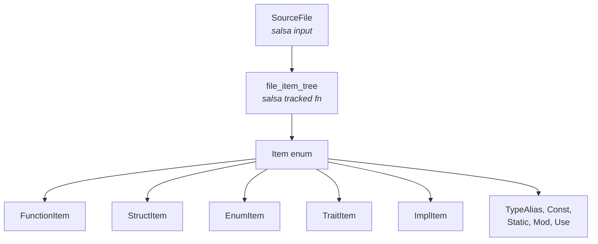
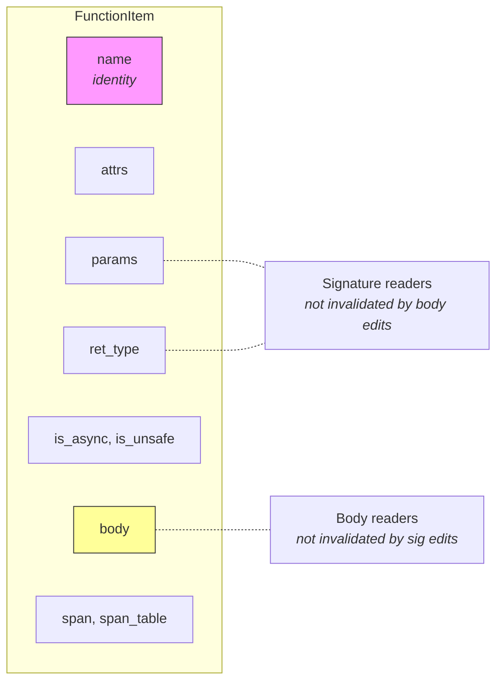
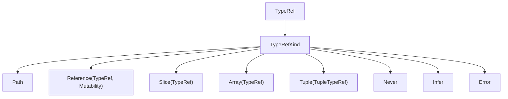
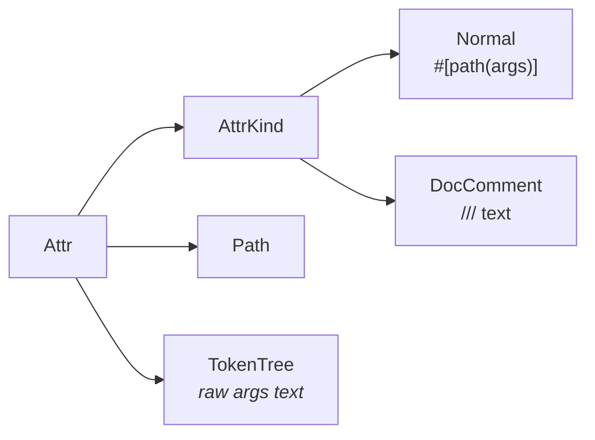
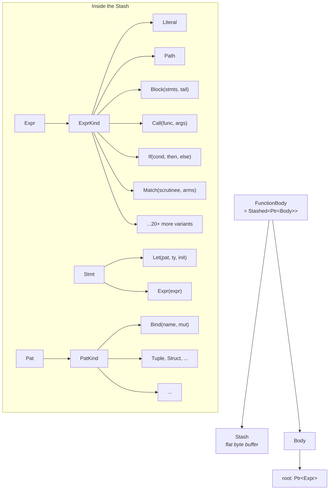
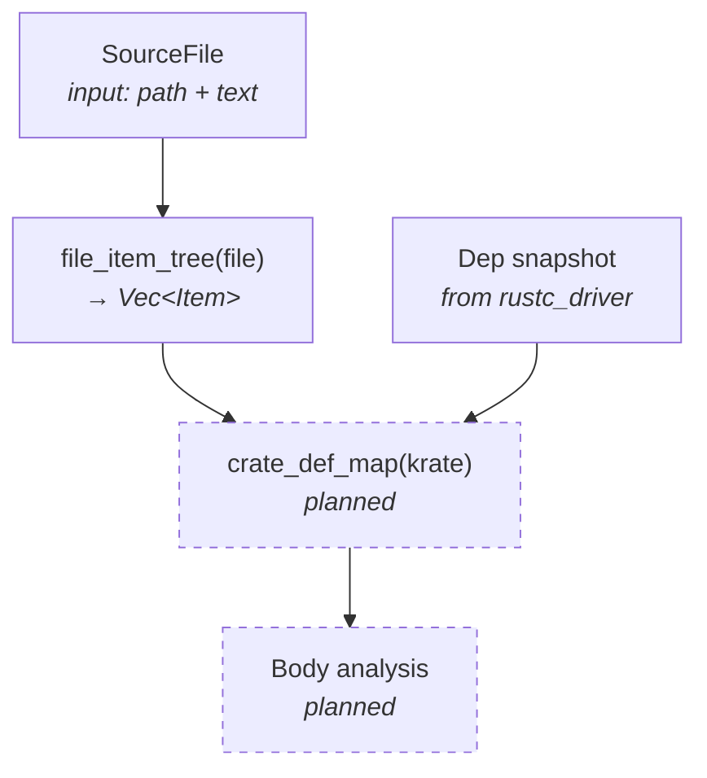

# IR

The sage IR lives in the `sage-ir` crate. It's built on salsa 0.26 and
represents Rust source code as a collection of tracked structs with
strategically placed incremental firewalls.

## Overview

The IR has three layers: **items** (top-level declarations), **types**
(as written in source, unresolved), and **bodies** (expressions, statements,
patterns inside function bodies).

## Items and tracked fields

Each item kind is its own salsa tracked struct. The `Item` enum wraps them
all — it's `Copy` since each variant is just a salsa ID.

Tracked fields create **incremental firewalls**. Salsa compares each
`#[tracked]` field independently across revisions. A query that only reads
`params` won't re-execute when `body` changes.

The `name` field is **untracked** — it serves as the item's identity. When
`file_item_tree` re-executes after an edit, salsa matches the new item to
the old one by comparing `name`. If the name matches, each tracked field is
compared individually and only changed fields are marked dirty.

## Types

Type references represent types as written in source (unresolved). They're
salsa tracked structs, so recursive types like `&Vec<String>` are just
nested salsa IDs — cheap and `Copy`.

`Path` holds a `Vec<Name>` of segments. For now, paths are captured as a
single segment with the full source text. Proper multi-segment resolution
comes later.

`Error` marks type nodes the lowering didn't recognize — any new
tree-sitter node kind we haven't handled yet shows up as `{error}` in
test output, making gaps immediately visible.

## Attributes

Attributes are tracked structs with a `kind` distinguishing normal
attributes (`#[derive(Debug)]`) from doc comments (`/// ...`). Doc
comments are lowered as `DocComment` attrs and displayed in their original
syntax form.

Every item struct carries `attrs: Vec<Attr>` as a tracked field, so
attribute changes are tracked independently from other item properties.

## Bodies

Function bodies live in a **Stash** — a type-erased flat buffer for
`Copy`-only data with thin handles (`Ptr<T>`, `Slice<T>`). This avoids
the overhead of a salsa tracked struct per expression node.

The body is wrapped in `Stashed<T>`, which pairs a `Stash` with a root
pointer and implements `PartialEq` via byte comparison. If the body didn't
change, the bytes are identical and salsa skips downstream invalidation.

Body types mix stash handles (`Ptr`, `Slice`) for tree structure with
salsa IDs (`Name`, `Path`, `TypeRef`) for data shared with the signature
level. A `Cast` expression references the same `TypeRef` tracked struct
that might appear in a function's return type.

## Spans

Every node carries `SpanIndices` — a pair of `u32` byte offsets into the
source file. These are 8 bytes, `Copy`, and carry no lifetime.

A `SpanTable` tracked struct maps spans back to their source file, but
semantic queries that don't need source locations never read the span
table, so span changes don't trigger re-analysis.

## Query graph

The critical property: each level only depends on the specific tracked
fields it reads. Name resolution reads signatures but not bodies. Body
analysis reads bodies but isn't invalidated by changes to unrelated
functions (salsa matches items by name across revisions).
