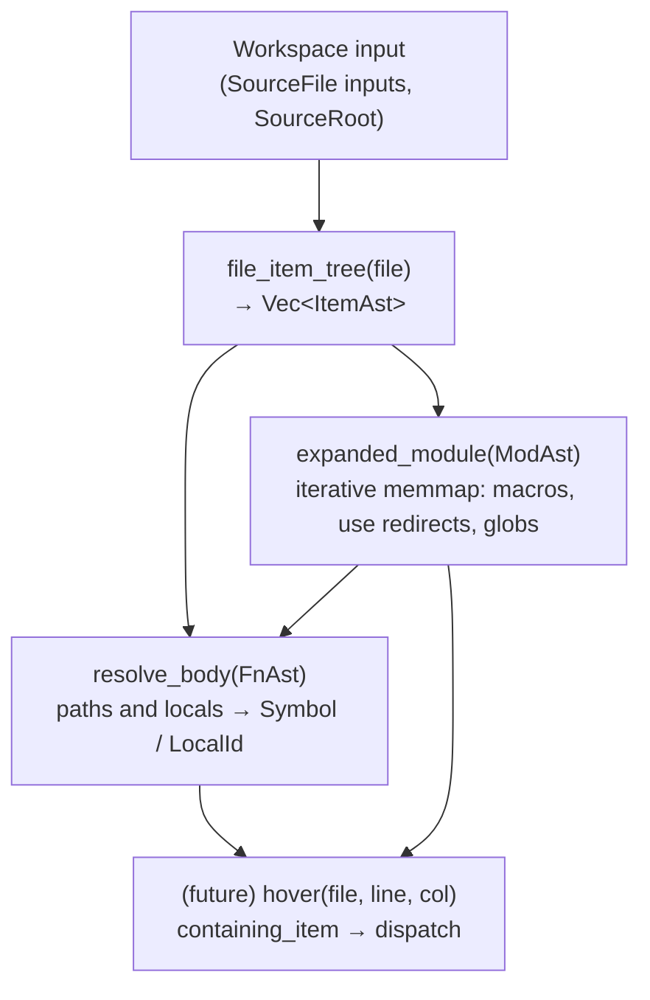

# Overview

This page is the conceptual entry point to sage's design. It covers
the vocabulary you'll see everywhere in the code (`Symbol`,
`ModSymbol`, `ItemAst`, `ModAst`, …), the wrapper-of-enum pattern
those types use, and the layered phases that turn source text into
analysis results. For wiring details and crate layout see
[architecture](./arch.md); for field-level IR details see
[the IR page](./ir.md).

## Our tenets

Sage is designed around three tenets:

1. **Fast and on demand.** We do only the work that is needed to produce the requested result. When you execute a test, we only want to look at the code used by that test.
2. **Sound and interoperable with rustc.** We only accept code that rustc also accepts, and the code should do the same thing in rustc and in SAGE.
3. **Opinionated.** We don't need to accept all of Rust. We are willing to require Rust programs to adopt patterns we consider best practice to enable us to compile faster.

## Sage at a glance

Sage is a Rust analysis tool that processes a deliberately
restricted subset of Rust as fast as possible. The whole pipeline
runs as demand-driven [salsa] queries, so editing a function body
doesn't re-analyze signatures, and editing one file doesn't
re-analyze unrelated files.

Two design choices shape the entire codebase:

1. **Local items and external items are unified at the kind level.**
   A function defined in the workspace and a function imported from
   `serde` are both *functions*; callers shouldn't have to branch on
   "where did this come from" until they actually need to (e.g.
   reading the body, which only locals have).
2. **Identity is salsa-tracked at the leaves**, not at the wrapper
   layer. A `ModAst` has a salsa id. The `ModSymbol` enum that
   wraps it is a plain `Copy` newtype — comparing two `ModSymbol`s
   compares their inner data.

[salsa]: https://github.com/salsa-rs/salsa

## Vocabulary

### Symbols, modules, and items

Three name suffixes appear throughout the IR:

- **`Ast`** — anything derived from the local workspace. Includes
  item handles (`FnAst`, `StructAst`, …), expression trees
  (`BodyAst` — work in progress), span tables. An `FnAst` *contains*
  its body, so the suffix is consistent across the handle and what
  it transitively owns.
- **`Ext`** — an external definition compiled by rustc. Plain
  `Copy` structs holding `(CrateNum, DefIndex)` — structural
  identity, no salsa interning. There's one ext leaf per kind we
  care about distinguishing (today: `ModExt`, `SymExt`).
- **`Symbol`** — a thing in a Rust program, regardless of source.
  Wraps `Ast` and `Ext` variants behind one `Copy` enum.

The pieces compose like this:

```
Symbol            — anything in a Rust program (local or external)
├── ItemAst       — what was written at item position locally
│   ├── FnAst, StructAst, EnumAst, …
│   └── ModAst    — a local module (file-based, inline, or crate root)
└── SymExt        — an external definition (CrateNum, DefIndex)

ModSymbol         — anything that names a *module* (local or external)
├── ModAst        — local module
└── ModExt        — external module
```

`Symbol` and `ModSymbol` are the types most code holds. They're
plain `Copy` newtypes around an enum; you call `.data()` to pattern
match. `ItemAst` is a sibling enum that lives at item position
inside the AST — `ModAst::items` is `Vec<ItemAst>`, not
`Vec<Symbol>`, because items as written can't be external.

### Wrapper-of-enum

The same pattern shows up at multiple levels: a small `Copy` struct
wrapping a private data enum.

```rust
pub struct ModSymbol<'db> {
    data: ModSymbolData<'db>,
}

pub enum ModSymbolData<'db> {
    Ast(ModAst<'db>),
    Ext(ModExt),
}

impl<'db> ModSymbol<'db> {
    pub fn ast(ast: ModAst<'db>) -> Self { /* ... */ }
    pub fn ext(ext: ModExt) -> Self { /* ... */ }
    pub fn data(self) -> ModSymbolData<'db> { self.data }
}
```

Why a wrapper-of-enum and not just a bare enum?

- The wrapper lets us add methods that dispatch internally
  (`module.parent(db)`, `module.crate_root(db)`) without forcing
  every caller to match on variants.
- It lets us swap in a more-optimized representation later (e.g. a
  flat `u64` packing the variant tag plus payload) without churning
  the API.
- It centralizes the constructors: `ModSymbol::ast(...)` /
  `ModSymbol::ext(...)` / `ModSymbol::external(cn, di)` are the
  blessed entry points; the field is private.

### Salsa identity vs. structural identity

Anything labeled `Ast` is salsa-tracked: `ModAst::new(db, ...)`
returns a handle whose identity is per-call-site (the same site
called twice gives the same handle; two textually-identical sites
in different files give different handles). Salsa caches queries
keyed on these handles.

Anything labeled `Ext` is a plain `Copy` struct with structural
identity. Two `ModExt { crate_num, def_index }` values with equal
fields are equal. The wrapper enums `Symbol` and `ModSymbol` aren't
interned at all — their identity flows from the inner data.

This split is deliberate: workspace AST nodes need salsa identity
to participate in incremental computation, but external defs come
from rustc's metadata and are already keyed by `(CrateNum,
DefIndex)`, so re-interning them would just add overhead.

## Phases

Each phase is a salsa query (or family of queries) that consumes the
previous layer and produces the next. Phases are *layered*, not
strictly sequential: a hover request walks down the chain only as
far as needed to answer the question, recomputing what's stale and
reusing what's cached.



### Input layer

A `SourceFile` is a `#[salsa::input]` carrying a path and text. A
`SourceRoot` holds the list of files that make up a workspace
crate. Both are inputs; everything downstream is derived.

The crate root module is built with `ModAst::crate_root(db, file)`,
which mints a `ModAst` with `parent = None`, `file = Some(file)`,
and `items = None` (inline contents come from the file). Wrap it
with `ModSymbol::ast(...)` to start resolution.

### Parse layer

`file_item_tree(file)` runs tree-sitter and lowers the CST to a
`Vec<ItemAst>`. The CST is not stored. Tree-sitter is fast enough
that we re-parse on text changes; salsa's incremental boundary
sits at the *tracked struct* layer, not the CST.

Lowering produces *declaration-site* `ModAst`s for `mod foo`
syntax — these have `parent = None` and `file = None`. Resolution
later wraps them with parent/file context (see below).

### Expanded-module layer

`expanded_module(ModAst)` produces an `ExpandedModule`: a list of
`MemmapEntry` values representing what names the module exports.
Macro invocations expand here; `use foo::bar` becomes a `Redirect`;
`use foo::*` becomes a `Glob`. The same machinery applies whether
the module's contents come from a file (`file_item_tree`) or an
inline `mod foo { ... }` body (`mod_ast.items(db)`).

External modules don't have an expanded module — their contents
come from `TcxDb::module_children` directly. The dispatching
wrapper `module_memmap(ModSymbol)` handles both arms; salsa caches
the local case keyed on `ModAst`.

### Resolution layer

`resolve_name(module, name, ns)` is the user-facing "what does this
name refer to here?" entry point. It layers `ModSymbol::resolve_member`
(walks the expanded module) over an extern-prelude and std-prelude
fallback, returning a `Symbol` or `ResolutionError`.

`ModSymbol::resolve_path` walks `::`-separated paths from any starting
module — handling `crate`, `self`, `super`, leading `::`, and bare
identifiers (which check the current module first, then the extern
prelude).

### Body resolution layer

`resolve_body(FnAst, ModSymbol, ...)` produces a `ResolvedBody`: a
fresh tree mirroring the syntactic body, with paths replaced by
`Res` (a `Symbol` or `LocalId`) and bindings replaced by `LocalId`.

Bodies live in [stashes](#stashes) — flat byte arenas with `Ptr`
and `Slice` handles — rather than as forests of salsa tracked
structs. This keeps body cache keys cheap to compare.

## Stashes

The `sage-stash` crate provides a heterogeneous, type-erased arena
for `Copy` data, with thin handles into it:

- **`Stash`** — the arena itself: a byte buffer plus per-entry
  metadata. Holds a mix of any `Copy` types that implement
  `StashData`.
- **`Ptr<T>`** — a `Copy` handle to a single value in a `Stash` (a
  32-bit index, type-checked on access).
- **`Slice<T>`** — same idea for a contiguous sequence of `T`.
- **`Stashed<T>`** — pairs a `Stash` with a root value of type `T`,
  producing a self-contained, comparable, hashable bundle. Derives
  `PartialEq`/`Eq`/`Hash` from the byte content of the stash plus
  the root.

Stashes are used for IRs whose internal nodes vastly outnumber
their roots — function bodies, expression trees — so the salsa
cache key (the `Stashed` bundle) is one comparable value per body,
while the interior is a flat `Vec<u8>` rather than a forest of
separately tracked structs.

## Style and conventions

- **Hold `Symbol`/`ModSymbol` by default.** AST handles
  (`FnAst`, `ModAst`, …) are for code that already knows it's
  inside the workspace and is walking AST structure. Anything that
  might cross workspace/dependency boundaries should use the
  wrapper.
- **Methods live at the narrowest level where they're well-defined.**
  Universal operations (`name`) live on the wrapper at every
  level. Kind-specific operations (`resolve_member`) live on the
  kind wrapper (`ModSymbol`). Source-specific operations (`body`)
  live on the leaf (`FnAst`).
- **Prefer methods that dispatch internally** over having callers
  match on `data()` themselves. The match is fine when the caller
  genuinely needs both branches; otherwise wrap it in a method.

## Where to go next

- [Architecture](./arch.md) — pipeline wiring, crate layout, the
  `TcxDb` interface to rustc.
- [IR](./ir.md) — field-level details: every item kind, body
  representation, MEM-map data model, span tracking.
- [Subsetting](./subsetting.md) — what parts of Rust sage
  deliberately doesn't handle yet.
