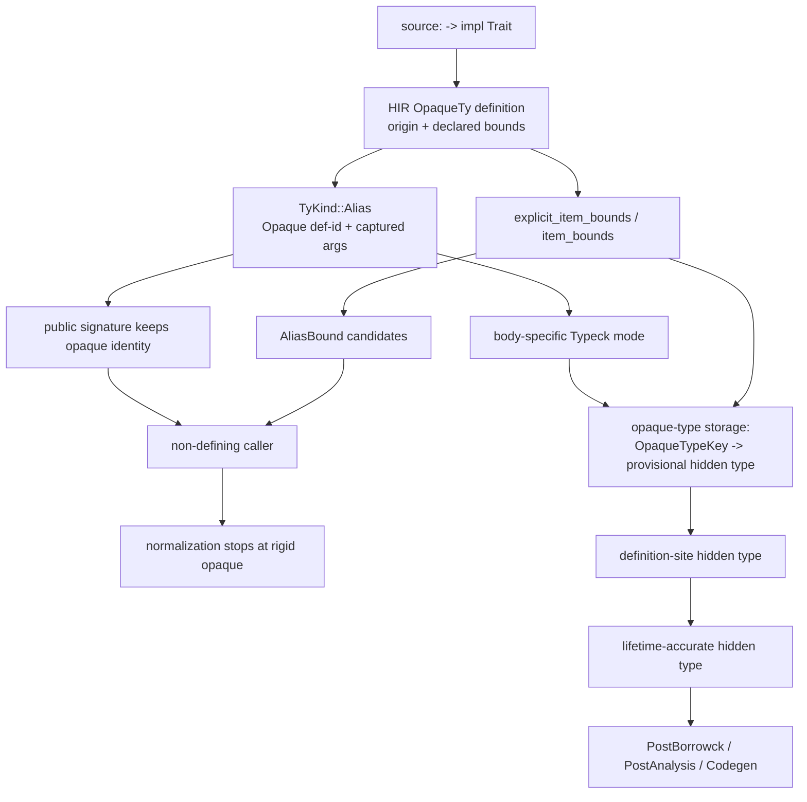

# rustc Opaque Types and the New Trait Solver

This report records how the local rustc checkout models opaque types, with an
emphasis on the next-generation trait solver. It is descriptive research, not a
Sage design contract. Sage's normative contracts remain in [Typed IR], [Trait
Solver], and [D13].

The source was inspected at rust-lang/rust commit
`70222712809cd5cc1718ed8995914a1cbacb6b92` (2026-08-31). The implementation is
changing actively; in particular, the in-tree rustc-dev-guide page for
new-solver opaques describes an older normalization implementation in several
places. The source and tests at this revision are authoritative for this
report.

[Typed IR]: ../typed-ir.md
[Trait Solver]: ../trait-solver.md
[D13]: ../decisions.md#d13-named-associated-and-opaque-aliases-share-one-semantic-family

## Executive summary

An opaque type in rustc is an **alias with a stable definition identity and
generic arguments**. It is not replaced globally by its hidden type. What the
compiler may learn from it depends on the operation and typing context:

- Its declared item bounds can prove trait and associated-type facts while the
  hidden type remains unknown.
- Outside a defining or reveal context, normalization returns the same alias,
  marked rigid for the current solver context.
- While checking a body allowed to define the opaque, relating the opaque to an
  expected type registers that type as a provisional hidden type. Repeated
  defining uses must agree, and the hidden type must satisfy the opaque's
  declared bounds.
- After HIR type checking, rustc identifies valid defining uses, remaps their
  types into the opaque declaration's generic parameter space, and checks all
  uses against one hidden type. MIR borrow checking later supplies the
  lifetime-accurate hidden type.
- Post-analysis and code generation may reveal all hidden types. The current
  `Reflection` mode does so as well.
- As a compatibility rule, auto-trait solving may inspect an opaque's hidden
  type even outside its defining scope. This is separate from ordinary
  alias-bound reasoning.

The high-level flow is:



## 1. Surface forms and HIR origins

AST lowering creates a `hir::OpaqueTy` for three existential forms, recorded by
`hir::OpaqueTyOrigin`:

| Origin | Surface form | Defining relationship |
|---|---|---|
| `FnReturn` | `fn f() -> impl Trait` | the function body defines the hidden type |
| `AsyncFn` | `async fn f() -> T` | the function body defines the hidden coroutine type |
| `TyAlias` | `type A = impl Trait` or an associated opaque alias | explicitly selected defining items constrain the hidden type |

Argument-position `impl Trait` is different. `ImplTraitContext::Universal`
lowers it as a fresh universal generic parameter, conceptually
`fn f<T: Trait>(x: T)`, not as an opaque alias.

For an async function, AST lowering constructs an opaque return type with a
`Future<Output = T>` item bound. The hidden type is the generated coroutine.
The `Output = T` part is therefore available from the opaque's interface
without revealing that coroutine.

Key source locations in `~/dev/rust`:

| File | Identifier | Role |
|---|---|---|
| `compiler/rustc_hir/src/hir.rs` | `OpaqueTyOrigin` | classifies RPIT, async, and type-alias opaques |
| `compiler/rustc_ast_lowering/src/lib.rs` | `ImplTraitContext` | distinguishes universal APIT from existential opaque forms |
| same | `lower_opaque_inner` | creates the HIR opaque definition |
| same | `lower_coroutine_fn_ret_ty` | creates the async return opaque |
| same | `lower_coroutine_fn_output_type_to_bound` | constructs `Future<Output = T>` |

### Captured generic arguments

An opaque alias application carries generic arguments. Type and const
parameters are invariant and therefore captured. Lifetimes are invariant when
captured and bivariant when not captured; `OpaqueTypeKey::iter_captured_args`
uses those variances to distinguish the two.

Capture rules are edition- and origin-sensitive:

- async returns and TAITs capture all in-scope lifetimes by default;
- RPITITs capture all in-scope lifetimes;
- ordinary RPITs do so in edition 2024;
- a precise `use<...>` bound explicitly selects captures and disables the
  implicit capture-all rule.

Rustc duplicates captured lifetime parameters onto the opaque definition so
late-bound lifetimes can become arguments to the alias. This representation is
substantially more complicated than Sage's current `Dummy`-lifetime model, but
the identity-plus-arguments shape remains applicable to Sage.

Relevant implementations are `opaque_captures_all_in_scope_lifetimes` in
`rustc_hir_analysis/src/collect/resolve_bound_vars.rs`, `variance_of_opaque` in
`rustc_hir_analysis/src/variance/mod.rs`, and `OpaqueTypeKey` in
`rustc_type_ir/src/opaque_ty.rs`.

## 2. Semantic representation: an alias which may become rigid

The type-system representation is:

```text
TyKind::Alias(IsRigid, AliasTy {
    kind: AliasTyKind::Opaque { def_id },
    args,
})
```

`AliasTyKind` also contains projections, inherent associated types, and
checked free aliases. This validates the broad shape of Sage's shared alias
family, while rustc's exact variants and checked-free-alias policy differ.

`IsRigid` is solver state attached to the alias occurrence, not an intrinsic
property of the opaque definition. Before structural normalization the alias
is normally non-rigid. If normalization cannot reveal it in the current typing
mode, the result is the same alias marked rigid. The solver can then stop trying
to normalize that occurrence and can use its declared bounds.

Rigidness is valid only for the current typing mode and parameter environment.
Changing either may make more normalization possible. This is why rustc warns
that rigidness cannot be cached independently of that context.

Key source: `AliasTyKind`, `IsRigid`, and `TyKind::Alias` in
`compiler/rustc_type_ir/src/ty_kind.rs`.

## 3. Bounds are the public interface

`explicit_item_bounds(opaque_def_id)` lowers the written `impl Trait` bounds to
clauses and retains their spans. `item_bounds` elaborates those clauses, for
example by adding supertraits. The solver also has split `item_self_bounds` and
`item_non_self_bounds` queries so candidate assembly can read only the useful
partition.

For an async return opaque, these facts include, schematically:

```text
opaque<F-args>: Future
<opaque<F-args> as Future>::Output = T
```

Consequently a caller can:

1. prove that the returned value implements `Future`; and
2. normalize its `Future::Output` to `T`;

without reading the coroutine hidden type or the function body.

The distinction between **interface facts** and **hidden representation** is a
primary incremental boundary. Rustc metadata encodes an opaque's explicit item
bounds, self bounds, origin, capture information, generics, and—when one
exists—the hidden `type_of` needed by later reveal/codegen phases. A required
trait method has no hidden opaque type to encode.

Relevant source:

- `rustc_hir_analysis/src/collect/item_bounds.rs`:
  `explicit_item_bounds`, `item_bounds`, `item_self_bounds`, and
  `item_non_self_bounds`;
- `rustc_metadata/src/rmeta/encoder.rs`: opaque-specific metadata encoding and
  `should_encode_type`;
- `rustc_metadata/src/rmeta/decoder/cstore_impl.rs`: external providers for
  bounds and `type_of`.

## 4. The typing modes are reveal capabilities

The next solver receives a `TypingMode` as part of its canonical query input.
The mode determines which opaques may be defined or revealed:

| Mode | Opaque normalization behavior |
|---|---|
| `Coherence` | checks that a proposed hidden type could satisfy the item bounds, but makes the result ambiguous and does not establish an ordinary definition |
| `Typeck { defining_opaque_types_and_generators }` | may register hidden types only for local opaques in the body's defining set; all others become rigid |
| `PostTypeckUntilBorrowck { defining_opaque_types }` | same defining set, but a new entry is seeded from HIR typeck's hidden type with fresh region variables |
| `PostBorrowck { defined_opaque_types }` | reveals only hidden types already defined by the body; it cannot define new ones |
| `Reflection` | currently reveals through `type_of`, with a FIXME about whether opaques should instead remain rigid |
| `PostAnalysis` | reveals all opaque hidden types; must not be used for user-visible checks that could expose them |
| `Codegen` | reveals all hidden types and permits layout computation |
| `ErasedNotCoherence` | optimistic cache-sharing attempt which treats opaques as rigid and records whether the goal must be retried in the original mode |

The body-specific sets come from `opaque_types_defined_by(body_def_id)`. That
query walks semantic types reachable from the item's signature and selected
TAIT declarations; it is not merely a lexical “inside this module” test.

`TypingMode::ErasedNotCoherence` is a performance optimization with semantic
guardrails. Rustc first canonicalizes many goals without body-specific opaque
state. Operations which touch relevant opaques record a rerun condition. The
solver then repeats the query with the original typing mode and the caller's
pre-existing opaque storage only when the answer may differ.

The real canonical key therefore includes both:

- `TypingModeEqWrapper(typing_mode)`; and
- `QueryInput::predefined_opaques_in_body` when the non-erased attempt is
  required.

New opaque definitions are returned in
`ExternalConstraintsData::opaque_types` and imported into the caller's
inference context. This is the direct rustc analogue of requiring goal outputs
and side constraints to survive canonicalization, caching, and caller import.

Key source:

- `compiler/rustc_type_ir/src/infer_ctxt.rs`: `TypingMode` and rerun
  conditions;
- `compiler/rustc_type_ir/src/solve/mod.rs`: `QueryInput` and
  `ExternalConstraintsData`;
- `compiler/rustc_next_trait_solver/src/canonical/mod.rs`:
  `canonicalize_goal` and response import;
- `compiler/rustc_next_trait_solver/src/solve/eval_ctxt/mod.rs`: erased-first
  evaluation and external-constraint construction.

## 5. Normalizing an opaque in the new solver

All aliases enter normalization through a projection-style clause of the form:

```text
ProjectionClause { projection_term: alias, term: expected }
```

`compute_projection_goal` dispatches by alias kind. Opaques go to
`normalize_opaque_type` in
`rustc_next_trait_solver/src/solve/project_goals/opaque_types.rs`.

### Outside a defining or reveal context

The solver equates `expected` with the same opaque alias marked
`IsRigid::Yes`. Thus normalization succeeds in the sense of reaching a normal
form, but it does **not** reveal a hidden type. Structural matching can proceed
with an abstract, rigid head.

### Inside a defining type-checking context

The operation is deliberately relational because `expected` is the proposed
hidden type:

1. Verify that the opaque is local and in the mode's defining set.
2. Structurally normalize its type and const arguments. Lifetimes are retained.
3. Form `OpaqueTypeKey { def_id, normalized_args }`.
4. If the key already has a provisional hidden type, equate the new expected
   type with the previous one.
5. Otherwise register the expected type in the inference context's rollbackable
   opaque-type storage.
6. Require the hidden type to be well formed.
7. Instantiate every explicit item bound, replace occurrences of this opaque
   with the hidden type, and add the resulting goals.
8. Return newly registered opaque constraints in the canonical response.

This lets an opaque be defined wherever type relation occurs, including within
a nested solver query. It avoids making hidden-type inference depend on which
return expression happened to be visited first.

There is an important difference from ordinary associated-type normalization.
Rustc's internal `PredicateKind::NormalizesTo` is currently restricted to
associated projections and requires a fully unconstrained output variable.
`compute_projection_goal` selects an associated-type candidate using that
unconstrained output and only afterwards equates it with the caller's expected
term. This makes associated normalization behave like a function of its inputs.

Opaque **definition**, by contrast, uses the expected term as the proposed
hidden type. A Sage operation `Normalize(opaque) -> Type` can still present a
functional API by returning a fresh hidden-type variable and relating the
caller's expectation afterwards, but the definition constraint must remain
part of the inference transaction. Simply looking up a pre-existing hidden
type during body checking would lose this behavior.

## 6. Trait solving without revealing the hidden type

Trait candidate assembly first structurally normalizes the goal's self type.
An opaque outside its defining scope becomes a rigid opaque. The solver then
assembles `AliasBound` candidates from the opaque's `item_self_bounds` and, for
nested projection cases, `item_non_self_bounds`.

For example, given:

```rust
fn make() -> impl Iterator<Item = String> { /* ... */ }
```

the returned opaque's bounds directly support both
`Opaque: Iterator` and `<Opaque as Iterator>::Item = String`. No impl is
selected for the opaque and no hidden type is needed.

Alias-bound candidates are semantically preferred over impl candidates. As a
performance optimization, candidate assembly does not even enumerate user
impls when a constraint-free non-global environment or alias-bound candidate
already applies. That preference both preserves abstraction and avoids
dependencies on unrelated impls.

For associated-type projection, candidate selection is explicitly insulated
from the caller's expected output:

```text
Projection(alias, caller_expected)
    -> NormalizesTo(alias, fresh_output)
    -> select and merge candidates
    -> equate(fresh_output, caller_expected)
```

This matches Sage's existing rule that the expected type must not participate
in normalization candidate selection.

Relevant source:

- `rustc_next_trait_solver/src/solve/assembly/mod.rs`:
  `assemble_alias_bound_candidates_recur` and candidate assembly ordering;
- `rustc_next_trait_solver/src/solve/trait_goals.rs`:
  `merge_trait_candidates`;
- `rustc_next_trait_solver/src/solve/project_goals/mod.rs`:
  `normalize_associated_term`;
- `rustc_next_trait_solver/src/solve/normalizes_to.rs`:
  `compute_normalizes_to_goal`.

### Provisional hidden types and incomplete guidance

Inside a defining body, normalizing the opaque may turn the self type of a
trait goal into a still-unconstrained hidden-type inference variable. Rustc has
special guidance for this case:

- find opaque storage entries whose hidden type is sub-unified with that
  variable;
- instantiate the opaque's declared item bounds, replacing the opaque self type
  with the inference variable;
- consider blanket impls which do not commit to a concrete self type; and
- force the resulting certainty to `Maybe`, so the goal is reproved after the
  hidden type becomes known.

If none of that applies, the result remains ambiguous, with extra state used by
HIR type checking to distinguish cases which would fail if the opaque were
rigid. The source calls this compatibility machinery `OpaqueTypesJank`; it is a
targeted response to recursive/non-defining uses, not the core opaque model.

Representative tests are:

- `tests/ui/impl-trait/non-defining-uses/use-item-bound.rs`;
- `tests/ui/impl-trait/non-defining-uses/use-blanket-impl.rs`;
- `tests/ui/traits/next-solver/opaques/non-defining-use-hir-typeck.rs`.

### Auto-trait leakage

For auto traits, rustc intentionally has a different compatibility rule. If a
rigid opaque's declared bounds do not already prove the auto trait, the builtin
auto-trait candidate obtains `type_of(opaque)` and recursively checks the hidden
type's constituents. This can reveal that an opaque is `Send` even when `Send`
was not written in its interface.

The solver avoids this hidden-type query when the auto trait is already an item
bound, both because the alias-bound candidate is sufficient and to reduce query
cycles. This behavior is observable Rust compatibility policy and should not be
confused with ordinary opaque normalization.

Key source: `consider_auto_trait_candidate` in
`rustc_next_trait_solver/src/solve/trait_goals.rs` and the opaque arm of
`instantiate_constituent_tys_for_auto_trait` in
`solve/assembly/structural_traits.rs`.

## 7. Finishing hidden-type inference

The solver's opaque storage is provisional and rollback-aware. It maps an
`OpaqueTypeKey` to a `ProvisionalHiddenType { ty, span }`, with duplicate entries
retained when canonical response import causes formerly distinct keys to
become structurally equal.

At the end of HIR type checking,
`FnCtxt::compute_definition_site_hidden_types`:

1. resolves inference variables in all opaque uses;
2. groups uses by opaque definition;
3. classifies a use as defining only when its non-lifetime arguments are
   distinct generic parameters and its hidden type has no unresolved
   non-region inference variables;
4. deeply normalizes the chosen hidden type;
5. remaps body generic parameters into the opaque declaration's parameter
   space;
6. records one `DefinitionSiteHiddenType`; and
7. equates every other use with that definition.

HIR type checking erases regions during the remap. MIR borrow checking repeats
the defining-use work with real regions and is the source of truth for the
lifetime-bearing hidden type. `type_of_opaque_hir_typeck` exposes the earlier
result; `type_of_opaque` obtains the borrow-check result and is used by later
reveal phases.

For RPIT, the defining function is examined. For TAIT, rustc can inspect all
explicit defining items and requires their hidden types to agree. For an opaque
associated type in an impl, associated functions and constants in that impl are
the permitted defining sites.

Relevant source:

- `rustc_infer/src/infer/opaque_types/table.rs`: rollbackable storage;
- `rustc_hir_typeck/src/opaque_types.rs`: defining-use classification and HIR
  hidden type;
- `rustc_middle/src/ty/mod.rs`: `ProvisionalHiddenType`,
  `DefinitionSiteHiddenType`, and generic remapping;
- `rustc_hir_analysis/src/collect/type_of/opaque.rs`: collecting and comparing
  hidden types from defining sites.

Higher-ranked opaque defining uses remain unsupported. The source also contains
several explicit compatibility paths and FIXMEs around recursive uses, member
constraints, and inference guidance. The current implementation is therefore a
useful architecture reference, not a small algorithm to copy wholesale.

## 8. RPIT in traits becomes an associated type

Return-position `impl Trait` in a trait (RPITIT), including async functions in
traits, crosses the opaque and projection models:

1. AST lowering still creates an HIR opaque and records that it occurs in a
   trait or trait impl.
2. Rustc synthesizes an anonymous associated type for each RPITIT in the trait.
   It has a stable synthetic `DefId`, inherited generics, item bounds derived
   from the HIR opaque, and metadata linking it back to the method and opaque.
3. HIR type lowering represents the trait method's return as a projection of
   that synthetic associated type, not as an opaque alias.
4. A corresponding synthetic associated type is created in each trait impl.
5. Rustc equates the trait and impl method signatures with RPITIT projections
   replaced by inference variables. The inferred values become the impl-side
   associated type definitions.
6. In a default trait body, rustc adds a projection equality connecting the
   synthetic associated type to the original opaque, so the body may define the
   default method's hidden type.

Conceptually:

```rust
trait Service {
    fn call(&self) -> impl Future<Output = Reply>;
}
```

behaves approximately like:

```rust
trait Service {
    type CallFuture<'a>: Future<Output = Reply>
    where
        Self: 'a;

    fn call(&self) -> Self::CallFuture<'_>;
}
```

The real generics and lifetime-equality clauses are more intricate. The key
architectural point is that **dispatch sees a projection**, while each impl
supplies its own hidden value. Treating RPITIT as an ordinary opaque returned by
the trait method would incorrectly imply one hidden type shared by all impls.

Key source:

- `rustc_ty_utils/src/assoc.rs`:
  `associated_types_for_impl_traits_in_trait_or_impl` and the two
  `associated_type_for_impl_trait_*` functions;
- `rustc_hir_analysis/src/hir_ty_lowering/mod.rs`: `lower_opaque_ty`;
- `rustc_hir_analysis/src/check/compare_impl_item.rs`:
  `collect_return_position_impl_trait_in_trait_tys`;
- `rustc_ty_utils/src/ty.rs`: the default-body projection-to-opaque clause.

## 9. Consequences for a Sage RPIT slice

The rustc model supports several conclusions for Sage, while leaving policy
choices open.

### Pieces that fit the existing Sage architecture

1. **Keep opaque identity in signatures.** A return-position `impl Trait`
   should create a stable opaque type symbol owned by the function and lower the
   return type to `AliasTy::Opaque { def, args }`.
2. **Make bounds a narrow product.** An opaque-bounds query keyed by the opaque
   symbol should return trait clauses and associated-type equalities. Caller
   checking should depend on this product, not on the defining body or hidden
   type.
3. **Use alias-bound candidates.** Trait proof and associated normalization
   should consume declared opaque bounds without selecting an impl for the
   opaque or revealing its hidden type.
4. **Carry definition permission explicitly.** Solver and relation cache keys
   need enough context to distinguish a body which may define an opaque from an
   ordinary caller. A global reveal flag is too coarse.
5. **Return hidden-type constraints through canonical responses.** If a nested
   goal can define an opaque, that registration must participate in
   canonicalization, occurs/universe checks, caching, rollback, and caller
   import just like other inference results.
6. **Keep normalization functional at its public boundary.** For associated
   types, select using only the alias inputs and relate the returned type to the
   expectation afterwards. For a defining opaque, model the returned value as a
   hidden-type inference result rather than allowing the caller expectation to
   choose between candidates.
7. **Represent external opaque aliases as aliases.** Rustc metadata may provide
   the stable definition, arguments, generics, and declared bounds. It must not
   answer Sage's trait or normalization goals.

### A plausible first slice

The smallest useful slice is ordinary, local RPIT rather than TAIT, RPITIT, or
full async checking:

- parse and symbolize `fn f(...) -> impl Bounds`;
- lower the checked signature to a stable opaque alias;
- expose declared trait and projection bounds through keyed queries;
- prove those bounds and normalize their associated equalities while keeping
  the opaque rigid at callers;
- infer one hidden type from the defining function's return/tail expressions;
- verify that hidden type against the declared bounds; and
- expose the signature, opaque definition, bounds, and definition-site hidden
  type separately in the Semantic Inspector.

That slice establishes the representation and solver boundary needed by async
functions. Async support can then synthesize the bound
`Future<Output = declared_return>` and use the same machinery; `.await` needs
only the public `IntoFuture`/`Future::Output` facts at user-facing type-checking
time.

### Choices rustc does not settle for Sage

- **Auto-trait leakage:** Sage can initially expose only declared opaque bounds,
  avoiding hidden-type reads in callers. Matching rustc's inferred `Send`/`Sync`
  behavior can be a separate compatibility slice.
- **Borrow-check split:** rustc needs HIR and MIR hidden types because regions
  matter. With Sage's current `Dummy` lifetimes and no borrow checking, one
  definition-site hidden type is sufficient for now, provided the representation
  leaves room for a later lifetime-accurate phase.
- **TAIT defining scopes:** rustc's cross-item defining-use search is not needed
  for RPIT and would create a much wider dependency boundary. It should arrive
  only with TAIT support.
- **RPITIT:** this should be designed as synthetic associated-type projection,
  not obtained automatically by extending ordinary RPIT.
- **Post-analysis reveal:** typed IR should retain the opaque alias. A later
  lowering/codegen phase may request hidden types through an explicit operation;
  user-facing checking should not silently switch modes.

## 10. Source and test index

The most useful starting points in the pinned checkout are:

| Concern | Source or test |
|---|---|
| Alias representation and rigidness | `compiler/rustc_type_ir/src/ty_kind.rs` |
| Opaque key and captured arguments | `compiler/rustc_type_ir/src/opaque_ty.rs` |
| Typing/reveal modes | `compiler/rustc_type_ir/src/infer_ctxt.rs` |
| Opaque normalization | `compiler/rustc_next_trait_solver/src/solve/project_goals/opaque_types.rs` |
| Functional associated normalization | `compiler/rustc_next_trait_solver/src/solve/project_goals/mod.rs` and `solve/normalizes_to.rs` |
| Alias-bound candidate assembly | `compiler/rustc_next_trait_solver/src/solve/assembly/mod.rs` |
| Auto-trait leakage | `compiler/rustc_next_trait_solver/src/solve/trait_goals.rs` and `solve/assembly/structural_traits.rs` |
| Canonical opaque inputs/outputs | `compiler/rustc_next_trait_solver/src/canonical/mod.rs` and `solve/eval_ctxt/mod.rs` |
| Hidden-type inference | `compiler/rustc_hir_typeck/src/opaque_types.rs` |
| Final hidden-type queries | `compiler/rustc_hir_analysis/src/collect/type_of/opaque.rs` |
| Defining-scope discovery | `compiler/rustc_ty_utils/src/opaque_types.rs` |
| RPITIT synthesis | `compiler/rustc_ty_utils/src/assoc.rs` |
| Async return lowering | `compiler/rustc_ast_lowering/src/lib.rs` |
| Alias-bound inference regression | `tests/ui/impl-trait/non-defining-uses/use-item-bound.rs` |
| Blanket-impl inference regression | `tests/ui/impl-trait/non-defining-uses/use-blanket-impl.rs` |
| Hidden type must not leak in defining scope | `tests/ui/traits/next-solver/opaques/dont-type_of-tait-in-defining-scope.rs` |
| Erased-mode rerun tracking | `tests/ui/traits/next-solver/canonical/erased-opaques.rs` |

The related rustc-dev-guide chapters are
`src/doc/rustc-dev-guide/src/opaque-types-impl-trait-inference.md`,
`opaque-types-type-alias-impl-trait.md`,
`return-position-impl-trait-in-trait.md`, and `solve/opaque-types.md`. They are
valuable explanations of intent and history, but exact source paths and some
normalization details in `solve/opaque-types.md` predate the pinned code.
