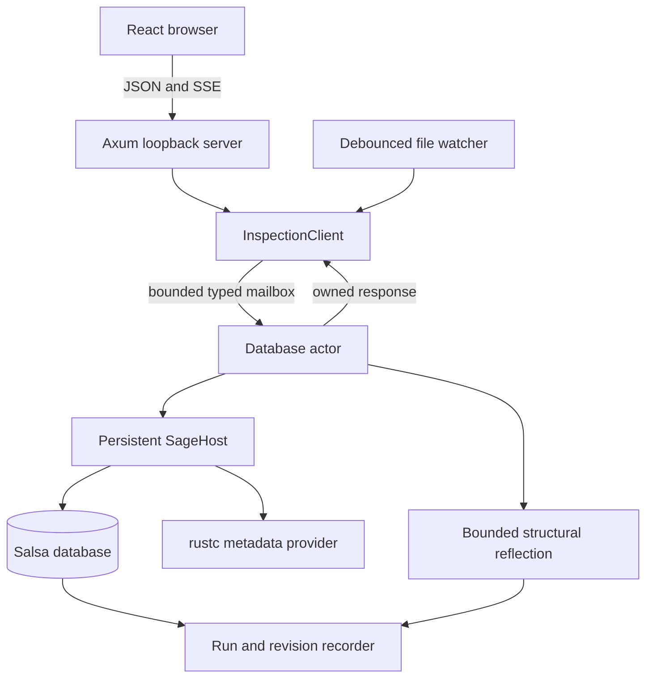

# Semantic Inspector

The Semantic Inspector is Sage's interactive code-review surface. Running
`cargo sage inspect` opens a local web application which browses the selected
crate's symbols, requests semantic products on demand, and shows the dynamic
Salsa and metadata work which produced each result. It is an observer of Sage;
the [Oracle Test Harness](../oracle-test-harness.md) remains the independent
exact conformance check.

## Inputs and outputs

The input is one selected Cargo target, its represented Rust source files, and
the reachable dependency metadata needed by Sage. The service retains that
workspace across requests and ordinary source edits. Its externally visible
outputs are:

- one complete, detail-free directory of represented local symbols;
- a selected local or external symbol with a positive list of available
  products;
- an owned generic render tree for one requested product;
- a bounded continuation for an omitted reflected subtree;
- the dynamic query/metadata tree for one inspection run; and
- retained revisions, exact input deltas, demanded runs, and comparisons.

The browser does not interpret Rust symbol kinds or product identifiers. It
interprets these generic resources and uses canonical paths supplied by the
server for navigation.

## Runtime architecture



Axum owns transport and embedded assets. It has no database handle and performs
no selection, semantic analysis, or reflection. A single actor serializes
typed requests, source edit batches, and workspace reloads. Ordinary `.rs`
changes update existing `SourceFile` inputs; Cargo or toolchain changes rebuild
the host and are reported as an explicit workspace-reload revision. The actor
then publishes Cargo metadata's authoritative workspace root together with the
selected package and source roots to the watcher. The watcher replaces its
non-recursive workspace/package and `.cargo/config{,.toml}` directory watches
and recursive source-tree watch before waiting for the next edit. Both
`rust-toolchain` filenames are configuration inputs. The command reports ready
only after these initial watches are installed; it does not infer either Cargo
root from a possibly nested target source path.

After reconstruction, replacement roots are installed before obsolete roots
are removed. A transient replacement-installation failure retains the prior
complete set, reports a structured degraded-watcher event, and retries. A
failed obsolete-root cleanup retains both old and replacement watches and
reports that harmless degraded state; it never sacrifices coverage of the new
source tree.

A live session owns exactly one Cargo library target. Multi-target workspaces
must select it with `--package`; the session preserves distinct Cargo package
and target names. Dependency preparation builds only that selected library and
collects all of its normal direct dependencies by Cargo package identity and
extern name, including dependencies which are also workspace members; an
unrelated broken member cannot block inspection. Reconstruction builds a
replacement before swapping it into the actor. The replacement's rustc
metadata thread must reach `after_expansion` without diagnostics and report
readiness before the host can be published. A malformed manifest, failed
build, or metadata-stub failure therefore returns a structured reload error
while the prior database, revision, and watch set remain usable.

```{anchor}
semantic_inspector_service_boundary
```

<a id="si-a1"></a>
> **SI-A1 — One actor owns one coherent live workspace.** Axum and the file
> watcher communicate through a bounded typed client; only the actor owns and
> mutates the host. Source edit batches are applied serially to the retained
> database, while configuration changes reconstruct it at an explicit reload
> boundary.
>
> **Required verification:** Same-host cold/warm/relevant/unrelated edit tests
> distinguish ordinary input revisions from database reloads and never expose
> a partially applied batch.

<a id="si-a2"></a>
> **SI-A2 — The typed inspection service is below transport.** Service request
> and result types do not depend on Axum, React, terminal state, LSP, or the
> Oracle schema. HTTP handlers only decode, call `InspectionClient`, and encode.
>
> **Required verification:** Service and router tests construct typed providers
> independently and compare the actual HTTP boundary without accessing Sage
> from a handler.

The executable entry point constructs either the live provider or the reviewed
scripted fixture, starts the actor and watcher, binds loopback port 2442 by
default, and serves assets embedded with `rust-embed`:

```{anchor}
semantic_inspector_command_entry
```

Expected startup failures are reported as CLI errors rather than panics. A
bind conflict points to `--port`; failure to open the default browser is only a
warning because the printed loopback URL and server remain useful.

## Protocol and generic browser

The normative `/api/v1` schema is recorded in the accepted [Semantic
Inspector RFD](../../rfds/semantic-inspector/protocol.md). Every success and
error carries the process-wide revision ID and a request ID; resources which
do not exist are structured 400 or 404 responses. The server returns the only
valid products for a selected symbol, so an absent body is omission rather
than a synthetic “unavailable” product.

<a id="si-a3"></a>
> **SI-A3 — One exact JSON fixture drives both halves.** Backend tests construct
> independent typed Rust values and compare exact Axum bytes with the reviewed
> bundle. Browser tests consume those same bytes through a strict fixture
> server which rejects unlisted demand.
>
> **Required verification:** The route manifest, response bytes, expected
> provider demand, and browser scenarios are checked without deserializing an
> expected response to manufacture the backend value under test.

<a id="si-a4"></a>
> **SI-A4 — The browser is a generic protocol interpreter.** Symbol
> presentation, positive product descriptors, render nodes, value nodes, and
> trace nodes determine the UI; JavaScript does not branch on Sage symbol kinds
> or known product IDs.
>
> **Required verification:** A fixture-only invented kind and product render
> and navigate without a product-specific component, and omitted products make
> no request.

<a id="si-a5"></a>
> **SI-A5 — The URL stores durable intent, not response state.** Selection,
> product, search, grown panel, and revision views update browser history. A
> revision mismatch discards every response-derived value, fetches the current
> directory, and replays the URL's canonical symbol/product intent. Each event
> stream connection checks the current revision, closing any notification gap
> while the browser was disconnected.
>
> **Required verification:** Direct-load, Back/Forward, replace-versus-push,
> missing-target, event-reconnect, and revision-event tests inspect both the
> restored view and API demand.

The local symbol directory is fetched eagerly because it is small identity and
presentation data needed for useful browser-local search. No signature, body,
field type, associated value, impl candidate, or callee body is part of that
resource. External metadata may be read only when macro resolution or
expansion requires it to determine generated local membership. If that
expansion cannot account for every possible child, the directory retains the
safe represented children and marks their parent explicitly incomplete.

<a id="si-a9"></a>
> **SI-A9 — Local search starts from one complete detail-free index.** The
> browser filters the returned local directory without sending search text or
> fetching branches. Dependency symbols are excluded. Index construction may
> use external facts needed for macro expansion, but no broader semantic
> metadata or item details.
>
> **Required verification:** A real-workspace trace snapshots the closed set of
> operation families used by directory construction, including the permitted
> macro metadata families, and explicitly forbids signatures, bodies,
> associated values, and impl discovery.

<a id="si-a15"></a>
> **SI-A15 — Product availability is positive and non-eager.** Selecting a
> symbol returns opaque product IDs, labels, and URLs without requesting any
> advertised product. Local and external symbols use the same mechanism;
> unsupported products are absent.
>
> **Required verification:** Local/external catalog tests assert the exact
> positive lists and forbid product-detail reads while constructing them.

## Canonical navigation

Local paths encode the selected crate and typed ownership segments. Named
segments include namespace/kind information; anonymous impl segments use a
stable header hash which excludes body, member, and span detail. External
roots include rustc's crate disambiguator and every structured definition-path
segment includes its kind, name, and disambiguator. Display labels are never
parsed to recover identity.

Inspector navigation deliberately has its own external-path projection. The
existing conformance projection omits anonymous rustc ownership segments where
both emitters omit them; canonical navigation retains those
segments so, for example, a variant and its constructor do not share an
address. Adding navigation detail must not change oracle output.

```{anchor}
semantic_inspector_external_paths
```

<a id="si-a8"></a>
> **SI-A8 — Navigation uses backend-authored canonical ownership paths.** Local
> and external semantic references carry opaque canonical paths distinct from
> labels. Paths survive unrelated/detail edits, sibling movement, and host
> reconstruction; rename, move, deletion, or a forged path fails explicitly.
>
> **Required verification:** Path tests cover local association, anonymous and
> generated ownership, reordered siblings, rename failure, reconstruction,
> external parent/children, and crate disambiguation. The full exact oracle
> suite separately proves that navigation-only path detail does not enter the
> conformance representation.

## Semantic products and reflection

The current local function products are identity, source, expanded Concrete
IR, checked signature, diagnostics, and completed Typed IR. External products
are limited to independently available metadata such as identity, signature,
and children. Each product is requested independently and frozen into owned
protocol values before the actor replies.

A local product refreshes its symbol handle and any newly introduced reflected
cross-link by walking the symbol's explicit owner chain and enumerating only
siblings at those owner boundaries. It does not rebuild the recursive
directory or observe membership in unrelated descendant modules. This keeps
edited product requests correct without turning the eager search index into an
incremental dependency of every semantic product.

Ordinary structs and enums derive `Reflect`; the derive recursively preserves
every field and enum payload. Explicit implementations supply semantic names,
symbol cross-links, spans, stashed roots, and shared arena identities. The
context limits depth and node count. Repeated pointers become shared
references, and a limit produces a frozen continuation rather than silently
dropping detail.

```{anchor}
semantic_inspector_reflect_derive
```

<a id="si-a6"></a>
> **SI-A6 — Product reflection is faithful, bounded, and owned.** Ordinary
> structure is derived, semantic leaves are explicit, sharing/cycles are
> represented by identities and back-references, and limits yield immutable
> continuations which require no later database borrow.
>
> **Required verification:** Derive-shape, same- and cross-stash shared-edge,
> semantic-link, bounded wide-sequence traversal, representative real IR, and
> continuation tests cover these cases.

<a id="si-a16"></a>
> **SI-A16 — Representation growth flows through the derive.** Product
> producers do not hand-serialize Sage CST, type, signature, or Typed-IR
> structures. Adding an ordinary field or variant changes reflected output
> through the `Reflect` implementation unless an explicit semantic override is
> documented.
>
> **Required verification:** Compile/shape tests cover named, tuple, and unit
> forms, real products retain their wrappers and nested type trees, and
> exhausting continuation capacity cannot leave an orphan shared reference.

## Execution evidence

The workspace uses a temporary Salsa 0.26.1 fork. A tracked-function fetch
emits `WillRequest` before memo lookup and a balanced `DidRequest` with
`Executed`, `Validated`, `Reused`, or `Cancelled`. An RAII guard balances
unwinding. Sage database events and external-metadata operations are correlated
with that dynamic stack without per-query annotations.

Consecutive identical leaf requests are losslessly coalesced into one trace
node with an observation count. This preserves the millions of cache lookups a
solver run can perform without making the JSON tree itself millions of nodes.

```{anchor}
semantic_inspector_salsa_events
```

```{anchor}
semantic_inspector_salsa_request_guard
```

<a id="si-a17"></a>
> **SI-A17 — Every tracked invocation has a balanced lifecycle span.** The
> span begins before memo lookup, including already-current reuse, and ends on
> execution, validation, reuse, cancellation, or unwinding.
>
> **Required verification:** Cold, warm, edited, nested, panicking, and
> pre-fetch revision-cancellation tests assert balanced entry/exit and all four
> terminal dispositions. Accumulator traversal separately proves that its
> internal memo refreshes use the same lifecycle.

<a id="si-a11"></a>
> **SI-A11 — Unknown work is visible rather than omitted.** Supported Sage and
> metadata operations use stable operation families; any query without a
> semantic-key projection is retained as `unmapped` with its raw diagnostic
> ingredient. A checked closed dependency claim fails in the presence of an
> unexpected fallback.
>
> **Required verification:** Real traces include all balanced Salsa requests
> and metadata calls, and forbidden-demand tests cannot pass by filtering an
> unknown node.

Analysis, reflection, and pure view assembly are explicit trace phases.
Reflection begins only after the requested semantic value is available, and
the run freezes before Axum serialization. The browser can filter, resize,
grow, collapse, and expand this already-owned tree without causing semantic
work.

<a id="si-a7"></a>
> **SI-A7 — Semantic work ends before serialization and browser rendering.**
> Every tracked read used to reflect a product lies inside the recorded
> analysis/reflection boundary; view assembly is explicit and later JSON/DOM
> work has no database access.
>
> **Required verification:** Phase tests inspect real products, while strict
> frontend fixtures prove tree interaction performs no additional semantic
> request.

<a id="si-a12"></a>
> **SI-A12 — Checked trace assertions use a deterministic projection.** Dynamic
> parentage and dispositions are retained; only explicitly unordered siblings
> are canonically sorted. Tests assert closed sets or extensible
> required/forbidden patterns and do not assign semantic meaning to scheduler
> order or raw Salsa IDs.
>
> **Required verification:** Producer-authored sequential and unordered groups,
> cold/warm/edit traces, and forbidden fallback assertions establish the
> checked projection while raw debug payload remains available on failure.
> Async group spans are poll-scoped so interleaved futures cannot corrupt
> dynamic parentage.

## Revisions and edit experiments

A revision record contains input deltas and zero or more inspection run
handles. Applying an edit creates a revision but does not itself claim that a
semantic query ran. A run is added only when the browser or another client
demands work. Product comparisons report value change and observed differences
between executed and reused operation identities; they do not invent causal
invalidation edges Salsa did not report.

Within one live database, revision IDs contain Salsa's actual revision number.
A small database-generation component distinguishes a reconstructed host,
whose Salsa counter begins again, from the database it replaced. Each retained
summary also carries an explicit cause: initial workspace state, an identified
input-edit batch, or a workspace reload linked to the previous generation's
last revision and its structured reason.

<a id="si-a13"></a>
> **SI-A13 — Input revisions and demanded work are separate facts.** Revision
> advancement records exact changed inputs even when no inspection follows;
> retained runs record only actual demand. A workspace reconstruction is
> distinct from a fine-grained source-input revision.
>
> **Required verification:** Cold/warm/relevant/unrelated/reload tests inspect
> revision details before and after demand and compare retained products and
> traces across revisions.

## Current status

### Current frontier and evidence

- **SI-A1/A8/A9/A13/A15:** `tests/semantic_inspector.rs` exercises a retained
  real `DbDropGuard::db` host, exact macro-expansion metadata allowances,
  product catalogs, local/external navigation, relevant/unrelated edits,
  sibling reorder, rename failure, and explicit host reconstruction.
- **SI-A2/A3:** `crates/sage-inspector/tests/protocol_contract.rs` drives the
  reviewed 25-route manifest through the production Axum router and compares
  exact response bytes, headers, structured errors, and provider-demand
  fixtures.
- **SI-A4/A5/A7:** `crates/sage-inspector/web/src/InspectorApp.test.tsx` uses the
  same strict manifest and responses to test client-side filtering, generic
  invented products, URL history, external links, incomplete membership,
  revision reset/replay/fallback, per-revision product caching, explicit
  reruns, continuations, comparisons, and trace expansion.
- **SI-A6/A16:** `crates/sage-reflect/src/lib.rs` tests derived field/variant
  shape, same- and cross-stash sharing, bounded wide-sequence traversal, and
  frozen continuation pages; the real inspector test snapshots complete
  Concrete IR, signature, and Typed-IR structural shapes, including nested
  types, resolved static dispatch, and semantic links.
- **SI-A9/A11/A12/A17:** the real directory trace snapshots its complete set of
  operation families; the remaining real trace tests cover executed,
  validated, reused, cancelled/unwinding, nested metadata, phase attribution,
  producer-authored sequential solver-query and unordered trait/normalization
  candidate groups, and forbidden query families. The scripted bundle supplies
  the stable human-reviewed projection.
- `real_command_serves_embedded_assets_and_correlated_request_logs` launches
  the actual command on port 0 and checks embedded direct-route assets, JSON,
  and actor-owned request logs together.
- Startup and reload tests cover an occupied loopback port, watcher readiness,
  a deliberately corrupted metadata-provider invocation, unique stub
  ownership, and a valid keyword extern alias; failures neither panic nor
  replace a working host.
- Injected replacement-watch and obsolete-unwatch failures prove that reloads
  retain a complete watch set and expose any degraded cleanup state.

Run the reviewed fixture without compiling a workspace:

```text
cargo run --bin cargo-sage -- sage inspect \
  --fixture semantic-inspector --port 2442 --no-open
```

Run against the current crate with `cargo sage inspect --package <name>` after
installing the Cargo subcommand in the normal development workflow.

### Current limitations

- The reviewed scripted provider currently advertises `identity` for four
  basic local symbols without implementing those product requests. The
  exhaustive catalog integration test records this as
  [KD-5](../../implementation/known-deviations.md#kd-5-the-scripted-inspector-advertises-products-it-cannot-return).
- The local symbol path matrix covers the represented `DbDropGuard` fixture;
  duplicate same-name definitions and every generated ownership form do not
  yet have a complete adversarial matrix.
- Named external paths and duplicate same-name crate versions resolve by
  rustc's crate disambiguator. Direct replay of a path through an anonymous
  external impl owner does not yet have a complete resolver/evidence matrix.
- Raw Salsa IDs remain visible only inside `unmapped` diagnostic keys. Stable
  checked evidence uses operation families and required/forbidden patterns;
  not every query ingredient has a semantic key projection.
- Revision retention is process-memory and bounded to 64 revisions. It is not
  persisted across inspector processes.
- Cross-browser layout and CSS behavior are not automatically tested. The
  Vitest/jsdom suite checks browser state and demand against the exact bundle;
  the real-process smoke separately checks embedded assets, direct routing,
  the Axum boundary, visible result fields, and actor-owned demand.

These limitations narrow evidence or ergonomics; they do not change the
service, protocol, reflection, or revision contracts above.
