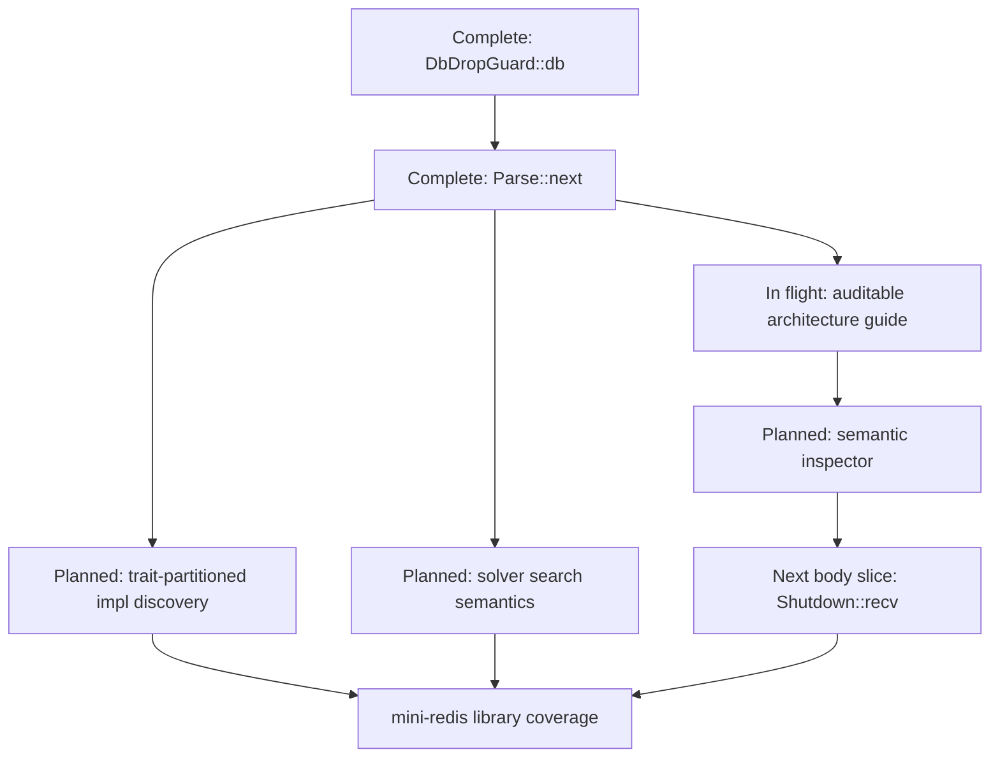

# Build-Out Roadmap

This roadmap answers: **what coherent semantic outcome are we building next?**
It is organized around cross-cutting implementation slices rather than around
source modules, architecture chapters, or individual RFD lifecycles.

A slice has an observable acceptance target and commonly changes several
phases and subsystems together. Architecture chapters describe each area's
destination and local **Current Status**. RFD `implementation.md` files own
detailed checkpoint lists. This page records the ordering and dependencies
between the larger outcomes.

## Sequence at a glance

Arrows express architectural or review dependencies, not a requirement that
all unrelated work stop. The Semantic Inspector is a review dependency for
future application slices even where the compiler feature itself could be
implemented without it.

## Completed slice: `DbDropGuard::db`

### Goal and acceptance target

Type-check the pinned mini-redis body `DbDropGuard::db` and emit a fully
elaborated static `Clone::clone` call that compares byte-for-byte with the
rustc oracle representation.

### Why this slice

This established the first end-to-end seam from source-associated function
identity through field resolution, derive-generated evidence, trait-method
lookup, fixed-trait proof, explicit adjustment elaboration, and exact oracle
comparison.

### Scope

The slice covers one ground, synchronous method call. It does not claim
general method resolution, arbitrary derives, borrow checking, or complete
Typed IR coverage.

### Affected architecture

- [Symbols and Semantic Identity](../design/infrastructure/symbols.md)
- [Type Checking](../design/checking.md)
- [Trait Solver](../design/trait-solver.md)
- [Typed IR](../design/typed-ir.md)
- [Oracle Test Harness](../design/oracle-test-harness.md)

### Implementation plan and progress

The slice is **complete**. Its detailed acceptance criteria, exact snapshot,
and cold/warm dependency evidence are recorded in [Mini-redis Slice 1][mini-1].
The accepted [Method Resolution] and [Typed IR Elaboration] RFDs continue to
generalize mechanisms first exercised here.

## Completed slice: `Parse::next`

### Goal and acceptance target

Type-check the pinned mini-redis body `Parse::next`, including external
`Iterator::Item` normalization and inherent `Option::ok_or`, with fully
elaborated typed IR and exact oracle identity.

### Why this slice

This forced solver operations to have goal-specific outputs and exercised the
global dependency-impl seam without widening the target to the whole crate.
It also pinned the dependency rule that normalization reads only the selected
associated value and no callee body.

### Scope

The slice covers one demanded associated type, represented external impl
metadata, and one rigid inherent call. It does not cover GATs, specialization,
opaque reveal, codegen dispatch selection, or complete local impl indexing.

### Affected architecture

- [Type Checking](../design/checking.md)
- [Trait Solver](../design/trait-solver.md)
- [Typed IR](../design/typed-ir.md)
- [Oracle Test Harness](../design/oracle-test-harness.md)

### Implementation plan and progress

The slice is **complete** through the [Associated Type Normalization RFD]. Its
acceptance and query-trace evidence are recorded in [Mini-redis Slice 2][mini-2].
The remaining local impl-index architecture is separated into the
[Trait Impl Candidate Discovery RFD].

## In-flight slice: auditable architecture and review evidence

### Goal and acceptance target

Make the architecture book usable as a guide to the compiler: introduce the
phase/subsystem/representation taxonomy, explain symbols as the semantic
spine, give each chapter a destination contract plus Current Status/evidence,
and ground load-bearing mechanisms in source anchors.

The slice is complete when the phase and major subsystem entry guides exist,
the module-expansion pilot and one body-checking example have review packets,
and the book's maintenance contract enforces the new ownership model.

### Why now

The two completed mini-redis slices exposed that reviewing architecture by
reading implementation diffs does not scale. The guide and evidence model are
needed before broadening body coverage further.

### Scope and non-goals

This is a documentation and reviewability slice. It does not change compiler
semantics merely to make a phase contract look cleaner. Semantic discrepancies
found during the audit require their own decision or RFD.

### Affected architecture

All architecture navigation is affected. The primary contract is the accepted
[Auditable Architecture Guide RFD].

### Dependencies

The completed semantic slices provide real examples and evidence. The planned
Semantic Inspector builds on the evidence model but is not required to begin
the documentation rewrite.

### High-level implementation plan

1. Establish navigation and documentation ownership.
2. Reshape the overview and document symbols.
3. Convert this roadmap to cross-cutting slices.
4. Pilot module expansion, then document the remaining phases and subsystems.
5. Connect existing tests and snapshots; later add Semantic Inspector commands.

### Progress

**In flight.** Navigation, ownership, the semantic overview, and the Symbols
chapter have landed. Detailed progress is in the RFD's [implementation
plan][auditable-plan].

## Planned slice: semantic inspector and persistent edit testing

### Goal and acceptance target

Provide a persistent `cargo sage inspect` service and CLI that selects a
semantic item, prints readable signatures or completed Typed IR, records
structured semantic/Salsa/metadata queries, and reruns against edits in the
same database.

Acceptance includes cold, warm, relevant-edit, and unrelated-edit tests whose
traces use stable semantic event keys rather than raw Salsa debug strings.

### Why this slice is next

Architecture chapters can link existing unit tests and snapshots, but the
inspector turns review evidence into a consistent interactive workflow. It is
the practical bridge from reading a claim to inspecting output and incremental
dependencies.

### Scope and non-goals

The first client is a batch and interactive CLI over a reusable service. An
LSP adapter is a later client. Human-readable rendering does not replace or
normalize the exact oracle representation.

### Affected architecture

- [Validation and Inspection](../design/validation/README.md)
- [Oracle Test Harness](../design/oracle-test-harness.md)
- [Symbols and Semantic Identity](../design/infrastructure/symbols.md)
- the incrementality guide introduced by the architecture slice

### Dependencies

- the architecture evidence vocabulary from the in-flight slice;
- stable semantic selectors, with source-position selection building on
  [Resolve at Position]; and
- the existing query and metadata logging hooks.

### High-level implementation plan

1. Pin owned observation and stable trace-event contracts.
2. Extract a persistent workspace host and read-only analysis view.
3. Implement semantic selection and inspection operations.
4. Add deterministic human rendering and CLI clients.
5. Add watch/edit experiments and retain a clean future LSP boundary.

### Progress

**Planned.** The [Semantic Inspector RFD] is Draft; no implementation has
started.

## Planned slice: trait-partitioned impl discovery

### Goal and acceptance target

Make impl discovery complete across the local crate and reachable dependency
crates while keying every lookup by trait and optionally a conservative rigid
self head. Edits to an unrelated trait's impl partition must not invalidate a
consumer whose relevant result is unchanged.

Acceptance requires query-trace and edit-invalidation tests for positive,
negative, and incomplete discovery, including proof that unrelated impl
headers, associated values, and bodies are not read.

### Why this slice

`Parse::next` established the semantic contract for global relevant impls, but
the current local backing query still scans expanded impl identities. Scaling
whole-crate checking requires the incremental dependency to match the semantic
trait key.

### Scope and non-goals

This slice indexes candidate identity and completeness. It does not implement
specialization, coherence, GAT normalization, codegen selection, or a general
self-type discrimination scheme beyond a conservative refinement.

### Affected architecture

- module expansion and its terminal completeness contract
- name resolution of local impl headers
- [Trait Solver](../design/trait-solver.md)
- the external metadata and incrementality guides introduced by the
  architecture slice

### Dependencies

The semantic query boundary and external relevant-impl lookup already exist.
The tracked map/lookup shape and edit evidence remain to be pinned by the
[Trait Impl Candidate Discovery RFD]. The Semantic Inspector is useful review
infrastructure but not a semantic prerequisite.

### High-level implementation plan

1. Pin the complete visible-impl and trait-key contracts.
2. Build stable local impl identity facts without lowering unrelated headers.
3. Partition lookup dependencies by trait and conservative self head.
4. Merge local and external completeness at the solver boundary.
5. Add persistent edit-invalidation and negative-dependency evidence.

### Progress

**Planned.** The RFD is Draft. The current solver has a trait-keyed public
query but not the required trait-partitioned local source dependency.

## Planned slice: solver recursion, scheduling, and monotone progress

### Goal and acceptance target

Define and implement cycle semantics, fair future scheduling, and optional
monotone intermediate result envelopes without making scheduler order affect
the final logical result absent resource exhaustion.

Acceptance includes grounded soundness/completeness modulo explicit overflow,
terminating sound behavior for non-ground queries, deterministic final results
across permitted schedules, and focused cyclic/fairness tests.

### Why this slice

The positive solver supports the completed ground slices, but its current
inductive cycle and active-frame behavior is not the agreed destination for
general recursive proof trees. Scheduling and cycle semantics must be designed
together before concurrency is broadened across conjunctions and alternatives.

### Scope and non-goals

This slice does not add negative reasoning, specialization, coinduction for
arbitrary traits, or codegen vtable/method selection. Overflow remains an
explicit resource outcome rather than a logical answer.

### Affected architecture

- [Trait Solver](../design/trait-solver.md)
- body obligation scheduling in [Type Checking](../design/checking.md)
- incrementality and inspection evidence

### Dependencies

The current canonical query/result boundary and future-based solver are the
starting point. The design work is split among [Cycle Semantics], [Scheduling
and Fairness], and [Incremental Trait Results]. Trait-partitioned impl
discovery is independently required for narrow candidate dependencies.

### High-level implementation plan

1. Settle inductive/coinductive cycle and fixpoint semantics plus resource
   limits.
2. Pin the proof-tree scheduling contract and meaningful yield points.
3. Define safe progress envelopes and subsumption.
4. Implement behind the existing goal-specific output boundary.
5. Test schedule independence, cyclic ground completeness, non-ground
   termination, and explicit overflow.

### Progress

**Planned.** All three RFDs are Draft. Research and destination tenets exist;
the current active-frame algorithm remains the implementation frontier.

## Next application slice: `Shutdown::recv`

### Goal and acceptance target

Type-check the pinned mini-redis async body `Shutdown::recv`, including an
external future-producing method, `IntoFuture`/`Future::Output` elaboration,
assignment, early return, and a high-level typed `Await` node. Sage and rustc
must again emit exact identical reference IR for the body.

### Why this slice

It is the smallest next mini-redis body that crosses the async/await and
future-output boundary without requiring whole-crate coverage. It extends the
same review discipline used for the first two slices.

### Scope and non-goals

The typed output retains `Await`; state-machine lowering and borrow checking
are deferred. Lifetimes remain `Dummy`.

### Affected architecture

- body checking and elaboration
- [Typed IR](../design/typed-ir.md)
- [Trait Solver](../design/trait-solver.md)
- external metadata
- [Oracle Test Harness](../design/oracle-test-harness.md)

### Dependencies

The auditable architecture slice supplies the review packet. The Semantic
Inspector is the preferred trace interface. Required `IntoFuture` and
`Future::Output` semantics must be pinned before implementation; unrelated
solver-search generalization is not automatically a prerequisite.

### High-level implementation plan

1. Pin the shared typed representation for the source body and `Await`.
2. Inventory the exact external signatures, projections, and obligations.
3. Implement the narrow future/await semantic path behind existing query
   boundaries.
4. Add typed-IR snapshot, exact oracle comparison, and cold/warm dependency
   evidence.
5. Update every affected architecture Current Status section in the same
   checkpoint.

### Progress

**Planned.** The target is specified in [Mini-redis Slice 3][mini-3]; a focused
implementation RFD has not yet been opened.

## Future slice: mini-redis library coverage

### Goal and acceptance target

Type-check every body in the pinned default-feature `mini_redis` library
target, emit no Sage diagnostics for the rustc-clean crate, produce no
unsupported typed nodes, and compare every shared body representation exactly
with the oracle.

### Ordering and dependencies

This is intentionally not one opaque implementation task. It follows the
reviewable body slices above and depends on the impl-discovery, solver, method,
Typed IR, metadata, and inspection capabilities demanded by the remaining
feature families. The [Mini-redis Conformance Roadmap] owns the finer
application ordering.

### Progress

**Future.** Library-wide acceptance has not started; two bodies are complete
and `Shutdown::recv` is the next pinned rung.

## Relationship to RFD status

Accepted and completed RFD lists remain in the book's RFD section. An RFD can
complete while the broader slice or destination capability remains partial.
Conversely, a slice may require several RFDs. Update this roadmap when a slice
is introduced, reordered, blocked, or completed; update an RFD implementation
file when one of its detailed checkpoints lands.

[mini-1]: ./mini-redis.md#slice-1-dbdropguarddb
[mini-2]: ./mini-redis.md#slice-2-parsenext
[mini-3]: ./mini-redis.md#slice-3-shutdownrecv
[Mini-redis Conformance Roadmap]: ./mini-redis.md
[Associated Type Normalization RFD]: ../rfds/associated-type-normalization/README.md
[Trait Impl Candidate Discovery RFD]: ../rfds/trait-impl-candidate-discovery/README.md
[Auditable Architecture Guide RFD]: ../rfds/auditable-architecture-guide/README.md
[auditable-plan]: ../rfds/auditable-architecture-guide/implementation.md
[Semantic Inspector RFD]: ../rfds/semantic-inspector/README.md
[Resolve at Position]: ../rfds/resolve-at-position/README.md
[Method Resolution]: ../rfds/method-resolution/README.md
[Typed IR Elaboration]: ../rfds/typed-ir-elaboration/README.md
[Cycle Semantics]: ../rfds/trait-solver-cycle-semantics/README.md
[Scheduling and Fairness]: ../rfds/trait-solver-scheduling/README.md
[Incremental Trait Results]: ../rfds/incremental-trait-results/README.md
