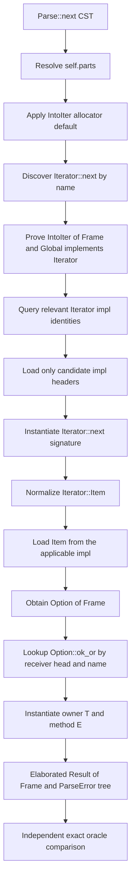

# RFD: Associated Type Normalization for `Parse::next`

**Status:** Draft

**Depends on:**

- [Trait System](../trait-system/README.md) — checked traits, impls, associated
  item identities, and parameter environments
- [Trait Solving](../trait-solving/README.md) — canonical goals, isolated
  candidates, answer merging, and body obligations
- [Trait Impl Candidate Discovery](../trait-impl-candidate-discovery/README.md)
  — complete trait-keyed local and upstream impl discovery
- [Method Resolution](../method-resolution/README.md) — fixed-trait method
  lookup, receiver adjustments, and selected-call transactions
- [Typed IR Elaboration](../typed-ir-elaboration/README.md) — completed calls,
  explicit receiver operations, and exact oracle comparison

## TL;DR

- Make the mini-redis `Parse::next` body the acceptance target for the first
  associated-type normalization path.
- Add the common `AliasTy::{Named, Associated, Opaque}` type family, while
  implementing operational normalization only for the associated projection
  needed by this slice.
- Generalize solver responses with goal-specific outputs: proof operations
  return `Proven`, while input-only `Normalize(alias)` returns a type.
- Add normalization-aware alias relation without making trait proof return a
  selected impl or encoding normalization's result as an input variable.
- Import external ADT generic defaults, relevant impl headers, and selected
  associated type values through narrow, owned `TcxDb` queries.
- Generalize method checking enough to elaborate external `Iterator::next`
  and external inherent `Option::ok_or`, including owner and method generic
  substitutions.
- Require exact oracle output and semantic query traces which prove that no
  unrelated impls, unneeded associated values, or callee bodies were read.

## Motivation

The next mini-redis slice is this body:

```rust,ignore
fn next(&mut self) -> Result<Frame, ParseError> {
    self.parts.next().ok_or(ParseError::EndOfStream)
}
```

Its surface area is small, but its type is not available from method-name
lookup alone. `Iterator::next` is declared as:

```rust,ignore
trait Iterator {
    type Item;
    fn next(&mut self) -> Option<Self::Item>;
}
```

The receiver is `vec::IntoIter<Frame>`. The applicable upstream impl assigns
`type Item = T`, so checking this call requires the relation:

```text
<vec::IntoIter<Frame, Global> as Iterator>::Item  normalizes-to  Frame
```

There are two additional dependencies hidden by the short source:

- `IntoIter<T, A>` has the default type argument `A = Global`, so the source
  spelling `IntoIter<Frame>` must become the semantic type
  `IntoIter<Frame, Global>`; and
- `Option::ok_or` is an external inherent method. Its owner generic is the
  `Option` element type and its method generic is the error type inferred from
  `ParseError::EndOfStream`.

The current implementation represents the common alias family, imports
external ADT generics and defaults, and discovers explicit upstream impls by
fixed trait and conservative self head. It also represents associated
projections in owned metadata and implements input-only associated-type
normalization over isolated local, external, and environment-value candidates.
Canonical type outputs participate in response binding, merging, caching, and
caller import, while trait proof still returns only `Proven`. Selected external
trait-method signatures may now contain associated projections: body checking
replaces them with caller inference variables and retains input-only
normalization operations through terminal obligation processing. The
`Iterator::next` half of the slice is operational, including explicit mutable
`Dummy` borrowing and name-keyed identity-only auditing for external inherent
shadowing. External inherent method selection and the final exact oracle slice
remain. This RFD defines one vertical change which closes those remaining gaps
without introducing eager global normalization or asking rustc to answer
Sage's trait goals.

## Change in a nutshell

The completed body has this conceptual shape:

```text
Call Option::<Frame>::ok_or::<ParseError>(
    Call <IntoIter<Frame, Global> as Iterator>::next(
        RefMut[Dummy](
            Field Parse::parts(
                Deref(Local self)
            )
        )
    ),
    ParseError::EndOfStream,
)
```

Checking reaches that tree through separate semantic boundaries:



The diagram is an explanation of dependencies, not a requirement that each
box become a public Salsa query. `LocalFnSym::body` remains the one public body
query. Stable cross-item and metadata facts get narrow tracked boundaries;
temporary inference and partially elaborated expressions remain inside body
checking.

## Completion contract

The slice is complete when the pinned mini-redis `Parse::next` body and a
focused isolated fixture satisfy all of these conditions:

- checking produces no diagnostic;
- the completed body contains no source `MethodCall`, unresolved field or
  path, inference variable, adjustment recipe, unsupported placeholder, or
  debug-formatted type;
- the first receiver is an explicit mutable borrow with `Lifetime::Dummy`;
- the two calls name `Iterator::next` and `Option::ok_or` and retain their
  dispatch and generic substitutions;
- every expression type needed by this body is concrete, including
  `Option<Frame>` and `Result<Frame, ParseError>`;
- no selected callee body or impl body is queried;
- Sage and rustc independently emit the same deterministic shared tree, and
  pass/fail is exact textual identity;
- both sides match a checked-in exact snapshot; and
- an unchanged second body query reuses the result without rereading external
  metadata.

The completed tree need not erase every alias in the program. This particular
projection must normalize because its value is required to establish the
method-chain and declared return types. Alias identity may remain in proof
provenance or in types whose normalized value is not demanded.

## Architectural tour

### 1. Represent aliases as types, not as ADTs

`Ty` gains one alias case backed by a common family:

```rust,ignore
enum Ty<'db> {
    // rigid and inference forms ...
    Alias(AliasTy<'db>),
}

enum AliasTy<'db> {
    Named(NamedAliasTy<'db>),
    Associated(ProjectionTy<'db>),
    Opaque(OpaqueAliasTy<'db>),
}
```

An associated projection records at least:

- the associated type definition identity;
- the implementing `Self` type;
- the owning trait identity and trait arguments; and
- any associated-item arguments, even though generic associated types remain
  ineligible in this first slice.

All variants retain definition identity and arguments. A named alias is not an
ADT, an associated projection is not an inference variable, and an opaque is
not its hidden type. Adding the family together prevents a temporary
projection-only representation from becoming a second type taxonomy.

The stash remains the storage model for `Ty`, `AliasTy`, arguments, and solver
terms. Stable definition identities remain Salsa symbols; dynamically produced
type terms do not become Salsa-interned values.

Every structural operation must handle aliases explicitly: stash copying and
hashing, folding, substitution, display, occurs checking, universe checking,
canonicalization, response extraction, structural decomposition, and typed-IR
emission. Successful output may not fall back to a debug string for an alias.

This RFD implements normalization semantics for `AliasTy::Associated` only.
`Named` and `Opaque` land as representable terms with their destination
identity. Their expansion and reveal rules remain later work and inability to
reveal them is never interpreted as `No`.

### 2. Import complete external nominal types

Source type lowering cannot faithfully construct `IntoIter<Frame>` without
knowing the declaration's generic parameters and defaults. Add a narrow
external ADT-signature boundary containing:

- ordered generic parameter identities and kinds;
- trailing type defaults as owned `RawTy` values;
- the represented ordinary type-predicate environment; and
- separate completeness for ordinary type checking and any deferred const or
  higher-ranked contract.

Omitted trailing arguments are filled from declared defaults in order, with
earlier arguments substituted into later defaults. A missing default is an
arity error; it is not replaced by an inference variable. For this target,
`IntoIter<Frame>` becomes `IntoIter<Frame, Global>`.

The instantiated ADT parameter environment is submitted through the existing
body/signature obligation path. Default expansion and well-formedness are
semantic properties of the type declaration, not ad hoc preparation performed
by trait candidate matching.

### 3. Separate external impl enumeration from impl contents

The [Trait Impl Candidate Discovery
RFD](../trait-impl-candidate-discovery/README.md) owns the complete candidate
universe and indexing contract. This slice consumes its minimum trait-keyed
external path and fixes the metadata dependency shape:

```text
relevant_impls(trait, optional simplified self head)
    -> deterministic impl identities + completeness

impl_signature(impl identity)
    -> generics + trait head + self type + predicates + completeness

impl_associated_type_value(impl identity, associated type identity)
    -> binder-aware value + completeness
```

These are conceptual typed operations; exact Rust names may differ. Local
associated values come from the corresponding impl-item symbol query, while
external values cross `TcxDb`; normalization consumes the same checked
provider shape after that boundary. The operations have
three intentional properties:

1. Enumeration is keyed by the fixed trait and may additionally use a
   conservative rigid self head. It never scans all traits through Sage.
2. An ordinary trait proof loads relevant impl headers but does not load their
   associated values.
3. Normalizing one associated type loads only that value from candidates which
   survive header matching; other associated items and all impl bodies remain
   untouched.

All values crossing `TcxDb` are owned and free of rustc or Salsa lifetimes.
The rustc-backed implementation uses rustc's authoritative relevant-impl
metadata for every reachable crate in the current compilation. It does not
decode rmeta independently, scan source trees for dependencies, or include
downstream crates absent from the compilation.

The checked import layer lowers each external impl into the same binder-aware
shape used for local impls. Candidate assembly then distinguishes local and
external identities but does not maintain two proof algorithms.

For this target, the selected upstream impl is conceptually:

```rust,ignore
impl<T, A: Allocator> Iterator for IntoIter<T, A> {
    type Item = T;
}
```

Matching binds `T = Frame` and `A = Global`. Its predicate produces the nested
goal `Global: Allocator`, which must itself use complete external candidate
discovery. The implementation may not special-case either `IntoIter` or
`Allocator`.

### 4. Add goal-specific solver outputs

The solver boundary distinguishes operations which produce semantic values
from the proposition language used by assumptions and residual conditions:

```rust,ignore
enum SolverGoal<'db> {
    Prove(ProofGoal<'db>),
    Normalize(AliasTy<'db>),
}

enum GoalOutput<'db> {
    Proven,
    Type(Ptr<Ty<'db>>),
}
```

A successful canonical response carries its output beside its substitution and
residual proof goal:

```rust,ignore
Yes {
    output: GoalOutput<'db>,
    subst: Subst<'db>,
    modulo: ProofGoal<'db>,
}
```

The exact Rust names may change during implementation, but these semantic
boundaries do not. Structural conjunction, implication, and quantification
remain in `ProofGoal` and therefore produce `Proven`; a conjunction is not
asked to combine several unrelated operation values. `GoalOutput` is an
extensible family, so later callable-instance or vtable operations can receive
purpose-built outputs instead of being encoded as types.

Normalization is conceptually:

```text
Normalize(alias) -> Type
```

The alias is the complete operation input. There is no expected output term or
caller-created output inference variable in the query.

For an associated projection, candidate assembly:

1. identifies the owning fixed trait and relevant impl set;
2. opens each impl binder in an isolated candidate context;
3. matches the projection's trait reference and `Self` type against the impl
   head;
4. proves the impl predicates;
5. reads and instantiates only the requested associated type value; and
6. publishes that value as the candidate's `Type` output.

An explicit projection-equality assumption is another possible normalization
candidate. A bare environment fact such as `T: Iterator` proves only the trait;
it does not invent a value for `T::Item`. This slice obtains its value from an
impl. The goal and clause model must leave room for represented environment
projection facts even though lowering associated-type bindings from source
where-clauses is not required for `Parse::next`.

The expected caller type does not participate in selecting a normalization
candidate. Each candidate computes its own canonical type output; the aggregate
result is related to the caller's expected type only after candidate merging.
Otherwise an expected `Frame` could incorrectly filter two overlapping
normalization candidates and turn ambiguity into a selected answer.

`Normalize` reuses canonicalization, isolated proof contexts, residual proof
goals, answer merging, cycle/resource handling, and transactional response
application. Response-local variables appearing in its type output participate
in the response binder, occurs and universe checks, stash copying, caching, and
caller import. It is not an eager helper which mutates caller inference while
trying impls.

The existing proposition `T: Trait` is evaluated through `Prove` and returns
`Proven`. It does not start returning a selected impl: environment facts and
multiple equivalent impl proofs can establish truth without supplying one
associated value. Normalization has its own candidate assembly because its
answer includes a type.

If no complete candidate can determine the value, the result is uncertainty or
explicit exhaustion as appropriate, not `No` merely because the represented
subset had no value. Multiple viable candidates which normalize to the same
canonical result may merge; incompatible results remain ambiguous until
future coherence or specialization rules justify a priority.

This changes early cancellation as well as response storage. An unconditional
`Proven` answer absorbs sibling ways to prove the same proposition. An
unconditional `Type(A)` answer does not by itself absorb a live candidate which
may return `Type(B)`; cancellation requires candidate dominance or a sound
proof that every remaining output agrees.

### 5. Make type relation normalization-aware

Structural equality remains the fast path for two rigid types. When relation
reaches an alias, it uses an `AliasRelate`-style operation:

- identical alias applications can relate structurally without revealing;
- a revealable alias is normalized and its returned type is related to the
  other side; and
- if both sides require normalization, both returned types are related only
  after their operations have independently merged candidates.

This matters even though `Iterator::next` returns the projection nested in
`Option`. `Option<<IntoIter<Frame, Global> as Iterator>::Item>` first relates
structurally at the rigid `Option` constructor and then normalizes the element
leaf when it must equal `Frame`.

Body checking registers any unresolved normalization operation and its
resulting relation with the same obligation lifecycle used for trait goals. It
retries after relevant inference changes and must reach a terminal result or
diagnostic before a successful `CheckedBody` is returned. A projection does not
get replaced by an error type solely to let method lookup continue silently.

### 6. Generalize method signature instantiation

The first call continues to use name discovery outside the solver. Method
resolution finds `Iterator::next`, asks the solver the fixed post-deref goal
`IntoIter<Frame, Global>: Iterator`, and imports the selected trait function
signature. Projection-bearing signatures become eligible when every
projection is represented, even if its value is not yet known.

Before selecting that trait candidate, method resolution uses the same narrow
external inherent lookup boundary required by the second call to prove that no
same-name inherent method shadows `Iterator::next`. This shadow audit reads
only candidate identity and completeness; it does not load unrelated inherent
methods or any candidate signature. Introducing the boundary at this point is
necessary for sound trait-method selection on an external rigid receiver.

The mutable receiver recipe is consumed into an explicit `Ref` node with
`Mutability::Mut` and `Lifetime::Dummy`. The solver proposition still uses
`IntoIter<Frame, Global>` rather than `&mut IntoIter<Frame, Global>`.

The second call consumes candidates from that narrow external inherent lookup
boundary:

```text
inherent_method_candidates(receiver rigid head, method name)
    -> deterministic function/owner identities + completeness
```

For `Option<Frame>` and `ok_or`, method resolution opens the owning inherent
impl/ADT generics and the method's own generics as separate scopes. It binds:

```text
owner T  = Frame
method E = ParseError
```

External function metadata must preserve that ownership split. Flattening all
parameters into one unclassified list is insufficient once the same signature
must receive substitutions from receiver matching, explicit arguments, and
argument inference.

Inherent and trait candidates still obey the priority and completeness rules
from the Method Resolution RFD. External lookup is not allowed to declare
`NotFound` until its name-keyed provider source is complete.

### 7. Preserve predicate fidelity across rustc metadata

An unsupported predicate cannot be silently removed to make `next` or `ok_or`
eligible. Raw signature data reports whether the ordinary call contract is
complete.

Rustc may attach host-effect predicates used only when a function is called in
a const context. Sage currently checks ordinary non-const bodies. The bridge
may classify such a predicate as const-only using rustc's native predicate
kind and retain separate const-call incompleteness; it may not classify an
unknown predicate as irrelevant merely because this fixture would otherwise
fail. Ordinary trait, projection, and well-formedness predicates which affect
this call must be represented or make the source incomplete.

Const body checking and const-evaluation semantics are not introduced by this
RFD. The focused tests must nevertheless demonstrate that `Option::ok_or` is
eligible for this ordinary call for an explicit semantic reason, not because a
wildcard metadata arm discarded a condition.

### 8. Retain substitutions in completed IR

A resolved call records enough information to distinguish:

- its selected function definition;
- direct/inherent versus static-trait dispatch;
- the selected `Self` and trait arguments for static dispatch; and
- owner and method type substitutions which affect the call.

Thus the completed `next` call retains the instantiated `Iterator` reference,
and the completed `ok_or` call retains `T = Frame` and `E = ParseError`.
Receiver adjustment recipes and a selected impl identity are not required in
the final tree: the former have become explicit expression nodes, and the
latter is proof machinery rather than the semantic target of static trait
dispatch.

The shared oracle schema is extended to carry the same call information. The
rustc emitter projects native selected definitions, node substitutions, and
adjustments directly into that schema. The Sage emitter projects its completed
tree independently. Neither emitter reads the other's output, and the
comparator performs no alias expansion, path repair, or paired normalization.

### 9. Make incremental dependencies executable

The cold semantic trace for this body must be explainable in terms of stable
keys. It includes only work such as:

- the `IntoIter` declaration needed to apply its allocator default;
- name discovery and signature data for `Iterator::next`;
- name-keyed external inherent shadow lookup for `IntoIter` and `next`;
- relevant `Iterator` impl identities for the `IntoIter` rigid head;
- headers of candidates which may apply;
- the requested `Item` value from each impl which survives applicability
  checking when normalization begins;
- any relevant `Allocator` proof required by the selected header;
- name-keyed external inherent lookup for `Option` and `ok_or`; and
- the selected `ok_or` signature.

It excludes:

- impls for unrelated traits;
- disjoint rigid self-head buckets when the candidate index can prove them
  irrelevant;
- associated values other than `Iterator::Item`;
- other `Option` methods when the metadata boundary is name-keyed;
- `Iterator::next`, `Option::ok_or`, or impl bodies; and
- unrelated mini-redis bodies.

Tests distinguish semantic lookup events, typed external metadata requests,
and Salsa computations which actually execute. Event order is normalized
unless ordering is itself the contract. A warm unchanged query produces the
same body with no new metadata requests or body-query execution.

## Required tests

### Type and metadata tests

- `AliasTy::Associated` survives stash copy, folding, substitution,
  canonicalization, response extraction, and deterministic display.
- `Named`, `Associated`, and `Opaque` are distinct alias identities and cannot
  be constructed as `Ty::Adt`.
- An external default depending on an earlier generic is instantiated in
  declaration order.
- `IntoIter<Frame>` becomes `IntoIter<Frame, Global>`; a missing required
  external argument is diagnosed rather than inferred.
- Projection-bearing `Iterator::next` metadata is complete and preserves
  `<Self as Iterator>::Item`.
- Ordinary and const-only signature completeness are kept distinct.

### Discovery and solver tests

- A successful trait proof returns `Proven`; a successful normalization returns
  `Type`, and invalid goal/output pairings are rejected at the canonical
  response boundary.
- An upstream impl proves `IntoIter<Frame, Global>: Iterator`.
- Its `A: Allocator` condition produces and discharges the nested external
  `Global: Allocator` goal.
- A plain truth proof does not request `Iterator::Item`.
- Normalizing the projection requests the applicable impl's `Item` value and
  produces `Frame`.
- A bare `T: Iterator` environment fact does not manufacture a concrete
  `T::Item` value.
- A blanket candidate remains visible through the fallback bucket.
- Incomplete external enumeration prevents `No`.
- Two incompatible applicable normalization answers remain ambiguous; an
  expected caller type does not select one.
- A type output containing a response-local variable round-trips through the
  response binder and caller import without losing sharing or universe data.
- An unconditional normalization answer does not cancel a live candidate which
  can still produce a different type.
- Indexed and exhaustive candidate enumeration yield identical canonical
  proof and normalization results for a fixture matrix.

### Method and body tests

- `Iterator::next` produces an explicit mutable borrow and an
  `Option<Frame>` result.
- External inherent lookup finds `Option::ok_or` without treating every
  external ADT as an unknown provider.
- Receiver matching binds the owner generic `T`; the argument binds the method
  generic `E` independently.
- A late argument or return mismatch rolls back method variables,
  normalization responses, wakeups, and staged obligations together.
- The focused completed tree contains no source method call, alias required to
  be normalized, inference variable, or placeholder.

### Oracle and incremental tests

- The isolated `Parse::next` fixture has a checked-in exact shared-IR snapshot.
- The pinned mini-redis source body produces the same semantic shape under its
  real target configuration.
- The rustc and Sage files are byte-identical without comparator
  normalization.
- The cold query trace contains only the expected semantic and metadata keys.
- No callee or impl body is queried.
- Repeating the unchanged body query reuses the result and rereads no metadata.
- An impl edit for an unrelated trait does not reexecute `Iterator` candidate
  lookup; a relevant `Iterator` change does.

## Non-goals

- Full named-alias expansion or opaque reveal semantics.
- Generic associated types, higher-ranked projection bounds, or lifetime and
  const inference.
- Coherence checking, specialization, negative impls, or auto-trait semantics.
- Custom `Deref` method search.
- Const body checking or const evaluation.
- Borrow checking; every introduced borrow lifetime is `Dummy`.
- Async/await support or the `Shutdown::recv` slice.
- Whole-library mini-redis conformance.
- Changing solver scheduling, cycle semantics, or intermediate progress
  publication except where normalization must use their existing contracts.

## Frequently asked questions

### Why is global impl discovery a dependency instead of part of this RFD?

Global, trait-keyed candidate discovery is broader than normalization and is
already specified by its own RFD. This RFD fixes the metadata shape which the
normalization slice consumes and requires the relevant minimum to land, but it
does not redefine the candidate universe or indexing guarantees.

### Why not normalize every projection as soon as it is imported?

Eager normalization creates unnecessary impl dependencies, loses useful alias
identity, and cannot handle an intentionally unrevealed or inference-blocked
alias. Normalization occurs when type relation or another semantic operation
needs the value.

### Why not ask rustc for the normalized type?

Rustc is the authoritative loader for upstream metadata, not Sage's proof
oracle. Asking it to solve or normalize would bypass Sage's candidate,
canonicalization, ambiguity, and incremental contracts and could make exact
output agree while Sage's solver remained wrong.

### Why does `Normalize` not first prove `T: Trait` and inspect its result?

`Prove(T: Trait)` intentionally returns `Proven`, not an impl identity. It can
succeed from an environment fact or from multiple equivalent alternatives.
`Normalize` needs a candidate calculation which returns a type, so it reuses
the same relevant impl source and proof machinery under a distinct operation.

### Why include all three alias variants now?

They are one semantic family in the destination architecture. Introducing the
family together fixes the type taxonomy while leaving each reveal policy
independent. Only associated normalization becomes operational in this slice.

### Does the final call record the selected `Iterator` impl?

No. It records static dispatch to `Iterator::next` with the instantiated trait
reference. The impl justifies the call and supplies the associated value during
proof; it is not necessarily a unique semantic call target in generic code.

## Implementation

See [Implementation plan and status](./implementation.md).
