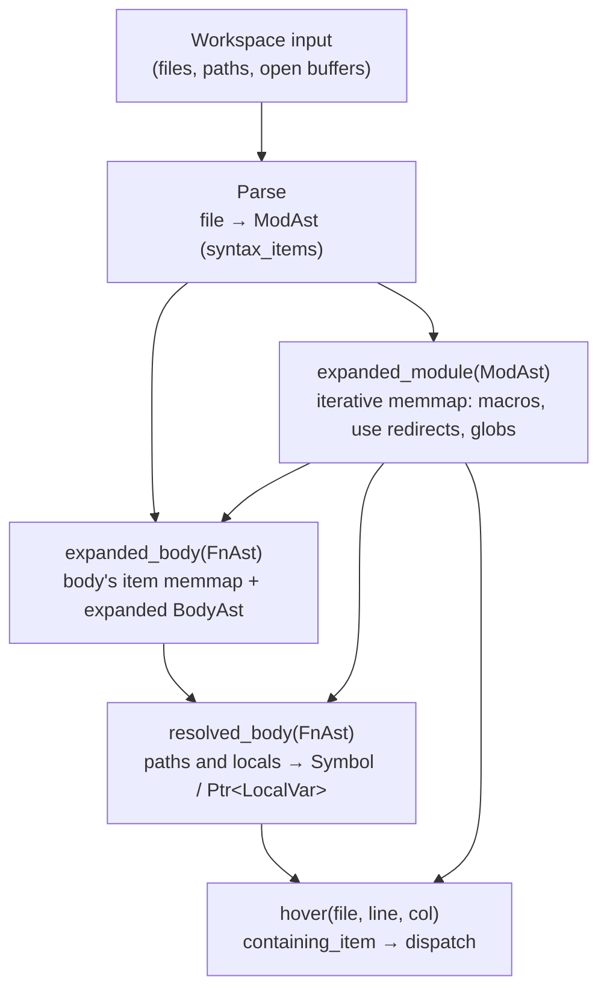

# Summary

This RFD is a draft for the high-level design overview and other specification documents (e.g., name resolution). It overlaps in some ways with the existing code but in other ways diverges. The plan is to sketch out the plan and then make a plan to align codebase with the plan.

# naming conventions

* symbol -- something in a Rust program
  * ast -- anything derived from the local workspace, at any granularity (item handles like `FnAst`, expression trees like `BodyAst`, span tables, etc.). A `FnAst` *stores* its `BodyAst` (guarded behind a tracked field), so the suffix is consistent across both the handle and the contents it transitively owns.
  * ext -- an external symbol compiled with rustc
  * mir -- a lowered, post-resolution representation derived from the AST. The `Mir` suffix takes the place of `Ast` for these IRs (e.g., `BodyMir`); they are still workspace-derived but are not raw syntax.

# IR shape

The types would look like this

* `Symbol<'db>` - a *symbol* represents something in a Rust program either from a local crate or an external source (see below)
  * `ModSymbol<'db>` - an enum with two variants
    * `ModAst<'db>` - this is a tracked struct representing a module parsed from the local workspace
    * `ModExt<'db>` - this is a tracked struct representing an external module compiled with rustc
  * `FnSymbol<'db>`
    * `FnAst<'db>` - this is a tracked struct representing a function parsed from the local workspace
    * `FnExt<'db>` - this is a tracked struct representing an external function compiled with rustc
  * ...

# Symbol sketch

We generally model each non-leaf type as a struct with a private field wrapping an enum

```
pub struct Symbol<'db> {
    data: SymbolData<'db>,
}

// create all of these, probably with some macros
impl<'db> From<ModSymbol<'db>> for Symbol<'db> { ... }
impl<'db> From<ModAst<'db>> for Symbol<'db> { ... }

impl<'db> Symbol<'db> {
    pub fn data(&self) -> SymbolData<'db> {
        self.data
    }
}

#[derive(Copy)]
pub enum SymbolData<'db> {
    
}
```

We prefer to add methods onto the struct.

The rationale is that we may wish to use more optimized representations later than can be converted into enums "on demand" (e.g., a private, flattened enum).

**Wrappers are not interned.** `Symbol`, `ModSymbol`, `FnSymbol`, etc. are plain `Copy` newtypes around their data enum. The leaves they hold (`ModAst`, `FnAst`, ...) are `#[salsa::tracked]` and provide identity. We aim to make minimal use of `#[salsa::interned]` overall.

# AST sketch

A `ModAst` carries two views of its contents:

* `syntax_items` — *literally* what the user typed, with no name resolution or macro expansion applied. `use` statements appear as `use` statements, macro invocations as macro invocations, etc.
* a `Memmap` of *expanded items* — derived from `syntax_items` by the existing iterative memmap/expansion logic. Plain items (structs, fns, ...) are copied across; `use` statements become redirects; macro invocations are resolved and expanded.

The expansion machinery itself is largely as-is (modulo bugfixes and refactors that are independent of this RFD).

**Ast and ext are not symmetric in structure.** `ModAst` has eager, owned `syntax_items` and a derived `Memmap`. `ModExt`, by contrast, is a thin handle into rustc (e.g., `(CrateNum, DefIndex)`) that answers child queries lazily via `TcxDb`. What ast and ext share is the *operations* exposed at the `ModSymbol` level (`resolve_member`, iterate children, etc.), not their internal layout.

**Memmaps are ast-only.** `Memmap` exists as a derived view over `ModAst::syntax_items`. `ModExt` does not have a memmap; `ModSymbol::resolve_member` dispatches on `data()` and consults the memmap on the ast arm, calling `TcxDb::module_children` directly on the ext arm.

**Ext leaves are plain structs.** `ModExt`, `FnExt`, etc. are simple `Copy` structs holding integer identifiers (e.g., `CrateNum` and `DefIndex`). They are neither `#[salsa::tracked]` nor `#[salsa::interned]` — their identity is structural.

**Inline modules.** `mod foo {}` written inside another module (or inside a function body) is its own tracked `ModAst`, parented at its enclosing container. Two inline modules are distinct `ModAst`s even if textually identical.

**`ItemAst` vs `Symbol`.** `ItemAst` exists primarily to be embedded in `ModAst::syntax_items` — it is the "what can appear at item position in parsed source" unifier. Most other code (name resolution, type checking, anything that may cross workspace/dependency boundaries) should hold `Symbol` instead. This subsumes today's `Item<'db>` enum: cross-source uses become `Symbol`, AST-position uses become `ItemAst`.

```
/// AST types that can appear as items in a module, as written
enum ItemAst<'db> {
  ModAst<'db>,
  FnAst<'db>,
  UseAst<'db>,
  MacroInvocationAst<'db>,
  // ...
}

#[salsa::tracked]
struct ModAst<'db> {
  name: Name<'db>,
  syntax_items: Vec<ItemAst<'db>>,

  #[salsa::tracked]
  memmap: Memmap<'db>,
}

#[salsa::tracked]
struct FnAst<'db> {
  name: Name<'db>,

  #[salsa::tracked]  
  body: Stashed<BodyAst<'db>>,
  
  #[tracked]
  pub span_table: SpanTable<'db>,
}
```

# Item containers: modules and bodies

A function body and a module are treated as the same kind of thing — an *item container*. Both hold a list of items and produce a memmap by iterative expansion. The expansion machinery (resolving macro paths against the current scope, expanding to fixpoint, threading `use` redirects, handling globs) is shared.

Bodies differ from modules in a few ways that we model as tweaks on the shared structure rather than separate machinery:

* a body's syntax list also contains non-item statements (lexically-scoped `let`s, expressions, control flow); modules assert there are none;
* body-local items have no meaningful `pub`-style visibility;
* path navigation (`foo::bar`) only descends through namespace-bearing kinds (modules, types, traits, enums) — fns are not traversable, regardless of container.

Lexical resolution of `let` bindings inside a body is a separate concern layered *on top of* the item memmap, not part of it.

# Span tracking

*same as today, let's document this*

Spans are *not* ast-exclusive. rustc encodes span information for external defs as well, so `Symbol::span` is universal. For external symbols where we cannot recover a useful span we fall back to a "dummy" span; callers that care about real source locations can check for it.

# Overall phases of compilation

Each phase is a salsa query (or family of queries) that consumes the previous layer and produces the next. Phases are *layered*, not strictly sequential: a hover request typically only walks down the chain far enough to answer the question, recomputing what's stale and reusing what's cached.



Notes:

* `expanded_body` depends on `expanded_module` of the surrounding module so that body-internal macro invocations can resolve macro names against the surrounding scope. The dependency is one-way: modules do not depend on the bodies they contain (body-local items are not visible to the surrounding module).
* `resolved_body` consumes both `expanded_body` (for body-local items and lexical `let` bindings) and `expanded_module` (for the surrounding scope), plus a workspace-level prelude/extern-prelude lookup (not drawn).
* `hover` is a *consumer*, not a phase: for a node under the cursor it walks down to the definition of the lexical thing the node refers to (a path or local use → its `Symbol` / `LocalVar` via `resolved_body`; an item declaration → `expanded_module`).

# Body IR layers

Each body-level phase produces a *fresh tree*; we are not (yet) using shared trees with side tables. This is cheaper to reason about and easier to walk. We can revisit if recomputation cost becomes a problem.

* **`BodyAst<'db>`** — the parsed function body, exactly as written, with macro invocations as opaque nodes. Just the body — items declared inside the body (e.g., `fn helper() {}`) are *not* part of `BodyAst`; they live as their own `FnAst`s parented at the enclosing `FnAst`, and are registered in the body's item memmap.
* **`expanded_body(FnAst)`** — produces a fresh, post-expansion `BodyAst` (same type, macro invocations replaced by their expansions) plus the body's item memmap. Expansion is its own visible IR layer; the parsed `BodyAst` is preserved as input, the expanded `BodyAst` is what downstream phases consume.
* **`resolved_body(FnAst)` → `BodyMir<'db>`** — a simplified IR over the expanded body. Structurally similar to the expanded `BodyAst`, but every path and name has been replaced. References to items become `Symbol`s; references to local bindings become `Ptr<LocalVar>`. `LocalVar<'db>` is *not* a symbol — locals are namespaced very differently from items and live stash-allocated within the body. Each binding occurrence allocates its own `LocalVar`, so shadowed `let a = ...; let a = ...;` produces two distinct `LocalVar`s. For now, `BodyMir` only encodes lexical name resolution — types are not yet resolved (e.g., `let x: Foo = ...` keeps `Foo` as a syntactic type, and `x.f` field access stays name-shaped). Over time, `BodyMir` is expected to drift further from the surface syntax (lowering control flow, type checking, method resolution).
* **`type_checked_body(FnAst)`** — a future layer; not in scope for now. When introduced, it will be a fresh tree that mirrors `BodyMir` with `Ty` annotations and resolved field/method access.

The `expanded_body` step is parallel to `expanded_module`: both are item containers undergoing iterative macro expansion. The difference is that the body container additionally carries a statement/expression tree (the `BodyAst`), while a module container does not.

# Style guide

* When referencing anything outside of the current focus (e.g., current function during type-checking):
  * use symbols, to allow for possibility of something imported or in an external crate
* AST references are used only
  * inside of other ASTs, for the component parts
  * when type-checking or walking a local, modular structure
* Prefer methods on `Symbol` / `ModSymbol` / etc. that internally dispatch on `data()`, rather than having callers match on `data()` themselves — somewhat OO in style
* Methods live at the *narrowest* level where they are well-defined:
  * Universal operations (e.g., `name`) live on the wrapper at every level and dispatch downward — duplication across levels is fine
  * Kind-specific operations (e.g., `resolve_member`) live on the kind wrapper (`ModSymbol`)
  * Source-specific operations (e.g., `body`) live on the leaf (`FnAst`)

# Stashes

The `sage-stash` crate provides a heterogeneous, type-erased arena for `Copy` data, with thin handles into it:

* `Stash` — the arena itself: a byte buffer plus per-entry metadata. Holds a mix of any `Copy` types that implement `StashData`.
* `Ptr<T>` — a `Copy` handle to a single value in a `Stash` (a 32-bit index, type-checked on access).
* `Slice<T>` — same idea for a contiguous sequence of `T`.
* `Stashed<T>` — pairs a `Stash` with a root value of type `T`, producing a self-contained, comparable, hashable bundle. `Stashed` derives `PartialEq`/`Eq`/`Hash` from the byte content of the stash plus the root.

Two allocation modes:

* `alloc` (no dedup) — distinct calls produce distinct `Ptr`s, even for equal values. Used when each occurrence is its own entity (e.g., each binding occurrence of a `LocalVar`).
* `intern` (dedup) — equal values share a `Ptr`. Used when identity is "by content" (e.g., normalised types).

We use stashes for IRs whose internal nodes vastly outnumber their roots — function bodies, expression trees — so that the salsa cache key (the `Stashed` bundle) is one comparable value per body, while the interior is a flat `Vec<u8>` rather than a forest of separately tracked structs. The pattern: each `body`-like thing is a `Stashed<RootKind<'db>>`, and references between interior nodes use `Ptr` / `Slice`.

Concretely, the body IRs introduced above are stashed:

* `BodyAst<'db>` is the struct that defines the parsed body tree; callers hold it as `Stashed<BodyAst<'db>>`.
* `BodyMir<'db>` is the struct for the resolved tree (with `LocalVar`s and item references); callers hold it as `Stashed<BodyMir<'db>>`.
* The typed body has the same shape: a root struct held as `Stashed<...>`.

Each stash is owned by exactly one body, so there is no cross-body sharing of `Ptr`s.

# Migration approach

The new shape is reached by mutating the existing types in place rather than running the old and new types side-by-side. Type aliases are not used as a transition device.

The unit of "the tree must compile and tests must pass" is the **milestone**, not the step. Each milestone is developed on a feature branch; intermediate steps within a milestone may leave the tree red. A milestone is merged to main only when its demo works end-to-end and the tree is green.

This relaxation lets each step be sized for clarity of *intent* rather than for atomic landability. We reorder, split, or merge steps freely within a milestone if it makes the work easier.

# Implementation plan

The plan is organised around milestones, each ending in a *demonstrable capability*. Within a milestone, the code is incrementally restructured; at the end of each milestone the tree is in a coherent state and a feature works end-to-end.

## Milestone 1 — "expanded module by path"

**Status:** demo working end-to-end. Snapshot tests in `crates/sage-ir/tests/dump_expanded_module_tests.rs`.

**What landed (final shape):**

* **Per-kind tracked structs renamed to `*Ast`.** `ModItem` → `ModAst`, `FunctionItem` → `FnAst`, `StructItem` → `StructAst`, etc.; `UseGroup` → `UseGroupAst`; `MacroDefItem` → `MacroDefAst`; `MacroInvocationItem` → `MacroInvocationAst`. `Item<'db>` → `ItemAst<'db>`.
* **`Symbol<'db>` is a `Copy` wrapper-of-enum**, no longer salsa-interned. Variants are `SymbolData::Ast(ItemAst)` and `SymbolData::Ext(SymExt)`. `SymExt` is a plain `Copy` struct holding `(CrateNum, DefIndex)`.
* **`ModSymbol<'db>` is a `Copy` wrapper-of-enum**, no longer salsa-interned. Variants are `ModSymbol::Ast(ModAst)` and `ModSymbol::Ext(ModExt)`. `ModExt` is a plain `Copy` struct.
* **`ModAst` carries `parent` and `file` fields directly.** The old `ModSymbolKind::{Local, LocalInline}` distinction is gone; `Local`/`LocalInline` are now expressible via field combinations on `ModAst`:
  * crate root: `parent = None`, `file = Some(crate_file)`, `items = None`.
  * file-based child (`mod foo;`): `parent = Some(parent_mod)`, `file = Some(child_file)`, `items = None`.
  * inline child (`mod foo { ... }`): `parent = Some(parent_mod)`, `file = None`, `items = Some(...)`.
  * raw declaration (lowering output, before resolution): `parent = None`, `file = None`.
* **`expanded_module` is keyed on `ModAst`** rather than `ModSymbol`. The convenience wrapper `module_memmap(ModSymbol, …)` dispatches: ast arm → `expanded_module(ast, …)`, ext arm → empty placeholder.
* **Resolution mints resolved ModAsts.** `resolve_mod` (now backed by a tracked function `resolve_mod_tracked`) takes a declaration-site `ModAst` plus a parent `ModSymbol`, and produces a *resolved* `ModAst` carrying the parent and file context. Resolution is salsa-cached — equal `(parent, decl, source_root)` triples produce the same `ModAst` id.
* **`dump_expanded_module(db, root, source_root, path)` is the entry point.** Snapshot tests cover root, `crate::`, inline, file, deep, and unresolved paths.

**Deferred (out of scope for milestone 1, picked up later):**

* Per-kind ergonomic wrappers `FnSymbol`/`StructSymbol`/… and the conversions described in the symbol-sketch section. The current `Symbol::data() → SymbolData::{Ast(ItemAst), Ext(SymExt)}` covers the cross-source axis; per-kind wrappers add a kind axis on top and are most useful once body IRs need to discriminate kinds. Today's callers branch on `ItemAst::Function(_)` etc. directly, which already produces well-typed code.
* `FnExt`/`StructExt`/… kind-specific ext leaves. Today both ext arms (for symbols and for modules) collapse onto `(CrateNum, DefIndex)` — `SymExt` and `ModExt` are the only ext leaves.

**Demo:** a top-level entry point that, given a starting scope and a path string (e.g., `"crate::foo::bar"`), returns the expanded memmap of the module it names, reached through the new IR types end-to-end.

```rust
fn dump_expanded_module<'db>(
    db: &'db dyn Db,
    root: ModSymbol<'db>,    // workspace root or some other entry scope
    path: &str,
) -> ExpandedModule<'db>;
```

Internally: split path into segments → `resolve_path` against the root → `ModSymbol` → `expanded_module(ModAst)`.

### Naming decisions to settle first

Today's `*Item` names don't all map cleanly to `*Ast` — pick before starting:

* `UseGroup` → ? (`UseAst` drops the "group" connotation; `UseGroupAst` keeps it)
* `MacroDefItem` → `MacroDefAst`
* `MacroInvocationItem` → `MacroInvocationAst`
* `Item::Error(SpanIndices)` is a bare variant, not a tracked struct — keep as a bare variant on `ItemAst`

### Steps

These are an outline of the work, not atomic PRs. The branch may go red in the middle.

1. **Rename per-kind tracked structs to `*Ast`.** `ModItem` → `ModAst`, `FunctionItem` → `FnAst`, `StructItem` → `StructAst`, etc., across `crates/sage-ir/src/{module,item}.rs`, `lower.rs`, `display.rs`, `derive*.rs`, `memmap/{seed,validate}.rs`, and tests. The struct contents are not yet final — step 3 mutates `ModAst`'s field set.
2. **Introduce ext leaves, kind wrappers, and the new top-level `Symbol`.** `ModExt`, `FnExt`, ... as plain `Copy` structs holding `(CrateNum, DefIndex)`. Kind wrappers (`ModSymbol`, `FnSymbol`, ...) and the new `Symbol<'db>` wrapper-of-enum. The pre-existing salsa-interned `Symbol`/`SymbolSource` are removed in step 3; until then they coexist with the new types under whatever names are most convenient on the branch.
3. **Replace `Module` / `ModuleSource` with `ModSymbol` / `ModAst`.** Collapse `ModuleSource::{Local, LocalInline}` into fields on `ModAst` (parent, file, etc.); the external arm becomes `ModExt`. Re-key tracked queries (`module_memmap`, `module_items`, `module_use_imports`, `definition`) on `ModAst` or `ModSymbol` as appropriate. Update `module_memmap`'s `cycle_initial` accordingly. Update all test fixtures and `driver.rs` / `main.rs` construction sites.
4. **Split `Item<'db>` → `ItemAst<'db>` + `Symbol<'db>`.** AST-position uses (`ModAst::syntax_items`, `TraitAst::items`, `ImplAst::items`, `MemmapEntry::Item`, `DeriveResult::Expanded::items`, `file_item_tree`'s return) become `ItemAst`. Cross-source uses (`definition`, `resolve_member`, `resolve_path` returns; `Res::Def`) become `Symbol`. Write the per-kind conversion from `ItemAst` to `Symbol`. Drop the old `Item<'db>` enum.
5. **Port resolve methods.** `Module::resolve_member`, `Module::resolve_path`, `resolve_name`, `dispatch_first_segment`, `symbol_to_module`, `resolve_use_path_to_module_from_path`, plus the construction-time path resolver in `memmap/resolve_path.rs`, all migrate to operate on `ModSymbol` / `Symbol`. Steps 3–5 are tightly coupled and probably land as one squashed change rather than separate commits.
6. **Rename `module_memmap` → `expanded_module(ModAst) -> ExpandedModule<'db>`.** Cosmetic; ratifies the naming. `ExpandedModule` replaces `ModuleMemmap`.
7. **Wire up the demo entry point.** `dump_expanded_module(db, root, path)` splits the path on `::`, builds a `Path` (using a synthetic span where needed), calls `resolve_path`, asserts the result is a `ModSymbol::Ast`, and returns its `expanded_module`. Add a snapshot test.

### What gets touched that the high-level steps don't name

* `derive/builtins.rs`, `derive.rs` (uses per-kind `*Item` and `Item<'db>`)
* `memmap/seed.rs`, `memmap/validate.rs` (pattern-match every `Item::*` variant)
* `ts_helpers.rs` (mints `MacroDefItem` / `MacroInvocationItem` indirectly)
* `body_resolve.rs` and `resolved.rs` — `Res::Def(Symbol)` is stash-allocated inside body IRs, so changing `Symbol`'s shape changes the byte layout of cached body stashes. Mechanical churn only; no body-IR-layer work.
* All test fixtures that construct `Module::new(db, ModuleSource::...)` — at least 6 in `crates/sage-ir/tests/`, plus `tests/expand_tests.rs`, `tests/body_resolve_tests.rs`, `src/driver.rs`, `src/main.rs`.

### Out of scope

Body IR layers (`expanded_body`, `BodyMir`), `LocalVar`, hover. Bodies see mechanical churn from `Symbol`'s shape change but no semantic work.

## Milestone 2 — "expanded body"

**Demo:** given a `FnAst`, produce the post-expansion `BodyAst` (macros expanded inside the body) plus the body's item memmap. Body becomes the second item-container kind, sharing machinery with `ModAst`.

Concrete steps to be sketched once milestone 1 lands; they include factoring the iterative-expansion loop into a shared "item container" abstraction and adding `expanded_body`.

## Milestone 3 — "resolved body"

**Demo:** given a `FnAst`, produce a `Stashed<BodyMir>` where every path is a `Symbol` and every local reference is a `Ptr<LocalVar>`. Adds `LocalVar` and the lexical-resolution layer on top of the item memmap.

## Milestone 4 — "hover"

**Demo:** given `(file, line, col)`, walk to the innermost AST node, dispatch on its kind, and return a description that points at the lexical definition (item `Symbol` or `LocalVar`). This is the motivating end-to-end use case.

## Risks

* **Salsa identity flip.** Today's `Module` is `#[salsa::interned]`; two callers that intern with equal source data get the same id. The new `ModSymbol::Ast(ModAst)` keys on `ModAst`'s salsa id, which is per-construction-site. Two callers that today produce equal `Module`s must, after the migration, agree on the same `ModAst` handle. Audit construction sites for cases where this matters (most are routed through `lower.rs`, which already produces a unique `ModAst` per parse site).
* **Inline-mod identity.** Today `LocalInline` keys by `(parent, mod_item)`. Under the new scheme, an inline `mod foo {}` *is* a `ModAst` — its identity is the per-parse-site tracked-struct id, which is naturally unique. Confirm `lower.rs` does not duplicate-construct.
* **Body cache invalidation.** `Res::Def(Symbol)` lives in body stashes; Symbol shape change invalidates body caches. Acceptable.

# Frequently asked questions

## Why split ast/ext at the leaf rather than the root?

Most code needs to work uniformly over a kind of symbol (module, function, etc.) and wants to ignore whether it came from the local workspace or from a dependency compiled by rustc. The kind is the axis callers branch on; the source is an implementation detail of the leaf. Putting the kind at the top of the hierarchy makes the common case ergonomic, and confines the ast/ext split to the places that genuinely care.
