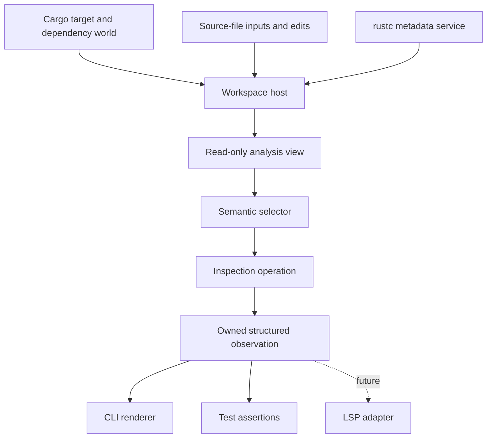

# RFD: Semantic Inspector and Incremental Query Testing

**Status:** Draft

**Depends on:**

- [Architecture](../../design/architecture.md) — the Salsa database, Cargo
  target selection, and rustc metadata boundary
- [Typed IR](../../design/typed-ir.md) — the semantic body the inspector
  presents
- [Resolve at Position](../resolve-at-position/README.md) — source-position
  selection

**Related:**

- [Oracle Test Harness](../../design/oracle-test-harness.md) — independent
  exact conformance testing
- [Trait Impl Candidate Discovery](../trait-impl-candidate-discovery/README.md)
  — a motivating consumer of edit-and-query dependency tests

## TL;DR

- Add a reusable semantic-inspection service over a persistent Sage workspace.
- Provide a `cargo sage inspect` client which can select an item, show readable
  typed IR, run focused semantic operations, and report the queries they
  executed.
- Preserve the same database across source edits so cold, warm, relevant-edit,
  and unrelated-edit behavior can be examined and tested.
- Record stable structured trace events. Raw Salsa debug strings and execution
  order are not the test contract.
- Keep inspection separate from the exact rustc oracle. The inspector helps a
  human understand Sage; it does not weaken or replace conformance checks.
- Put the reusable service below both the CLI and a future LSP adapter. The CLI
  does not need to communicate through LSP.

## Motivation

Sage's architecture is demand-driven, but its behavior is difficult to review
without reading implementation code. A reviewer currently has several partial
tools:

- oracle JSON shows a precise shared conformance value, but is intentionally
  optimized for exact comparison rather than human reading;
- unit tests can call individual queries, but require Rust code and knowledge
  of internal symbol handles;
- `Database::take_query_log()` exposes useful execution evidence, but mixes
  raw Salsa debug keys with handwritten metadata strings; and
- the current `cargo sage` command can print expanded module items, but cannot
  inspect a selected semantic item or retain a workspace across edits.

This makes important architectural claims unnecessarily expensive to check.
For example, a reviewer should be able to ask for
`crate::parse::Parse::next`, inspect its elaborated body, and verify that the
operation read `Iterator::Item` but no unrelated impl value or callee body.
They should then be able to edit an unrelated impl and rerun the same request
against the same Salsa database.

The tool is both an interactive debugger and a test facility. Its output makes
semantic and incremental boundaries observable without making those
observations part of Sage's language semantics.

## Change in a nutshell

The following command syntax is illustrative; exact spelling can be settled
during implementation.

```text
$ cargo sage inspect --package mini-redis
sage> body crate::db::DbDropGuard::db

fn DbDropGuard::db(&self) -> Db {
    <Db as Clone>::clone(&self.db)
}

sage> trace last
selection:
  resolve item crate::db::DbDropGuard::db
analysis:
  execute LocalFnSym::body(crate::db::DbDropGuard::db)
  request trait method Clone::clone
  prove Db: Clone
forbidden observations: none

sage> watch on
watching 9 source files
... edit src/db.rs ...
sage> rerun
```

A noninteractive form supports scripts and snapshot tests:

```text
cargo sage inspect --package mini-redis \
    body crate::parse::Parse::next --trace
```

Both forms call a shared typed service:



The observation contains everything needed for rendering. Rendering it must
not execute additional semantic queries.

### Interaction mockup

An [interactive browser mockup](./mockup.html) explores the first, deliberately
narrower review experience using representative `DbDropGuard::db` data. It
focuses on a single cold execution: search for a symbol, inspect its completed
result, and select the recorded operations to examine their intermediate
structures. The mockup is not connected to Sage and does not claim that every
displayed observation is implemented yet.

The prototype intentionally leaves persistent edits, invalidation explanations,
and revision comparison out of the primary interaction. Those remain later
extensions after the initial execution and its semantic products are
inspectable.

<iframe
  src="./mockup.html"
  title="Semantic Inspector interaction mockup"
  allowfullscreen
  style="width: 100%; height: 900px; border: 1px solid #dbe1dc; border-radius: 8px; background: white;"
></iframe>

Use the [full-page mockup](./mockup.html) when the embedded viewport is too
narrow.

## Detailed plans

### Persistent workspace host

Introduce a host/session abstraction which owns:

- the mutable Sage Salsa database;
- the selected Cargo package and target configuration;
- stable `SourceFile` inputs and their filesystem paths;
- the reachable dependency world and rustc metadata service; and
- a structured trace recorder.

The current `run_sage_with` callback is a one-shot borrowing boundary. It can
remain as a convenience wrapper, but the inspector needs a longer-lived owner
which can mutate inputs between read-only operations. A source edit updates
the existing `SourceFile` input and advances the same database rather than
constructing a fresh workspace.

The design follows a mutable-host/read-only-analysis split:

```text
WorkspaceHost
  apply_source_change(...)
  reload_workspace(...)
  analysis() -> Analysis

Analysis
  select(...)
  inspect(...)
```

The exact Rust ownership mechanism is not pinned by this RFD. An `Analysis`
may borrow the host during a synchronous operation or hold a Salsa snapshot.
The required invariant is that mutations occur through the host between
operations and inspection sees a coherent revision.

The rustc process continues to supply authoritative dependency metadata only.
Ordinary local source edits do not require rustc to type-check the local
crate. Changes to `Cargo.toml`, the lockfile, target selection, enabled
features, build-script outputs, or dependency artifacts may require a
workspace reload and a new metadata service.

Initially, modifying existing source files is sufficient for incremental
experiments. File creation, deletion, or module membership changes may reload
the workspace until source-root membership is represented as a mutable input.
The tool must say when it reloaded; it must not present a reload as
fine-grained reuse.

### Semantic selectors

An inspection begins by resolving a typed selector, not by exposing a raw
Salsa key. Initial selector forms are:

- an absolute semantic item path such as
  `crate::parse::Parse::next`; and
- a source position expressed as a file plus line and column.

The semantic path form covers modules, free items, inherent associated items,
and trait associated items. If a written path does not uniquely identify one
item, selection returns a structured ambiguity with the stable paths and
kinds of the possible items. It does not choose according to source or hash
map order.

Source-position selection builds on the Resolve at Position RFD. Conversion
between byte offsets and LSP's UTF-16 positions belongs at the client
boundary. Both selector forms resolve to the same internal `SelectedItem`;
inspection operations do not care how it was selected.

Stable display paths are user-facing identities. Internal Salsa IDs, arena
pointers, rustc `DefId` debug forms, and process-specific indexes must not be
required in commands or expected output.

### Inspection operations

The first useful operation set is:

| Operation | Result |
|---|---|
| `item` | item kind, path, source location, and owner |
| `signature` | checked semantic signature and predicates |
| `body` | completed elaborated typed IR and diagnostics |
| `impls` | relevant impl candidate identities and completeness |
| `prove` | a trait proof result with `Proven` output |
| `normalize` | an alias-normalization result with `Type` output |
| `trace last` | the structured trace of the preceding operation |
| `rerun` | the same request against the current revision |

`body` returns completed typed IR, not checking temporaries. Method syntax is
therefore shown as its resolved call, adjustments are explicit operations,
and lifetimes follow the existing `Dummy` policy.

`prove` and `normalize` use the solver's public operation boundary. Trait proof
does not expose a selected impl, and normalization is input-only; the CLI must
not invent a caller expected type as part of candidate selection.

The service returns a typed `InspectionResult` or equivalent observation
value. Command parsing, text rendering, and LSP conversion are adapters over
that result. The exact enum layout is deliberately left to implementation so
that it can follow the typed IR and solver APIs already present.

### Human-readable typed IR

The inspector gets a deterministic structural explorer designed for review.
The default body view is an expandable tree which mirrors the completed typed
IR: fields and collection elements are edges, expression variants are nodes,
and every expression displays its semantic type. Selecting a node shows its
complete review properties, including its Rust representation, precise type,
span, resolved definition or field, dispatch form, substitutions, lifetime,
and other variant-specific data. Source-like syntax and raw debug structure are
secondary renderings, not the primary representation.

The explorer and its optional pretty-printers follow these rules:

- names are stable and sufficiently qualified to disambiguate;
- inferred type and generic arguments can be shown without raw allocation
  identities;
- resolved calls identify their dispatch form;
- borrows, dereferences, coercions, and other elaborations are explicit;
- diagnostics are adjacent to the item being inspected; and
- optional verbosity can reveal spans and otherwise noisy substitutions.

This rendering is not the oracle schema. It may omit repetitive information
for readability, but it may not perform new type normalization, candidate
selection, or other semantic computation. The structured observation is
created while the operation trace is active; formatting that observation is a
pure step after the trace has been frozen.

Pretty-printer snapshots test readability and stability. Exact oracle tests
continue to compare independently emitted shared IR by textual identity. A
pretty-printer snapshot passing cannot make an oracle mismatch pass.

### Structured query traces

The trace answers “what work did this request cause?” rather than dumping an
implementation log. Each event records at least:

- a phase: workspace bootstrap, selection, requested analysis, or rendering;
- a source: Salsa execution, Sage semantic lookup, or external metadata;
- a stable operation family; and
- a stable semantic key; and
- its dynamic parent operation, when it ran while servicing another recorded
  operation.

Useful event classes include:

1. **Salsa query request:** one tracked function was requested by its parent.
   Its disposition distinguishes a function body which actually executed from
   a memoized value which was reused. Reuse may include a memo validated in the
   current request or a value already known to be valid for the current
   revision.
2. **Semantic lookup:** a public keyed boundary was requested, such as impl
   candidates for one trait and optional self head.
3. **External metadata:** a typed `TcxDb` operation requested one stable
   external item, impl header, or associated value.

The current raw `Debug` rendering of a Salsa database key is useful diagnostic
data but is not a durable assertion format. The recorder projects supported
query families into stable keys. An optional raw mode may accompany the
structured trace when debugging an unmapped query.

The interactive presentation is a rooted dynamic execution tree. Its root is
the user's inspection request; children are the Salsa queries, semantic
operations, solver work, or metadata reads requested while executing their
parent. This is the tree for one execution, not Salsa's complete persistent
dependency graph. A flat `WillExecute` sequence is insufficient to recover the
tree: the recorder must capture the active parent or use explicit nested Sage
operation spans rather than inferring parentage from adjacent events.

The tree must remain usable for deep executions. Every branch is independently
collapsible, with expand-all and collapse-all actions. The execution pane can
be widened with a draggable divider and promoted to a full-screen focused view;
neither operation reruns semantic work or changes the recorded observation.

Every major inspection panel—including symbol search, source, typed result, IR
tree, selected-node properties, and execution tree—has the same grow/restore
affordance. Growing a panel gives it the full available viewport so deeply
nested or wide structures can be reviewed without changing the inspection
request or executing additional semantic work.

`WillExecute` and `DidValidateMemoizedValue` are useful evidence for executed
and validated queries, respectively, but they are not a complete query-request
API: in particular, an already-verified memo may be returned without either
event describing the fetch. If the selected Salsa version does not expose a
structured fetch hook, the inspector must add explicit request spans around
the stable query families it promises to show (or contribute the required hook
upstream). It must not silently present “no execution event” as proof that no
query was requested.

Test assertions normally normalize the same events as a set or multiset.
Execution order and sibling order are available only as explicit diagnostic
modes; concurrent scheduling order is not a semantic or incremental contract.

Selection and requested analysis remain separate phases so a test can
distinguish the cost of finding an item from the cost of checking it.
Rendering consumes the already-owned observation after the analysis trace is
frozen. A test fails if ordinary rendering needs an unreported semantic query.

### Incremental experiments

An interactive session retains:

- the selector and operation used by `rerun`;
- the last structured result and trace;
- a monotonically increasing workspace revision; and
- whether the latest change was an input update or a full reload.

Watch mode observes relevant workspace files, applies changes to the host, and
marks the previous result stale. It need not execute continuously after every
keystroke: rerunning on an explicit command or after a debounce is sufficient.
What matters is that the same database receives the edit.

The testing API supports the following matrix:

| Run | Expected evidence |
|---|---|
| cold | required queries and metadata reads execute |
| warm | unchanged top-level result is reused |
| relevant edit | affected boundary and downstream consumers execute |
| unrelated edit | an index/lookup may reexecute, but an equal result is backdated and downstream work remains reused |

Assertions operate on structured events. They can require exact event
sets/multisets for a tightly pinned slice, or state required and forbidden
event patterns when incidental setup may grow. Negative assertions such as
“no associated value other than `Iterator::Item`” and “no callee body” are
first-class test cases.

Tests call the shared inspection service directly for speed and control. A
small number of CLI integration snapshots verify command parsing and
rendering. Tests which claim live incrementality must retain one host across
all revisions; reconstructing the host between runs is not valid evidence.

### CLI and future LSP clients

The CLI is the first client because it gives reviewers and tests a short path
to the facility. It supports batch output as well as a simple interactive
session. Machine-readable structured output may be offered in addition to the
default readable text.

The reusable service must not depend on terminal state, Clap types, JSON-RPC,
or LSP position encodings. A future LSP server can own the same host, apply
document changes, and expose custom requests or virtual documents for:

- item signatures and typed bodies;
- solver and impl-candidate inspections; and
- the trace for the most recent inspection request.

For example, an editor could open a read-only `sage-ir:` virtual document for
the selected function. The precise LSP extension is outside this RFD. The CLI
does not need to start or speak to an LSP server; both are adapters over the
same service.

### Failure and incompleteness

The inspector reports unsupported or incomplete analysis as structured data,
including diagnostics and candidate-source completeness where applicable. It
must not turn ambiguity, overflow, an incomplete impl source, or an
unsupported typed-IR node into a plausible-looking completed result.

A selection failure, analysis failure, and workspace reload are distinct
outcomes. Trace output remains available for failed operations when doing so
is safe, because it is often the most useful explanation of the failure.

## Required tests

The first complete CLI slice must include:

- semantic-path selection for a free function and an associated function;
- source-position selection producing the same selected item;
- deterministic readable signature and body snapshots;
- a `DbDropGuard::db` or `Parse::next` body inspection with required and
  forbidden structured trace events;
- cold and unchanged-warm execution in one session;
- a relevant edit and unrelated edit in one session;
- proof that rendering the observation adds no analysis events;
- explicit ambiguity and not-found selector results;
- a test distinguishing an input update from a workspace reload; and
- one batch CLI integration test whose output is backed by the same service
  used in unit tests.

The impl-index edit-invalidation matrix in the Trait Impl Candidate Discovery
RFD remains a separate semantic acceptance suite. This RFD supplies the
recorder and session infrastructure needed to express it.

## Non-goals

- Replacing or relaxing the exact rustc oracle.
- Giving rustc authority to solve Sage trait or normalization goals.
- Defining a stable public protocol for every internal tracked function.
- Treating raw query execution order as a correctness result.
- Building general IDE features such as completion, rename, or diagnostics
  publication.
- Implementing the LSP server or choosing its custom protocol.
- Supporting simultaneous clients or a shared background daemon in the first
  implementation.
- Reload-free handling of every Cargo, build-script, file-membership, or
  dependency change.

## Frequently asked questions

### Why not make the CLI an LSP client?

The useful reusable boundary is semantic inspection, not JSON-RPC. Making the
CLI depend on an LSP server adds process management and protocol concerns to
batch tests, while the server would still need the same typed service. Both
clients should share that service. An LSP-backed remote CLI can be added later
if multi-client workspace sharing becomes valuable.

### Why not print the oracle JSON more nicely?

The oracle schema answers a different question: whether rustc and Sage
independently emit exactly the same conformance value. It intentionally does
not expose Salsa dependencies, candidate completeness, or checking
diagnostics. Reusing it as the inspection model would either make inspection
too limited or tempt the oracle schema to absorb Sage-specific debugging
state.

### Does observing a trace change the trace?

Starting and stopping the recorder is outside semantic queries. Selection and
analysis may execute queries and are recorded in distinct phases. The
inspection result is then converted to a self-contained observation before
the analysis phase closes. Text or protocol rendering is pure. Tests enforce
this non-perturbation rule.

### Are exact trace snapshots required?

Only where the operation has a deliberately closed dependency contract.
Otherwise tests assert stable required and forbidden event patterns, usually
as sets or multisets. This avoids pinning scheduler order or irrelevant
presentation details while still detecting broadened semantic dependencies.

### Which parts are deliberately unspecified?

The final command grammar, terminal UI, exact Rust enum layout, watcher
library, Salsa snapshot ownership mechanism, raw diagnostic format, and future
LSP request names are implementation choices. The host lifetime, coherent
revision boundary, typed inspection service, pure renderer, structured stable
trace, and oracle separation are architectural constraints.

## Implementation

See [Implementation plan and status](./implementation.md).
