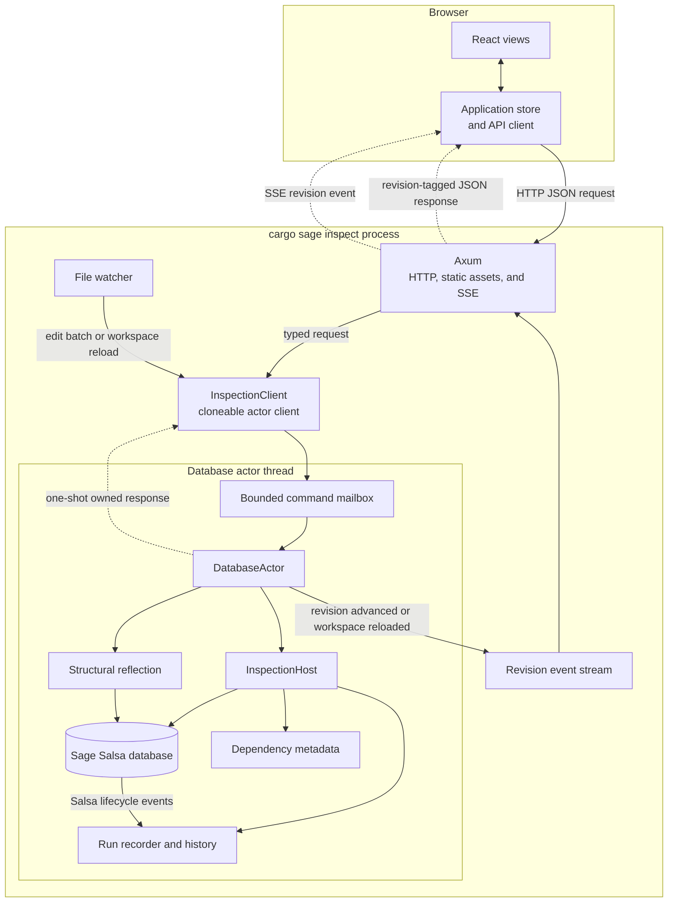
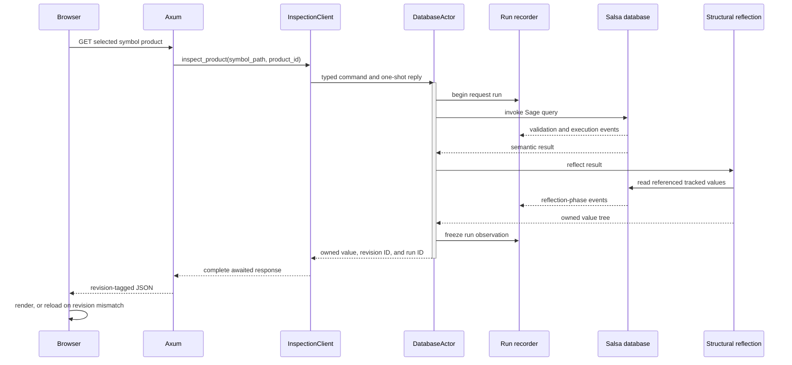

# RFD: Semantic Inspector

**Status:** Draft

**Depends on:**

- [Architecture](../../design/architecture.md) — the Salsa database, Cargo
  target selection, and rustc metadata boundary
- [Typed IR](../../design/typed-ir.md) — the semantic body the inspector
  presents

**Related:**

- [Oracle Test Harness](../../design/oracle-test-harness.md) — independent
  exact conformance testing
- [Trait Impl Candidate Discovery](../trait-impl-candidate-discovery/README.md)
  — a motivating consumer of edit-and-query dependency tests

**Detailed sub-RFDs:**

- [JSON Protocol](./protocol.md) — the normative `/api/v1` routes, DTOs,
  serialization rules, trace projection, and exact fixture format
- [Web Application Walkthrough](./web-application.md) — follows each visible
  part of the mockup through its JavaScript assembly, JSON request, inspection
  service operation, and Sage/Salsa query

## TL;DR

- Add a reusable semantic-inspection service, an Axum backend connected to a
  live Sage database, and a React/TypeScript browser client opened by
  `cargo sage inspect`.
- Browse the selected target's local symbol tree and inspect source concrete
  syntax, expanded concrete IR, signatures, Typed IR, and other supported
  symbol-keyed results on demand.
- Keep the browser generic: it interprets the symbol directory, server-authored
  product pages and rendering trees, execution traces, and revisions without
  branching on Rust symbol kinds or product identifiers.
- Pin the `/api/v1` boundary with reviewed exact JSON fixtures which are
  backend expectations and frontend test inputs.
- Address symbols with canonical backend-authored ownership paths which survive
  a fresh frontend bootstrap and make reflected definitions clickable.
- Keep external symbols out of the workspace tree. They remain reachable from
  semantic references and get a metadata-only view with navigable parents and
  children.
- Record the dynamic query tree, distinguish execution from reuse, retain the
  database across source edits, and support cold/warm and edit-invalidation
  experiments.
- Derive structural reflection for ordinary Rust values, use explicit semantic
  implementations for cross-links and storage projections, and fork Salsa to
  emit balanced spans for every query invocation.
- Retain Salsa revision records which separate input edits from the inspection
  runs actually demanded in that revision, and make repeated work comparable
  across edits.
- Keep inspection separate from the exact rustc oracle. The inspector helps a
  human understand Sage; it does not weaken or replace conformance checks.
- Put the reusable service below the web client and a future LSP adapter.

## Motivation

Sage's architecture is demand-driven, but its behavior is difficult to review
without reading implementation code. A reviewer currently has several partial
tools:

- oracle JSON shows a precise shared conformance value, but is intentionally
  optimized for exact comparison rather than human reading;
- unit tests can call individual queries, but require Rust code and knowledge
  of internal symbol identity;
- `Database::take_query_log()` exposes useful execution evidence, but mixes
  raw Salsa debug keys with handwritten metadata strings; and
- the current `cargo sage` command can print expanded module items, but cannot
  inspect a selected semantic item or retain a workspace across edits.

This makes important architectural claims unnecessarily expensive to check.
For example, a reviewer should be able to find
`crate::parse::Parse::next`, inspect its concrete and elaborated bodies, follow
its `Iterator::Item` and method references into dependency metadata, and
inspect the checked signatures involved without reading Sage's implementation.
The same session should show which queries and metadata reads produced the
result, then permit a source edit and show what executed or was reused.

The tool is both an interactive debugger and a test facility. Semantic results
and incremental-computation evidence are observations of Sage; neither becomes
part of Sage's language semantics.

## Change in a nutshell

The command creates a live Sage database for one selected Cargo target and
starts an Axum loopback server:

```text
$ cargo sage inspect --package mini-redis
Inspecting mini-redis (lib) at http://127.0.0.1:<port>/
```

The browser eagerly fetches one detail-free index of the selected target's
represented local symbols so the complete workspace tree can be searched and
filtered without further requests. Signatures, bodies, external metadata, and
other semantic products remain separate and are fetched only when selected. A
returned observation contains everything needed to render and expand that
product; ordinary client-side rendering must not execute additional semantic
queries. The complete runtime components and message flow appear at the start
of [Destination design](#system-at-a-glance).

### Interaction mockup

An [interactive browser mockup](./mockup.html) uses representative
`DbDropGuard::db` data to show the destination interaction: searching the local
symbol tree, inspecting concrete and typed results, following semantic links
to dependency metadata, and viewing the dynamic execution tree. The mockup is
not connected to Sage; controls for persistent edits and revision comparison
are not yet drawn.

<iframe
  src="./mockup.html"
  title="Semantic Inspector interaction mockup"
  allowfullscreen
  style="width: 100%; height: 900px; border: 1px solid #dbe1dc; border-radius: 8px; background: white;"
></iframe>

Use the [full-page mockup](./mockup.html) when the embedded viewport is too
narrow.

## Destination design

This section describes the complete inspector, independent of the order in
which it is implemented. [Implementation](./implementation.md) inventories all
work required for this destination and then groups it into reviewable slices.

The `SI-A<n>` callouts embedded below are stable **design anchors**. Each
states a load-bearing rule and the evidence required to establish it. The
explanatory text may move or grow without changing an anchor's identity;
changing the rule or its required evidence is an explicit RFD revision.

### System at a glance

The inspector is one local process with two concurrency domains. Axum owns the
asynchronous HTTP and event-stream boundary. A single database actor owns all
mutable semantic state and performs synchronous Sage work serially, away from
Axum's executor. The browser and file watcher reach that state only through a
cloneable `InspectionClient` and its bounded actor mailbox.



The main components have deliberately narrow responsibilities:

- the browser owns navigation, local filtering, and rendering, but no Sage
  semantics;
- Axum owns HTTP decoding, response serialization, embedded assets, and SSE,
  but never accesses the database directly;
- `InspectionClient` is the typed asynchronous facade over the actor mailbox;
- `DatabaseActor` orders reads, edits, and reloads and is the only owner of the
  live `InspectionHost`;
- `InspectionHost` retains the Salsa database, source inputs, dependency
  metadata, canonical-path index, ephemeral trace handles, run recorder, and
  revision history; and
- structural reflection converts database-borrowing semantic values into owned
  protocol values before the actor replies.

One ordinary product request follows this path:



This is a request sequence, not a claim that every product executes new Salsa
work. A current memo may be validated or reused. The recorder must preserve
that distinction, and reflection is included because traversing tracked or
stashed values can itself create observable dependencies. Serialization and
browser rendering begin only after the actor freezes the run.

### Persistent inspection host

One internal database actor owns the `InspectionHost`, including its live Sage
database, selected Cargo target, source inputs, and reachable dependency
metadata, for as long as the server is running. Axum application state holds a
cloneable `InspectionClient`, not the database or a database lock. Each handler
sends a typed message to the actor and awaits its one-shot owned response.

The service boundary is:

```text
Axum handler
  -> InspectionClient
       -> bounded actor mailbox
            -> DatabaseActor
                 -> InspectionHost
                      -> live Sage Database
       <- one-shot owned response
  <- await response
```

The actor runs synchronous analysis away from Axum's asynchronous executor and
processes database messages serially. A semantic request invokes the relevant
inspection operation against the live database, causing ordinary Salsa
validation, recomputation, and event emission. File-watcher edit batches and
workspace reloads are messages to the same actor, so mutation is naturally
ordered against reads.

No value borrowing from the database crosses the actor boundary. The actor
finishes structural reflection and freezes the run observation before replying
with owned protocol values. Mailbox and one-shot channel types, queue capacity,
and private message-enum names remain implementation details.

Every response identifies the coherent database revision from which it was
produced, preventing separately fetched panels from appearing to be one atomic
observation when they are not. An existing `SourceFile` input is updated in
the same database for ordinary edits. Changes to `Cargo.toml`, the lockfile,
target selection, enabled features, build-script outputs, file-set membership,
or dependency artifacts may require an explicit reload. The tool must never
present a reload as fine-grained incremental reuse.

The rustc process supplies authoritative dependency metadata only. It does not
type-check local Sage bodies or solve Sage trait goals.

<a id="si-a1"></a>
> **SI-A1 — One database actor owns the live incremental session.** Axum sends
> typed messages through `InspectionClient`; only the actor owns and accesses
> `InspectionHost`. Ordinary source edits update inputs in that same database.
> Cargo/dependency changes which reconstruct the host are reported as reloads
> and never presented as fine-grained reuse.
>
> **Required verification:** Handler tests prove that Axum uses the client and
> never accesses Sage directly. Cold, warm, relevant-edit, unrelated-edit, and
> reload tests retain and identify the host used for every run.

The complete browser-to-server update and history path, including the
distinction between a filesystem edit batch and the Salsa revisions produced
by its input setters, is defined by the [Web Application
Walkthrough](./web-application.md#8-what-happens-when-source-changes).

### Axum backend and on-demand API

`cargo sage inspect` constructs the inspection host and Axum application in the
same process. The server binds to `127.0.0.1:2442` by default, serves the
frontend's static assets, and exposes a JSON API over the typed inspection
service. A port override supports conflicts and port `0` supports isolated
tests. It does not support a remote bind or source mutation through HTTP.

The API is product-oriented rather than a serialized database dump:

- opening the workspace view requests one complete local `SymbolSummary`
  index, with parent edges and no semantic detail;
- expanding or filtering the local tree is then browser-local;
- selecting a tab requests that symbol's concrete IR, signature, Typed IR, or
  other supported product;
- following a semantic reference requests the destination symbol and its
  product-page list; and
- expanding a reflected product already returned to the browser is local UI
  work, except for an explicit continuation when a bounded collection was
  truncated.

Responses use the same owned observation structures used by service tests.
Every success or error carries the backend's current process-wide revision ID;
successes contain the requested value, while missing data and protocol failures
use structured HTTP errors. Semantic ambiguity, overflow, diagnostics, and
incompleteness remain in their domain-specific values. HTTP handlers do not
implement semantic selection, reflection, or pretty-printing themselves.

<a id="si-a2"></a>
> **SI-A2 — Axum is a transport over typed inspection.** Semantic selection,
> product-catalog construction, reflection, and query execution live in the
> typed database actor. Axum decodes requests, invokes `InspectionClient`,
> awaits an owned result, and serializes it.
>
> **Required verification:** Service tests exercise the same response DTOs as
> Axum contract tests, and handler tests prove that transport code performs no
> independent Sage queries or direct database access.

Navigation references cross the JSON boundary as backend-authored canonical
ownership paths. The frontend treats a path as opaque, but the service can
resolve it to the exact retained local or external identity without reparsing
or ambiguously resolving display text.

The local tool deliberately has no authentication or unguessable session URL.
One process serves one workspace on loopback. Canonical paths provide durable
URL intent within that workspace; continuation and run handles remain
ephemeral implementation details rather than security capabilities.

The concrete resources, common responses, update coordinator, and retained
revision/run records are specified in the [Web Application
Walkthrough](./web-application.md).

<a id="si-a3"></a>
> **SI-A3 — Exact JSON fixtures are the shared client/server contract.** A
> reviewed, versioned API fixture is the exact expected output of backend tests
> and the input of frontend tests. Neither side generates or maintains an
> alternate semantic fixture model.
>
> **Required verification:** Snapbox compares the actual Axum response bytes
> with the reviewed fixture; a strict static fixture server feeds the same
> bytes to browser tests and rejects unexpected requests; a small real-process
> smoke test crosses both implementations.

Every request emits a concise structured audit log to the terminal running
`cargo sage inspect`. Before complete Salsa tracing exists, this records the
request identifier, route family, fixture or live provider, database revision,
status, duration, and useful demand counts such as the number of symbol
summaries returned. It must make unexpected product requests visible without
dumping source text or full observations. Slice 6 enriches this coarse audit
trail with the complete dynamic query tree; it does not retroactively make the
earlier log a complete cache-hit trace.

### React frontend

The frontend is a React and TypeScript application built with Vite, managed by
npm with a committed lockfile, and served by Axum. The production bundle is
embedded in the executable with
`rust-embed`; a frontend development server may proxy to Axum during UI work,
but normal `cargo sage inspect` use starts only the Rust process. React is an
implementation choice made to get the first usable tool running quickly. It
can be replaced without changing the typed inspection service or JSON API.

React Router makes the URL the source of truth for the current semantic view.
Selecting a local or external symbol, changing the selected semantic product,
switching the top-level view, or growing a panel into the viewport creates a
browser-history location as appropriate. Back, Forward, direct loading, and
reload therefore restore that view. Rapidly changing filter text uses replace
rather than creating one history entry per keystroke. Disclosure nodes,
splitter widths, and other transient presentation details remain local state.

The frontend is a generic interpreter of four protocol concepts: the complete
symbol directory, a selected symbol's ordered product descriptors, the generic
rendering-tree vocabulary, and Salsa run/revision records. It eagerly requests
and filters the detail-free local directory, creates tabs directly from each
selected symbol's positive product list, and interprets the returned rendering
tree. Symbol kinds, origin, product identifiers, and Rust concepts may appear
as server-provided labels or reflected data, but they never select JavaScript
behavior. Adding a symbol kind or product whose page uses existing rendering
nodes requires no frontend change.

<a id="si-a4"></a>
> **SI-A4 — The frontend is a generic protocol interpreter.** It understands
> the symbol directory, ordered product descriptors, generic rendering trees,
> execution traces, and revisions. Product tabs come directly from the
> server's positive list; no behavior is keyed to a Rust symbol kind, origin,
> or particular product identifier.
>
> **Required verification:** A dummy-server fixture containing an invented
> symbol kind and product identifier renders without a corresponding
> TypeScript case. Omitting a product produces neither a tab nor a request, and
> local and external symbols use the same generic components.

<a id="si-a5"></a>
> **SI-A5 — The URL is durable intent; response-derived state is disposable.**
> The URL identifies the canonical symbol path, product, top-level view, grown
> panel, and search text. A revision mismatch discards the directory, products,
> and every response-derived cache, bootstraps again, and replays that URL.
> Rapid filter changes replace history; disclosure and sizing remain local.
>
> **Required verification:** Browser tests cover direct load, Back/Forward,
> push-versus-replace, complete state discard and bootstrap on mismatch, URL
> replay, and explicit fallback when the canonical path no longer resolves.

The initial testing stack is Vitest plus React Testing Library and browser
tests against the strict static API-fixture server. Playwright also drives a
small real-process smoke suite against Axum. Those tools are replaceable client
details; the exact API bytes, observable URL, JSON demand, and rendering
contracts are not.

The [Web Application Walkthrough](./web-application.md) maps every mockup view
through its JavaScript and API request to the semantic query which supplies it,
then applies the same model to revision-triggered reload and comparison.

### Structural reflection

Each product returns an owned generic `RenderNode` tree. Layout nodes compose
sections, code excerpts, notices, navigation, and structurally reflected
values; the browser only interprets that vocabulary. The structural
`ValueNode` embedded within it is produced through a `Reflect` trait. Ordinary
structs and enums opt in with a custom derive which recursively exposes their
actual fields and variants. Handwritten implementations are restricted to
explicit semantic projections and infrastructure types such as symbols,
spans, stashed values, sharing, cycles, and truncation.

The structural view is faithful to the inspected Rust value modulo documented
semantic projections and explicit truncation. It uses the actual struct field
names and enum variant payloads and does not replace them with a conceptual
schema. `Option<T>`, `Ptr<T>`, `Slice<T>`, and other wrappers remain visible
nodes; their contained values are recursively inspectable. A `Ptr<Ty>`
therefore expands to the precise `Ty` variant and all of that variant's fields,
and a `Slice<Ptr<Ty>>` expands each element in the same way. Raw addresses and
process-specific allocation indexes are omitted; shared pointees may instead
carry a display-local identity so repetition and cycles remain intelligible.
Storage infrastructure is the other explicit exception: `Stashed<T>` exposes
its semantic `root`, but the backing `Stash` and cached fingerprint are not
part of the inspected language value and may be omitted.

Semantic summaries are additive. For example, a `Ty::Adt` node may show
`DbDropGuard` beside the variant name and make its `Symbol` child navigable,
but it still exposes both tuple fields: the symbol and recursively reflected
type arguments. Source-like signature text is a separate presentation and
cannot stand in for structural fields. Adding a field to `FnSig` or a variant
to `Ty` must either make it appear through the derive or cause an explicit
reflection-coverage test to fail.

A semantic reference is not a string leaf. A custom symbol implementation
emits a dedicated reference node carrying the canonical symbol path and a
separate display label. A containing derived type therefore acquires
cross-links recursively without product-specific code. Targets include local
and external symbols; owner-relative targets such as fields may extend the
same family. The web client must not parse a displayed path and resolve it
again to implement a link.

Reflection is bounded by depth and total node count, preserves truncation as an
explicit node, and cannot invoke additional semantic operations after an
observation is returned. The exact trait and enum names are implementation
choices.

<a id="si-a6"></a>
> **SI-A6 — Reflection is structurally faithful and explicitly bounded.** Rust
> fields, variants, wrappers, and semantic references remain inspectable.
> Documented storage projections and explicit truncation are the only omitted
> structure; readable summaries never replace it.
>
> **Required verification:** Coverage snapshots include every representative
> field and `Ty` variant, semantic reference, shared value, cycle, and
> truncation node, and fail when an unhandled field or variant is added.

<a id="si-a16"></a>
> **SI-A16 — Structural reflection is derive-driven with explicit semantic
> overrides.** Ordinary structs and enums use a custom derive which recursively
> reflects their real fields and variants. Handwritten implementations are
> limited to named semantic or storage projections; every omission or
> replacement of structure is explicit and tested.
>
> **Required verification:** Adding a field or variant to a derived fixture
> automatically exposes it. Nested derived values use custom symbol, span,
> stash, sharing, cycle, and limit implementations; symbol leaves emit
> canonical-path links; and product code never hand-serializes a reflected Sage
> structure.

Structural reflection and server-side rendering-tree assembly occur while the
database is available and are named phases of the recorded inspection run:
expanding interned or stashed semantic values may itself read tracked data,
and those reads are dependencies of the observation. After the owned render
tree is complete, the recorder is frozen. HTTP serialization and browser
interpretation cannot execute Sage work.

<a id="si-a7"></a>
> **SI-A7 — Semantic computation ends before client rendering.** Analysis,
> structural reflection, server-side rendering-tree assembly, serialization,
> and browser interpretation are distinct. The owned render tree is complete
> and the trace is frozen before transport or frontend work begins.
>
> **Required verification:** Trace tests assign database reads to analysis or
> reflection, distinguish pure view assembly, and prove that serialization,
> client interpretation, and client expansion add no semantic events.

### Selecting symbols

The browser eagerly receives the complete detail-free local symbol directory.
Search text stays entirely in JavaScript: the client filters the directory,
presents every matching row, and uses the chosen row's canonical symbol path.
The backend never resolves the user's search string.

External symbols are intentionally absent from the directory. They become
selectable only through canonical paths embedded in reflected semantic
references. Source-position selection is not part of this RFD because the web
application has no interaction which supplies a source position; an eventual
editor-facing client can introduce that operation from a concrete use case.

Sage `Symbol` values remain the internal semantic identities. The protocol
address is a backend-authored canonical path whose segments traverse direct
definition ownership from the selected target or an external-crate root. A
segment carries the stable child key needed to distinguish namespaces,
unnamed impls, generated definitions, and duplicate external crate instances;
it is not merely a name. The frontend stores and returns the serialized path
without understanding its grammar. Display paths remain user-facing labels and
filter text; internal Salsa IDs, arena pointers, and rustc `DefId` debug forms
do not become protocol addresses.

<a id="si-a8"></a>
> **SI-A8 — Canonical symbol paths are durable protocol addresses.** Sage
> symbols remain internal semantic identities. JSON, URLs, revisions, and host
> reconstruction use backend-authored ownership paths which the frontend treats
> as opaque and never reconstructs from a display label.
>
> **Required verification:** Paths round-trip across unrelated edits and host
> reconstruction; sibling insertion or reordering leaves them unchanged;
> namespaces, unnamed impls, generated symbols, and duplicate external crates
> remain distinct; display-label changes do not affect lookup; and a renamed,
> moved, or deleted path fails explicitly rather than resolving approximately.

### Symbol tree and semantic navigation

The main symbol tree contains represented local symbols in the selected Cargo
target, including generated local symbols with expansion provenance. One
symbol-index operation eagerly walks the local module and associated-item
membership needed to return every `SymbolSummary`, its parent edge, and its
provenance. A represented field or associated item may have its own summary,
but the index contains no checked signatures, field types, bodies, associated
values, or external metadata. Expanding and filtering that index is local
browser work. External dependency symbols do not appear in this tree and are
not included in its search count.

<a id="si-a9"></a>
> **SI-A9 — Local discovery is eager but detail-free.** One operation returns
> the complete represented local symbol index. Search and disclosure are then
> browser-local; signatures, field types, bodies, associated values, impl
> candidates, and external metadata remain on demand.
>
> **Required verification:** The index snapshot contains all represented local
> symbols and provenance, while its demand trace forbids every semantic detail
> operation named above.

Signatures, semantic types, concrete and Typed IR, predicates, ownership
relationships, and other inspected structures render every represented symbol
reference as a navigation link. Following a link sends its canonical path to
the backend, which traverses exact ownership edges to recover the semantic
identity, and writes that same path to the current URL.
Navigation provides ordinary browser Back/Forward behavior and a
back-to-selected-local-symbol action so moving through a type or call graph
does not lose the review context.

Local and external identities have different views:

| Property | Local symbol | External symbol |
|---|---|---|
| Appears in workspace tree | yes | no |
| Stable identity and kind | yes | yes |
| Parent and represented children | yes | yes, from keyed metadata |
| Checked signature and predicates | when defined for the kind | when supplied by metadata |
| Source and concrete IR | when represented locally | not listed |
| Completed Typed IR body | for supported local bodies | not listed |

The external view states that it is metadata-backed and lists only the product
tabs it can supply; it does not show empty or disabled source and body tabs.
Its parent and child edges are navigable even when those definitions have
never appeared in the local tree. Unsupported child kinds and incomplete
metadata within an advertised product are reported as such; they are not
silently dropped from a view claiming completeness.

An external page does not synthesize one all-purpose "external node" value.
`SymExt { crate_num, def_index, kind }` is the retained identity. Each visible
semantic product remains a separate, on-demand operation: for example,
`FnSymbol::sig`, `TraitSymbol::sig`, `TraitSymbol::items`, and
`SymExt::expanded_module_items`. Predicates are fields of the corresponding
lowered signature, not a parallel summary invented by the inspector, and
associated items are not embedded into `TraitSignature`. The browser renders
each returned `Option<Stashed<...>>`, binder, slice, symbol wrapper, and nested
type with the same structural-reflection rules as local results.

Navigation edges are inspector values built from canonical paths and semantic
identities; they are not fields added to `SymExt`. Module
membership is the complete result of its keyed metadata query. If the client
bounds a large rendering, it shows an explicit truncation or continuation node
rather than relabelling the visited branch as the query result.

The typed service constructs the selected symbol's product catalog from its
retained identity, origin, kind, declaration shape, available metadata, and
Sage's implementation coverage. It does not request the products to discover
whether to list them. Each entry supplies an opaque identifier, display label,
and URL; the identifier is not a frontend enum.
If the catalog changes before that URL is requested, the backend returns a
structured `product-not-found` error with its current revision ID. Erroneous
Rust, solver ambiguity or overflow, and explicit implementation limits remain
data in the product's render tree. The browser presentation follows
[SI-A4](#si-a4).

<a id="si-a15"></a>
> **SI-A15 — Product lists are positive, narrow, and non-eager.** The typed
> service lists exactly the pages valid for a real symbol, each with an opaque
> identifier, label, and URL. It does not request any listed product merely to
> construct the list, and represents absent pages by omission rather than a
> status entry.
>
> **Required verification:** Catalog snapshots cover representative local and
> external kinds, while demand evidence forbids source, signature, body,
> fields, items, associated-value, and impl-candidate reads not needed to
> construct the selected-symbol summary itself.

### Inspection products

The API distinguishes three resource families:

| Family | Operations or products | Result |
|---|---|---|
| symbol selection | canonical path from the directory or a semantic reference | one selected-symbol summary and positive product list |
| symbol products | opaque server-authored product identifiers | one independently requested generic rendering tree |
| evidence and history | run, continuation, revision, comparison, rerun | retained observations and work records |

Immediate parent identity belongs to the selected-symbol summary; enumerating
fields, items, or other children may be an independent product. Product
identifiers such as `source`, `signature`, or `body` are backend data, not
protocol variants known to the client. A Diagnostics page may reuse the same
checked-body result as a body page, but that relationship remains entirely on
the server. The concrete route and DTO contract is specified in the [JSON
Protocol](./protocol.md).

`body` returns completed typed IR, not checking temporaries. Method syntax is
therefore shown as its resolved call, adjustments are explicit operations,
and lifetimes follow the existing `Dummy` policy.

### Future semantic actions

Interactive impl discovery, trait proof, and alias normalization are useful
future extensions but are not required by this RFD's prototype, protocol, or
acceptance evidence. `SI-A10` is retired and its number is not reused. The
current inspector observes solver operations performed by ordinary Sage
queries; it does not expose separate `impls`, `prove`, or `normalize` routes.

If a later design adds these interactions, the server can place generic action
nodes in a product's render tree. The action must retain its typed input on the
server rather than asking JavaScript to parse display text. It must also use
the existing solver boundaries: proof returns `Proven`, input-only
normalization returns `Type`, and proof does not reveal a selected impl. The
exact action protocol is deliberately not pinned here.

The service returns a typed `InspectionResult` or equivalent observation
value. HTTP, text, test, and future LSP adapters consume that result. The exact
enum layout is deliberately left to implementation so that it can follow the
typed IR and solver APIs already present.

### Human-readable typed IR

The inspector gets a deterministic structural explorer designed for review.
The default body view is an expandable tree which mirrors the completed typed
IR: fields and collection elements are edges, expression variants are nodes,
and every expression displays its semantic type. The complete review detail is
inline in the tree, including the Rust representation, precise type, span,
resolved definition or field, dispatch form, substitutions, lifetime, and
other variant-specific data. Source-like syntax and raw debug structure are
secondary renderings, not the primary representation.

The explorer and its optional pretty-printers follow these rules:

- names are stable and sufficiently qualified to disambiguate;
- symbol-bearing fields remain clickable semantic references rather than
  decorated text;
- inferred type and generic arguments can be shown without raw allocation
  identities;
- every embedded semantic type is an expandable reflected `Ty` tree, not only
  a formatted label attached to its parent;
- resolved calls identify their dispatch form;
- borrows, dereferences, coercions, and other elaborations are explicit;
- diagnostics are adjacent to the item being inspected; and
- optional verbosity can reveal spans and otherwise noisy substitutions.

This rendering is not the oracle schema. It may omit repetitive information
for readability, but it may not perform new type normalization, candidate
selection, or other semantic computation. The service creates a self-contained
structured observation while it can access the database; formatting and
client-side tree expansion operate on that observation without hidden semantic
work.

Pretty-printer snapshots test readability and stability. Exact oracle tests
continue to compare independently emitted shared IR by textual identity. A
pretty-printer snapshot passing cannot make an oracle mismatch pass.

<a id="si-a14"></a>
> **SI-A14 — Inspection evidence cannot weaken conformance.** Inspector JSON,
> reflection snapshots, and navigation transcripts are Sage debugging
> artifacts. Rustc and Sage oracle adapters remain thin and their shared output
> is compared independently by textual identity.
>
> **Required verification:** Inspector adapters are absent from the oracle
> comparison path, and an inspector snapshot cannot update or filter an oracle
> expectation.

### Structured query traces

The trace answers “what work did this request cause?” rather than dumping an
implementation log. Each event records at least:

- a phase: workspace bootstrap, selection, requested analysis, or reflection;
- a source: Salsa execution, Sage semantic lookup, or external metadata;
- a stable operation family; and
- a stable semantic key;
- its dynamic parent operation, when it ran while servicing another recorded
  operation.

Useful event classes include:

1. **Salsa query request:** one tracked function was requested by its parent.
   Its disposition distinguishes a function body which actually executed from
   a memoized value which was reused. Reuse may include a memo validated in the
   current request or a value already known to be valid for the current
   revision.
2. **Semantic lookup:** a public keyed boundary was requested, such as impl
   candidates for one trait and optional self head.
3. **External metadata:** a typed `TcxDb` operation requested one stable
   external item, impl header, or associated value.

The current raw `Debug` rendering of a Salsa database key is useful diagnostic
data but is not a durable assertion format. The recorder projects supported
query families into stable keys. An optional raw mode may accompany the
structured trace when debugging an unmapped query.

<a id="si-a11"></a>
> **SI-A11 — Promised semantic demand is completely observable.** Every
> supported Salsa request, Sage semantic operation, solver operation, and
> external metadata read appears under its dynamic parent with execution,
> validation, or reuse disposition. Unmapped work remains visible through a
> stable fallback category rather than disappearing.
>
> **Required verification:** Tests cover already-current memo fetches, balanced
> request/return parentage, the unmapped fallback, and required and forbidden
> semantic demand.

The interactive presentation is a rooted dynamic execution tree. Its root is
the user's inspection request; children are the Salsa queries, semantic
operations, solver work, or metadata reads requested while executing their
parent. This is the tree for one execution, not Salsa's complete persistent
dependency graph. A flat `WillExecute` sequence is insufficient to recover the
tree.

Sage therefore uses a temporary Salsa fork which creates a balanced tracing
span around every tracked-query invocation, before memo lookup and whether or
not the function body executes. The span records execution, memo validation,
or reuse of an already-current value. Nested queries inherit the invocation
span as their dynamic parent. Sage semantic operations and external metadata
reads create child spans in the same tracing context. Instrumentation is
generated by Salsa; individual Sage query definitions require no annotations.

<a id="si-a17"></a>
> **SI-A17 — Salsa query spans form the execution-tree spine.** The temporary
> Salsa fork emits one balanced span for every tracked-query invocation,
> including memoized requests, and records whether it executed, validated, or
> reused an already-current value. Nested queries, Sage operations, and
> metadata reads preserve dynamic parentage through the same span context.
>
> **Required verification:** Tests cover all three dispositions, nested
> parentage, balanced exit on every termination path, and the absence of
> per-query Sage annotations. Stable ingredient projection and an unmapped
> fallback remain checked; raw Salsa keys remain diagnostic only.

The tree must remain usable for deep executions. Every branch is independently
collapsible, with expand-all and collapse-all actions. The execution pane can
be widened with a draggable divider and promoted to a full-screen focused view;
neither operation reruns semantic work or changes the recorded observation.

Every major inspection panel—including symbol search, source, typed result, IR
tree, and execution tree—has the same grow/restore
affordance. Growing a panel gives it the full available viewport so deeply
nested or wide structures can be reviewed without changing the inspection
request or executing additional semantic work.

`WillExecute` and `DidValidateMemoizedValue` remain useful disposition evidence
inside a span, but neither is a complete query-request API: an already-verified
memo may be returned without either event. The fork's invocation span closes
that gap. It must not silently present “no execution event” as proof that no
query was requested. The fork remains isolated from Sage presentation so the
instrumentation can be upstreamed.

Checked evidence uses a defined deterministic projection. It preserves event
parentage, multiplicity, stable operation families and keys, and disposition.
Each producer marks its child group sequential or unordered. Sequential edges
preserve capture order. Unordered child subtrees are recursively serialized
and byte-sorted with duplicates retained, as specified by the [JSON
protocol](./protocol.md#run-observations-and-traces). Unmapped events use a
stable code-generated ingredient name when available. Raw arrival order,
timing, and implementation-specific Salsa debug keys remain failure artifacts,
not golden output. A trace containing an unknown fallback ingredient cannot
claim a closed exact dependency contract until that family is mapped.

<a id="si-a12"></a>
> **SI-A12 — Exact evidence does not pin non-semantic scheduling.** Reviewed
> transcripts are compared by textual identity after the fixed projection
> above. The projection may omit only fields declared non-contractual here; it
> never adapts to a particular test result.
>
> **Required verification:** Concurrent sibling reorderings leave the checked
> transcript unchanged, while changes to parentage, multiplicity, semantic
> keys, dispositions, or required/forbidden demand fail it.

Selection, requested analysis, and structural reflection remain separate
phases so a test can distinguish the cost of finding an item, checking it, and
turning the returned semantic value into an owned observation. Serialization
and browser rendering consume that observation after the trace is frozen. A
test fails if either needs an unreported semantic query.

### Incremental experiments

An interactive session retains:

- the selector and operation used by `rerun`;
- the last structured result and trace;
- a monotonically increasing workspace revision; and
- whether the latest change was an input update or a full reload.

The destination also retains input deltas and every inspection run under the
Salsa revision in which it occurred. Advancing a revision does not itself run
semantic queries: a revision with no user request or page reload has no
work tree. The revisions view compares edit batches with the work subsequently
executed, validated, or reused without claiming a causal dependency edge that
the recorder did not observe.

Watch mode observes relevant workspace files, applies a debounced change to the
host, and publishes a new process-wide revision ID. The browser reloads its
current semantic URL and refuses to install a response tagged with any other
revision. Reload means a complete frontend bootstrap: discard the old symbol
directory, products, and response-derived caches; fetch the new revision and
directory; then replay the URL's canonical symbol path and product. If that
path no longer resolves, the browser returns to the directory with an explicit
message rather than resolving its display label. What matters for incremental
evidence is that the backend still applies ordinary source edits to the same
database.

<a id="si-a13"></a>
> **SI-A13 — Revisions record edits and demanded work separately.** Advancing
> an input revision does not imply that a query ran. Runs are attached only to
> actual user or reload demand, and a workspace reload receives a new
> process-wide revision ID.
>
> **Required verification:** One retained host demonstrates revisions with
> zero runs, multiple runs in one revision, relevant and unrelated edits, and
> an explicitly recorded workspace-reload boundary.

The testing API supports the following matrix:

| Run | Expected evidence |
|---|---|
| cold | required queries and metadata reads execute |
| warm | unchanged top-level result is reused |
| relevant edit | affected boundary and downstream consumers execute |
| unrelated edit | an index/lookup may reexecute, but an equal result is backdated and downstream work remains reused |

Assertions operate on structured events. They can require exact event
sets/multisets for a tightly pinned slice, or state required and forbidden
event patterns when incidental setup may grow. Negative assertions such as
“no associated value other than `Iterator::Item`” and “no callee body” are
first-class test cases.

The primary browser/backend integration seam is the reviewed fixture bundle
defined by the [JSON protocol](./protocol.md#exact-fixture-bundle). Slice 1 is
frontend-only: a strict dummy server reads the route manifest and exact JSON,
rejects unknown requests, and records expected and forbidden demand. It has no
Rust DTO, Axum, or Sage database and therefore makes no backend claim.

Slice 2 constructs independent typed scripted Rust values, serializes them
through production DTOs and Axum, and uses Snapbox to compare status,
contractual headers, exact pretty-printed JSON bytes, and provider demand with
the bundle. Expected response bytes are never used as the values to serialize.
Volatile data is deterministic at its source through injected revision IDs,
request IDs, and ephemeral handle allocation; snapshots do not redact or
rewrite actual responses. Later slices replace scripted values with real Sage
operations over the Rust source fixture one resource at a time.

From Slice 2 onward, a small real-process suite starts `cargo sage inspect`
with port `0`, waits for its machine-readable application URL, and drives the
embedded application with Playwright. It covers the deployment seam—assets,
bootstrap, URL routing, and one representative semantic navigation—rather
than duplicating the complete frontend suite. Its combined
navigation transcript correlates visible results with server-owned API,
provider, and later Salsa/Sage evidence. `GET run(...)` appears explicitly as
a retained-record request with no semantic work.

Tests which claim live incrementality must retain one host across all
revisions; reconstructing the host between runs is not valid evidence.

### Web and future LSP clients

`cargo sage inspect` starts the Axum backend and embedded React client as one
loopback web application. The browser downloads and searches the detail-free
local symbol index, fetches supported products for the selected identity on
demand, expands returned reflected structures, and follows semantic
references. Tests call the typed service directly; a small Playwright suite
verifies the real-process seam, while the larger browser suite consumes the
same exact API fixture used by Axum contract tests.

The reusable service must not depend on terminal state, Clap types, JSON-RPC,
or LSP position encodings. A future LSP server can own the same host, apply
document changes, and expose custom requests or virtual documents for:

- item signatures and typed bodies;
- solver and impl-candidate inspections; and
- the trace for the most recent inspection request.

For example, an editor could open a read-only `sage-ir:` virtual document for
the selected function. The precise LSP extension is outside this RFD. The web
server does not need to implement or speak LSP; both are adapters over the same
service.

### Failure and incompleteness

The inspector reports unsupported or incomplete semantics in the value where
they belong, including diagnostics, solver ambiguity or overflow, and
candidate-source completeness. It must not turn any of these into a
plausible-looking completed result.

An unresolved canonical path or a request for a product not listed for that
symbol is a structured HTTP error carrying the backend's current revision ID.
An unexpected inspector failure is a server error. A workspace reload advances
the revision ID and causes a complete frontend bootstrap instead of combining
old and new values. A retained `run_id` may still make safe trace output
available for an error.

## End-state acceptance evidence

The completed RFD must include:

- client-side directory filtering and canonical-path selection for a free
  function and an associated function without checking every listed body or
  sending search text to the backend;
- deterministic structural snapshots of concrete IR, a signature, and Typed
  IR for `DbDropGuard::db` or `Parse::next`; these snapshots must expose the
  declaration-shaped `FnCst`/`FnCstData`, recursively reflected `ExprCst` and
  `TypeCst`, `CheckedBody`/`TyBodyData`, and every nested
  `TyExpr { data, ty, span }` rather than a renderer-specific simplification;
- navigation from a Typed IR function or trait reference to an external symbol
  by canonical path, without reparsing its display label;
- separate external-symbol snapshots for `SymExt` identity, a lowered
  signature, and associated or module items, plus parent navigation and
  omission of source/body product tabs; requesting one listed product must not
  read the others;
- navigation from an external child to its parent and back to the original
  local symbol;
- an Axum integration test proving that loading the complete symbol index does
  not request checked signatures, field types, bodies, associated values, or
  external metadata and that selecting a product fetches only that product;
- exact Snapbox comparisons of the actual Axum status, contractual headers,
  JSON bytes, and provider demand against one reviewed API fixture bundle;
- browser tests against a strict static server which serves that same bundle,
  rejects unknown routes, and prove product-tab construction, URL navigation,
  Back/Forward, and routed reload behavior;
- a black-box navigation transcript produced by a real
  `cargo sage inspect` process with port `0`, combining the
  reviewer-visible result with the exact semantic API and provider demand for
  each browser action;
- product-catalog snapshots proving that local and external product lists are
  server-authored and that catalog construction reads none of its products;
- an invented symbol kind and product identifier rendered without a
  corresponding frontend case;
- canonical-path round trips across unrelated edits and host reconstruction,
  including unnamed/generated and duplicate-external cases and explicit
  failure after rename, movement, or deletion;
- one revision ID on every success and error, plus complete client-state
  discard, bootstrap, and URL replay on mismatch;
- derive-coverage snapshots proving ordinary fields and variants appear
  automatically and custom semantic leaves add canonical cross-links without
  product-specific serialization;
- proof that rendering and client-side expansion of an owned observation add
  no semantic operations;
- explicit ambiguity, not-found, invalid-product, truncation, and
  incomplete-child results;
- one representative real-process browser flow across the embedded assets and
  actual Axum boundary;
- a complete structured query tree rooted in balanced Salsa invocation spans,
  covering execution, validation, already-current reuse, nested parentage,
  stable unmapped fallback, and raw diagnostic data retained only as a failure
  artifact;
- cold and unchanged-warm execution in one session;
- relevant and unrelated edits in one session;
- a retained Salsa revision with exact input deltas and no fabricated work
  when no operation was requested;
- automatic bootstrap which discards old state, requests the complete index and
  URL-selected product, and records that work under the new revision;
- comparison of aligned runs across revisions without presenting temporal
  correlation as an unrecorded invalidation edge;
- required and forbidden structured trace events;
- after slice 6, the same navigation transcript enriched with the correlated
  Salsa/Sage operation tree and execution or reuse disposition, rather than a
  separate unconnected trace fixture; and
- a test distinguishing an input update from a workspace reload.

The impl-index edit-invalidation matrix in the Trait Impl Candidate Discovery
RFD remains a separate semantic acceptance suite. This RFD supplies the
recorder and session infrastructure needed to express it.

## Implementation slices

The destination above is one design. Delivery is divided into vertical slices
so each checkpoint produces a reviewer-visible capability and evidence, rather
than landing one architectural layer at a time:

1. **Protocol and fixture-backed UI.** Implement the complete React mockup and
   generic protocol interpreter against the reviewed JSON bundle and a strict
   dummy server. This slice contains no Axum, Rust DTOs, embedded assets,
   inspector command, or Sage database.
2. **Axum transport and embedded application.** Define typed Rust DTOs and a
   reusable service boundary, serve the application from Axum through
   `rust-embed`, and launch it with `cargo sage inspect`. Independent typed
   scripted values must reproduce the reviewed fixture bytes exactly; no live
   Sage semantics are required yet.
3. **Real workspace symbols.** Replace the scripted session and symbol
   resources with a live Sage host and eagerly construct the detail-free local
   symbol index with canonical paths, searched entirely in the browser.
4. **Real selected-symbol products.** Add real source, concrete IR, signature,
   diagnostics, and completed Typed IR products through derive-driven
   structural reflection and generic rendering-tree assembly.
5. **Navigation and metadata.** Navigate canonical local and external symbol
   paths and inspect external products independently.
6. **Salsa event chain and execution tree.** Record the complete dynamic request
   tree from the temporary Salsa fork's invocation spans, including
   execution/reuse, semantic lookups, solver work, and external metadata reads.
7. **Live updates and revision history.** Watch source files, rerun inspections
   in one database, reload the current semantic URL at a new revision, retain
   per-revision edits and runs, compare repeated work, and distinguish input
   updates from workspace reloads.

The complete work inventory, dependencies between workstreams, and per-slice
acceptance checks live in [Implementation](./implementation.md). Slices may be
reordered when implementation evidence warrants it; reordering does not alter
the destination contract or remove work from the inventory.

## Non-goals

- Replacing or relaxing the exact rustc oracle.
- Giving rustc authority to solve Sage trait or normalization goals.
- Defining a stable public protocol for every internal tracked function.
- Treating raw query execution order as a correctness result.
- Building general IDE features such as completion, rename, or diagnostics
  publication.
- Implementing the LSP server or choosing its custom protocol.
- Supporting simultaneous clients or a shared background daemon.
- Reload-free handling of every Cargo, build-script, file-membership, or
  dependency change.

## Frequently asked questions

### Why not make the web application an LSP client?

The useful reusable boundary is semantic inspection, not JSON-RPC. Making the
web application depend on an LSP server adds protocol concerns while the
server would still need the same typed service. Both clients should share that
service. An LSP-backed remote client can be added later if multi-client
workspace sharing becomes valuable.

### Why React rather than Topcoat or a smaller browser framework?

React is the initial implementation choice because its routing, component
testing, browser-testing integration, and familiar state model minimize the
work needed to reach the first usable fixture-backed application. Bundle size
is not a primary concern for a loopback developer tool. Solid and Preact remain
credible replacements if experience with the recursive trees justifies a
different reactivity model.

[Topcoat](https://github.com/tokio-rs/topcoat) was evaluated directly. Its
Rust-first views, procedures, and server-rendered shards are useful, but its
current client runtime has a deliberately small data vocabulary and
client-side navigation remains planned. Its natural HTML-replacement, router,
and companion asset-bundle boundaries also differ from this RFD's Axum JSON
API, browser-owned recursive renderer, and `rust-embed` executable. Adopting it
now would require custom JavaScript in the most important parts of the
inspector or would change durable boundaries merely to select a UI framework.

The choice remains reversible because React code consumes owned JSON
observations and never owns Sage selection, reflection, or query semantics.

### Why not print the oracle JSON more nicely?

The oracle schema answers a different question: whether rustc and Sage
independently emit exactly the same conformance value. It intentionally does
not expose Salsa dependencies, candidate completeness, or checking
diagnostics. Reusing it as the inspection model would either make inspection
too limited or tempt the oracle schema to absorb Sage-specific debugging
state.

### Does observing a trace change the trace?

Starting and stopping the recorder is outside semantic queries. Selection and
analysis may execute queries and are recorded in distinct phases. Structural
reflection then converts the result to a self-contained observation while the
recorder remains active, so any tracked reads it requires are visible in the
reflection phase. The run is frozen before protocol serialization or browser
rendering. Tests enforce this non-perturbation rule.

### Are exact trace snapshots required?

Only where the operation has a deliberately closed dependency contract.
Otherwise tests assert stable required and forbidden event patterns, usually
as sets or multisets. This avoids pinning scheduler order or irrelevant
presentation details while still detecting broadened semantic dependencies.

### Which parts are deliberately unspecified?

Exact internal Rust enum names, component syntax, CSS system, page layout,
actor channel types and capacity, filesystem-watcher crate, raw diagnostic
format, and future LSP request names are implementation choices. React,
TypeScript, Vite, npm, React Router, and the selected testing tools are
provisional implementation choices: they may be replaced without changing the
durable service and protocol contracts. Axum, a database-owning actor reached
through a typed client, one eager detail-free local
symbol index, on-demand JSON semantic products, URL-addressable semantic
views, server-sent revision notifications, canonical symbol paths,
service-authored product-page and rendering trees, a local-only workspace tree,
a navigable external metadata view, coherent result revisions, a typed
inspection service, derive-driven reflection, pure generic client rendering,
complete query-invocation spans, retained revision/run history, and oracle
separation are architectural constraints.

## Implementation

See [Implementation plan and status](./implementation.md).
