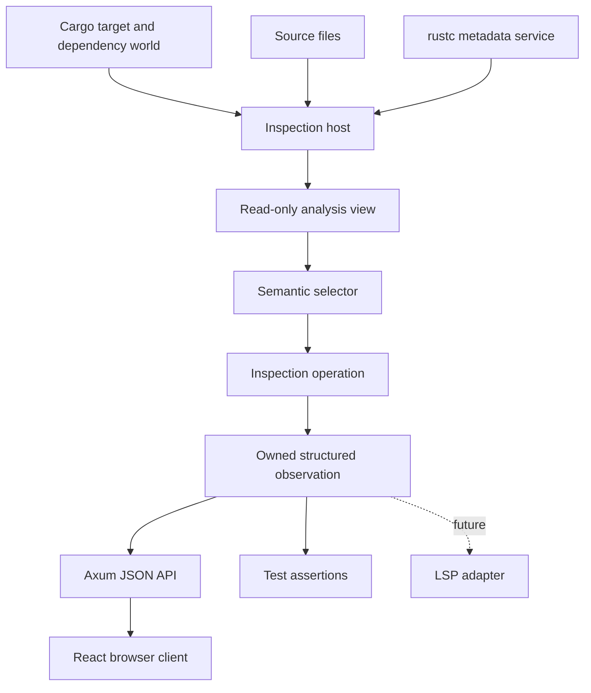

# RFD: Semantic Inspector

**Status:** Draft

**Depends on:**

- [Architecture](../../design/architecture.md) — the Salsa database, Cargo
  target selection, and rustc metadata boundary
- [Typed IR](../../design/typed-ir.md) — the semantic body the inspector
  presents
- [Resolve at Position](../resolve-at-position/README.md) — source-position
  selection

**Related:**

- [Oracle Test Harness](../../design/oracle-test-harness.md) — independent
  exact conformance testing
- [Trait Impl Candidate Discovery](../trait-impl-candidate-discovery/README.md)
  — a motivating consumer of edit-and-query dependency tests

**Detailed sub-RFDs:**

- [JSON Protocol](./protocol.md) — the normative `/api/v1` routes, DTOs,
  serialization rules, trace projection, and exact fixture format
- [Web Application Walkthrough](./web-application.md) — follows each visible
  part of the mockup through its JavaScript assembly, JSON request, inspection
  service operation, and Sage/Salsa query

## TL;DR

- Add a reusable semantic-inspection service, an Axum backend connected to a
  live Sage database, and a React/TypeScript browser client opened by
  `cargo sage inspect`.
- Browse the selected target's local symbol tree and inspect source concrete
  syntax, expanded concrete IR, signatures, Typed IR, and other supported
  symbol-keyed results on demand.
- Have the typed backend advertise a complete product catalog for each selected
  symbol; the browser never infers semantic availability from kind or origin.
- Pin the `/api/v1` boundary with reviewed exact JSON fixtures which are
  backend expectations and frontend test inputs.
- Preserve semantic references in the reflected result so definitions named by
  signatures, types, and Typed IR are clickable navigation targets.
- Keep external symbols out of the workspace tree. They remain reachable from
  semantic references and get a metadata-only view with navigable parents and
  children.
- Record the dynamic query tree, distinguish execution from reuse, retain the
  database across source edits, and support cold/warm and edit-invalidation
  experiments.
- Retain Salsa revision records which separate input edits from the inspection
  runs actually demanded in that revision, and make repeated work comparable
  across edits.
- Keep inspection separate from the exact rustc oracle. The inspector helps a
  human understand Sage; it does not weaken or replace conformance checks.
- Put the reusable service below the web client and a future LSP adapter.

## Motivation

Sage's architecture is demand-driven, but its behavior is difficult to review
without reading implementation code. A reviewer currently has several partial
tools:

- oracle JSON shows a precise shared conformance value, but is intentionally
  optimized for exact comparison rather than human reading;
- unit tests can call individual queries, but require Rust code and knowledge
  of internal symbol handles;
- `Database::take_query_log()` exposes useful execution evidence, but mixes
  raw Salsa debug keys with handwritten metadata strings; and
- the current `cargo sage` command can print expanded module items, but cannot
  inspect a selected semantic item or retain a workspace across edits.

This makes important architectural claims unnecessarily expensive to check.
For example, a reviewer should be able to find
`crate::parse::Parse::next`, inspect its concrete and elaborated bodies, follow
its `Iterator::Item` and method references into dependency metadata, and
inspect the checked signatures involved without reading Sage's implementation.
The same session should show which queries and metadata reads produced the
result, then permit a source edit and show what executed or was reused.

The tool is both an interactive debugger and a test facility. Semantic results
and incremental-computation evidence are observations of Sage; neither becomes
part of Sage's language semantics.

## Change in a nutshell

The command creates a live Sage database for one selected Cargo target and
starts an Axum loopback server:

```text
$ cargo sage inspect --package mini-redis
Inspecting mini-redis (lib) at http://127.0.0.1:<port>/
```

The web application calls a shared typed service:



The browser eagerly fetches one detail-free index of the selected target's
represented local symbols so the complete workspace tree can be searched and
filtered without further requests. Signatures, bodies, external metadata, and
other semantic products remain separate and are fetched only when selected. A
returned observation contains everything needed to render and expand that
product; ordinary client-side rendering must not execute additional semantic
queries.

### Interaction mockup

An [interactive browser mockup](./mockup.html) uses representative
`DbDropGuard::db` data to show the destination interaction: searching the local
symbol tree, inspecting concrete and typed results, following semantic links
to dependency metadata, and viewing the dynamic execution tree. The mockup is
not connected to Sage; controls for persistent edits and revision comparison
are not yet drawn.

<iframe
  src="./mockup.html"
  title="Semantic Inspector interaction mockup"
  allowfullscreen
  style="width: 100%; height: 900px; border: 1px solid #dbe1dc; border-radius: 8px; background: white;"
></iframe>

Use the [full-page mockup](./mockup.html) when the embedded viewport is too
narrow.

## Destination design

This section describes the complete inspector, independent of the order in
which it is implemented. [Implementation](./implementation.md) inventories all
work required for this destination and then groups it into reviewable slices.

The `SI-A<n>` callouts embedded below are stable **design anchors**. Each
states a load-bearing rule and the evidence required to establish it. The
explanatory text may move or grow without changing an anchor's identity;
changing the rule or its required evidence is an explicit RFD revision.

### Persistent inspection host

The host owns one live Sage database, selected Cargo target, source inputs, and
reachable dependency metadata for as long as the Axum server is running. Axum
handlers perform multiple on-demand inspections against that database. The
host watches represented source files, applies ordinary source edits to the
existing database, and reports when a Cargo or dependency change instead
requires a workspace reload.

The service follows an owning-host/read-only-analysis split:

```text
InspectionHost
  analysis() -> Analysis

Analysis
  select(...)
  inspect(...)
```

The exact synchronization mechanism between Axum and the database is not
pinned by this RFD. Sage analysis is synchronous, potentially CPU-intensive
work; handlers must not hold an asynchronous executor thread or an unrelated
lock across an `.await` while analysis runs. An implementation may serialize
requests through a database-owning worker or dispatch analysis as blocking
work. This transport choice stays outside the typed inspection service.

Every response identifies the coherent database revision from which it was
produced, preventing separately fetched panels from appearing to be one atomic
observation when they are not. An existing `SourceFile` input is updated in
the same database for ordinary edits. Changes to `Cargo.toml`, the lockfile,
target selection, enabled features, build-script outputs, file-set membership,
or dependency artifacts may require an explicit reload. The tool must never
present a reload as fine-grained incremental reuse.

The rustc process supplies authoritative dependency metadata only. It does not
type-check local Sage bodies or solve Sage trait goals.

<a id="si-a1"></a>
> **SI-A1 — One live host defines an incremental session.** Ordinary source
> edits update inputs in the same Sage database. Cargo/dependency changes which
> reconstruct the host are reported as reloads and never presented as
> fine-grained reuse.
>
> **Required verification:** Cold, warm, relevant-edit, unrelated-edit, and
> reload tests retain and identify the host used for every run.

The complete browser-to-server update and history path, including the
distinction between a filesystem edit batch and the Salsa revisions produced
by its input setters, is defined by the [Web Application
Walkthrough](./web-application.md#9-what-happens-when-source-changes).

### Axum backend and on-demand API

`cargo sage inspect` constructs the inspection host and Axum application in the
same process. The server binds to loopback, serves the frontend's static assets,
and exposes a JSON API over the typed inspection service. It does not support a
remote bind or source mutation through HTTP.

The API is product-oriented rather than a serialized database dump:

- opening the workspace view requests one complete local `SymbolSummary`
  index, with parent edges and no semantic detail;
- expanding or filtering the local tree is then browser-local;
- selecting a tab requests that symbol's concrete IR, signature, Typed IR, or
  other supported product;
- following a semantic reference requests the destination symbol and its
  availability; and
- expanding a reflected product already returned to the browser is local UI
  work, except for an explicit continuation when a bounded collection was
  truncated.

Responses use the same owned observation structures used by service tests,
with an HTTP envelope for revision and `available`, `unavailable`,
`incomplete`, `failed`, or `cancelled` result status. HTTP status remains a
separate transport fact. HTTP handlers do not implement semantic selection,
reflection, or pretty-printing themselves.

<a id="si-a2"></a>
> **SI-A2 — Axum is a transport over typed inspection.** Semantic selection,
> product availability, reflection, and query execution live in the typed
> inspection service. Axum decodes requests, invokes that service, and
> serializes its owned results.
>
> **Required verification:** Service tests exercise the same response DTOs as
> Axum contract tests, and handler tests prove that transport code performs no
> independent Sage queries.

Navigation references cross the JSON boundary as opaque, session-scoped
handles for typed `NavigationTarget` values. The display path is a label, not
the lookup key. Sending a handle back to Axum recovers the retained local or
external identity without reparsing or ambiguously resolving its text.

Because the API can reveal source and dependency metadata, the server
accepts requests only from its loopback session and does not enable permissive
cross-origin access. The exact session-token and browser-launch mechanics are
implementation choices, but another web origin must not be able to read an
inspector session silently.

The concrete resources, response envelope, update coordinator, and retained
revision/run records are specified in the [Web Application
Walkthrough](./web-application.md).

<a id="si-a3"></a>
> **SI-A3 — Exact JSON fixtures are the shared client/server contract.** A
> reviewed, versioned API fixture is the exact expected output of backend tests
> and the input of frontend tests. Neither side generates or maintains an
> alternate semantic fixture model.
>
> **Required verification:** Snapbox compares the actual Axum response bytes
> with the reviewed fixture; a strict static fixture server feeds the same
> bytes to browser tests and rejects unexpected requests; a small real-process
> smoke test crosses both implementations.

Every request emits a concise structured audit log to the terminal running
`cargo sage inspect`. Before complete Salsa tracing exists, this records the
request identifier, route family, fixture or live provider, database revision,
status, duration, and useful demand counts such as the number of symbol
summaries returned. It must make unexpected product requests visible without
dumping source text or full observations. Slice 6 enriches this coarse audit
trail with the complete dynamic query tree; it does not retroactively make the
earlier log a complete cache-hit trace.

### React frontend

The frontend is a React and TypeScript application built with Vite, managed by
npm with a committed lockfile, and served by Axum. The production bundle is
embedded in the executable with
`rust-embed`; a frontend development server may proxy to Axum during UI work,
but normal `cargo sage inspect` use starts only the Rust process. React is an
implementation choice made to get the first usable tool running quickly. It
can be replaced without changing the typed inspection service or JSON API.

React Router makes the URL the source of truth for the current semantic view.
Selecting a local or external symbol, changing the selected semantic product,
switching the top-level view, or growing a panel into the viewport creates a
browser-history location as appropriate. Back, Forward, direct loading, and
reload therefore restore that view. Rapidly changing filter text uses replace
rather than creating one history entry per keystroke. Disclosure nodes,
splitter widths, and other transient presentation details remain local state.

The frontend eagerly requests the complete local symbol-summary index, then
filters and expands that detail-free tree locally. It requests semantic
products only when the user asks to see them, caches responses for their
reported revision, and renders unavailable or incomplete status explicitly.
It contains no Sage semantic logic and never infers a symbol identity from
display text.

<a id="si-a4"></a>
> **SI-A4 — Product availability is server-authored.** A selected-symbol
> response contains a complete, revision-tagged product catalog. The client
> renders, disables, or omits views from `available`, `unavailable(reason)`,
> and `not-applicable` entries; it never derives semantic availability from a
> symbol's kind, origin, display text, or an empty product value.
>
> **Required verification:** Dummy-server browser tests cover representative
> local and external catalogs and prove that an unavailable body is not
> requested.

<a id="si-a5"></a>
> **SI-A5 — The URL identifies the current semantic view.** Selection, active
> product, top-level view, grown panel, and search text survive reload and
> browser navigation. Rapid filter changes replace history; disclosure and
> sizing state remain local.
>
> **Required verification:** Browser tests cover direct load, reload,
> Back/Forward, and push-versus-replace behavior.

The initial testing stack is Vitest plus React Testing Library and browser
tests against the strict static API-fixture server. Playwright also drives a
small real-process smoke suite against Axum. Those tools are replaceable client
details; the exact API bytes, observable URL, JSON demand, and rendering
contracts are not.

The [Web Application Walkthrough](./web-application.md) maps every mockup view
through its JavaScript and API request to the semantic query which supplies it,
then applies the same model to automatic refresh and revision comparison.

### Structural reflection

Inspection values are projected into an owned, renderer-neutral tree rather
than formatted independently by every panel. Records, enum variants,
sequences, scalar leaves, optional values, and bounded or truncated subtrees
have explicit representations. A derive handles ordinary structure; semantic
implementations give symbols, names, and spans stable readable forms and add
summaries to recursively reflected types.

The structural view is faithful to the inspected Rust value modulo documented
semantic projections and explicit truncation. It uses the actual struct field
names and enum variant payloads and does not replace them with a conceptual
schema. `Option<T>`, `Ptr<T>`, `Slice<T>`, and other wrappers remain visible
nodes; their contained values are recursively inspectable. A `Ptr<Ty>`
therefore expands to the precise `Ty` variant and all of that variant's fields,
and a `Slice<Ptr<Ty>>` expands each element in the same way. Raw addresses and
process-specific allocation indexes are omitted; shared pointees may instead
carry a display-local identity so repetition and cycles remain intelligible.
Storage infrastructure is the other explicit exception: `Stashed<T>` exposes
its semantic `root`, but the backing `Stash` and cached fingerprint are not
part of the inspected language value and may be omitted.

Semantic summaries are additive. For example, a `Ty::Adt` node may show
`DbDropGuard` beside the variant name and make its `Symbol` child navigable,
but it still exposes both tuple fields: the symbol and recursively reflected
type arguments. Source-like signature text is a separate presentation and
cannot stand in for structural fields. Adding a field to `FnSig` or a variant
to `Ty` must either make it appear through the derive or cause an explicit
reflection-coverage test to fail.

A semantic reference is not a string leaf. The reflected tree retains a
dedicated reference node carrying the actual navigation target and a separate
display label. Targets include local and external symbols; owner-relative
targets such as fields may extend the same family. The web
client must not parse a displayed path and resolve it again to implement a
link.

Reflection is bounded by depth and total node count, preserves truncation as an
explicit node, and cannot invoke additional semantic operations after an
observation is returned. The exact trait and enum names are implementation
choices.

<a id="si-a6"></a>
> **SI-A6 — Reflection is structurally faithful and explicitly bounded.** Rust
> fields, variants, wrappers, and semantic references remain inspectable.
> Documented storage projections and explicit truncation are the only omitted
> structure; readable summaries never replace it.
>
> **Required verification:** Coverage snapshots include every representative
> field and `Ty` variant, semantic reference, shared value, cycle, and
> truncation node, and fail when an unhandled field or variant is added.

Structural reflection occurs while the database is available and is a named
phase of the recorded inspection run: expanding interned or stashed semantic
values may itself read tracked data, and those reads are dependencies of the
observation. After reflection completes, the recorder is frozen. HTTP
serialization, pretty-printing, and browser rendering consume only the owned
observation and cannot execute Sage work.

<a id="si-a7"></a>
> **SI-A7 — Analysis, reflection, and rendering are distinct.** Analysis and
> structural reflection are recorded server work. Transport serialization and
> browser rendering occur after the observation and trace are frozen.
>
> **Required verification:** Trace tests assign reflection reads to the
> reflection phase, while serialization and client expansion add no semantic
> events.

### Semantic selectors

An inspection begins by resolving a typed selector, not by exposing a raw
Salsa key. Selector forms are:

- an absolute semantic item path such as
  `crate::parse::Parse::next`; and
- a source position expressed as a file plus line and column.

The semantic path form covers modules, free items, inherent associated items,
and trait associated items. If a written path does not uniquely identify one
item, selection returns a structured ambiguity with the stable paths and
kinds of the possible items. It does not choose according to source or hash
map order.

The browser supports selection from the local symbol tree, by absolute
semantic path, and by source position. Source-position selection follows the
Resolve at Position RFD. Conversion between byte offsets and LSP's UTF-16
positions belongs at the client boundary. All selector forms resolve to the
same internal `SelectedItem`; inspection operations do not care how it was
selected.

Stable display paths are user-facing designators. Internal Salsa IDs, arena
pointers, rustc `DefId` debug forms, and process-specific indexes must not be
required in commands or expected output.

<a id="si-a8"></a>
> **SI-A8 — Semantic identity is retained, not reconstructed from labels.**
> Paths and labels help users select and understand definitions; all subsequent
> navigation and operation inputs use opaque session handles for retained typed
> identities.
>
> **Required verification:** Changing a display label leaves the selected
> symbol unchanged, and expired handles fail rather than being reparsed.

### Symbol tree and semantic navigation

The main symbol tree contains represented local symbols in the selected Cargo
target, including generated local symbols with expansion provenance. One
symbol-index operation eagerly walks the local module and associated-item
membership needed to return every `SymbolSummary`, its parent edge, and its
provenance. A represented field or associated item may have its own summary,
but the index contains no checked signatures, field types, bodies, associated
values, or external metadata. Expanding and filtering that index is local
browser work. External dependency symbols do not appear in this tree and are
not included in its search count.

<a id="si-a9"></a>
> **SI-A9 — Local discovery is eager but detail-free.** One operation returns
> the complete represented local symbol index. Search and disclosure are then
> browser-local; signatures, field types, bodies, associated values, impl
> candidates, and external metadata remain on demand.
>
> **Required verification:** The index snapshot contains all represented local
> symbols and provenance, while its demand trace forbids every semantic detail
> operation named above.

Signatures, semantic types, concrete and Typed IR, predicates, ownership
relationships, and other inspected structures render every represented symbol
reference as a navigation link. Following a link selects the retained semantic
identity directly and writes its session-scoped handle to the current URL.
Navigation provides ordinary browser Back/Forward behavior and a
back-to-selected-local-symbol action so moving through a type or call graph
does not lose the review context.

Local and external identities have different views:

| Property | Local symbol | External symbol |
|---|---|---|
| Appears in workspace tree | yes | no |
| Stable identity and kind | yes | yes |
| Parent and represented children | yes | yes, from keyed metadata |
| Checked signature and predicates | when defined for the kind | when supplied by metadata |
| Source and concrete IR | when represented locally | unavailable |
| Completed Typed IR body | for supported local bodies | unavailable |

The external view states that it is metadata-backed and shows unavailable
products explicitly rather than presenting empty source or body panels. Its
parent and child edges are navigable even when those definitions have never
appeared in the local tree. Unsupported child kinds and incomplete metadata
are reported as such; they are not silently dropped from a view claiming
completeness.

An external page does not synthesize one all-purpose "external node" value.
`SymExt { crate_num, def_index, kind }` is the retained identity. Each visible
semantic product remains a separate, on-demand operation: for example,
`FnSymbol::sig`, `TraitSymbol::sig`, `TraitSymbol::items`, and
`SymExt::expanded_module_items`. Predicates are fields of the corresponding
lowered signature, not a parallel summary invented by the inspector, and
associated items are not embedded into `TraitSignature`. The browser renders
each returned `Option<Stashed<...>>`, binder, slice, symbol wrapper, and nested
type with the same structural-reflection rules as local results.

Navigation edges are inspector values built from retained identities and the
path by which the user arrived; they are not fields added to `SymExt`. Module
membership is the complete result of its keyed metadata query. If the client
bounds a large rendering, it shows an explicit truncation or continuation node
rather than relabelling the visited branch as the query result.

The typed service constructs the selected symbol's product catalog from its
retained identity, origin, kind, declaration shape, available metadata, and
Sage's implementation coverage. It does not request the products to discover
whether requesting them is meaningful. `available` means that the operation is
supported, not that a later request is guaranteed to complete: an available
product request can still return incomplete, failed, or cancelled after an
edit or when analyzing erroneous input. The browser presentation follows
[SI-A4](#si-a4).

<a id="si-a15"></a>
> **SI-A15 — Semantic product catalogs are narrow and non-eager.** The typed
> service derives a real symbol's catalog from retained identity, origin, kind,
> declaration shape, metadata capabilities, and implementation coverage. It
> does not request any advertised product merely to decide availability.
>
> **Required verification:** Catalog snapshots cover representative local and
> external kinds, while demand evidence forbids source, signature, body,
> fields, items, associated-value, and impl-candidate reads not needed to
> construct the selected-symbol summary itself.

### Inspection operations

The API distinguishes four resource families:

| Family | Operations or products | Result |
|---|---|---|
| selection | path, source position, retained symbol handle | one selected-symbol summary and product catalog |
| symbol products | source, concrete, signature, body, fields, items | one independently requested reflected semantic value |
| focused operations | `impls`, `prove`, `normalize` | candidate identities and completeness, `Proven`, or `Type` |
| evidence and history | run, continuation, revision, comparison, rerun | retained observations and work records |

Diagnostics are a view of the body product, not another Sage query. Immediate
parent identity belongs to the selected-symbol summary; enumerating fields,
items, or other children is an independent product. The concrete route and DTO
contract for every family is specified in the [JSON
Protocol](./protocol.md).

`body` returns completed typed IR, not checking temporaries. Method syntax is
therefore shown as its resolved call, adjustments are explicit operations,
and lifetimes follow the existing `Dummy` policy.

`prove` and `normalize` use the solver's public operation boundary. Trait proof
does not expose a selected impl, and normalization is input-only; the inspector
must not invent a caller expected type as part of candidate selection.

Focused operations receive opaque, typed operation-target handles emitted by
eligible reflected nodes. The browser does not construct a trait goal or alias
type by parsing display text. A later free-form query editor may mint the same
typed targets through a server-side parser, but that is not required here.

<a id="si-a10"></a>
> **SI-A10 — Focused operations preserve typed inputs and solver boundaries.**
> Reflected trait, goal, alias, and self-type nodes carry opaque operation
> targets. `impls`, `prove`, and input-only `normalize` accept those targets;
> proof does not reveal a selected impl and normalization has no expected-type
> input.
>
> **Required verification:** Exact request snapshots contain only retained
> typed handles, and service/query traces prove the public impl and solver
> boundaries were used without extra caller inputs.

The service returns a typed `InspectionResult` or equivalent observation
value. HTTP, text, test, and future LSP adapters consume that result. The exact
enum layout is deliberately left to implementation so that it can follow the
typed IR and solver APIs already present.

### Human-readable typed IR

The inspector gets a deterministic structural explorer designed for review.
The default body view is an expandable tree which mirrors the completed typed
IR: fields and collection elements are edges, expression variants are nodes,
and every expression displays its semantic type. The complete review detail is
inline in the tree, including the Rust representation, precise type, span,
resolved definition or field, dispatch form, substitutions, lifetime, and
other variant-specific data. Source-like syntax and raw debug structure are
secondary renderings, not the primary representation.

The explorer and its optional pretty-printers follow these rules:

- names are stable and sufficiently qualified to disambiguate;
- symbol-bearing fields remain clickable semantic references rather than
  decorated text;
- inferred type and generic arguments can be shown without raw allocation
  identities;
- every embedded semantic type is an expandable reflected `Ty` tree, not only
  a formatted label attached to its parent;
- resolved calls identify their dispatch form;
- borrows, dereferences, coercions, and other elaborations are explicit;
- diagnostics are adjacent to the item being inspected; and
- optional verbosity can reveal spans and otherwise noisy substitutions.

This rendering is not the oracle schema. It may omit repetitive information
for readability, but it may not perform new type normalization, candidate
selection, or other semantic computation. The service creates a self-contained
structured observation while it can access the database; formatting and
client-side tree expansion operate on that observation without hidden semantic
work.

Pretty-printer snapshots test readability and stability. Exact oracle tests
continue to compare independently emitted shared IR by textual identity. A
pretty-printer snapshot passing cannot make an oracle mismatch pass.

<a id="si-a14"></a>
> **SI-A14 — Inspection evidence cannot weaken conformance.** Inspector JSON,
> reflection snapshots, and navigation transcripts are Sage debugging
> artifacts. Rustc and Sage oracle adapters remain thin and their shared output
> is compared independently by textual identity.
>
> **Required verification:** Inspector adapters are absent from the oracle
> comparison path, and an inspector snapshot cannot update or filter an oracle
> expectation.

### Structured query traces

The trace answers “what work did this request cause?” rather than dumping an
implementation log. Each event records at least:

- a phase: workspace bootstrap, selection, requested analysis, or reflection;
- a source: Salsa execution, Sage semantic lookup, or external metadata;
- a stable operation family; and
- a stable semantic key;
- its dynamic parent operation, when it ran while servicing another recorded
  operation.

Useful event classes include:

1. **Salsa query request:** one tracked function was requested by its parent.
   Its disposition distinguishes a function body which actually executed from
   a memoized value which was reused. Reuse may include a memo validated in the
   current request or a value already known to be valid for the current
   revision.
2. **Semantic lookup:** a public keyed boundary was requested, such as impl
   candidates for one trait and optional self head.
3. **External metadata:** a typed `TcxDb` operation requested one stable
   external item, impl header, or associated value.

The current raw `Debug` rendering of a Salsa database key is useful diagnostic
data but is not a durable assertion format. The recorder projects supported
query families into stable keys. An optional raw mode may accompany the
structured trace when debugging an unmapped query.

<a id="si-a11"></a>
> **SI-A11 — Promised semantic demand is completely observable.** Every
> supported Salsa request, Sage semantic operation, solver operation, and
> external metadata read appears under its dynamic parent with execution,
> validation, or reuse disposition. Unmapped work remains visible through a
> stable fallback category rather than disappearing.
>
> **Required verification:** Tests cover already-current memo fetches, balanced
> request/return parentage, the unmapped fallback, and required and forbidden
> semantic demand.

The interactive presentation is a rooted dynamic execution tree. Its root is
the user's inspection request; children are the Salsa queries, semantic
operations, solver work, or metadata reads requested while executing their
parent. This is the tree for one execution, not Salsa's complete persistent
dependency graph. A flat `WillExecute` sequence is insufficient to recover the
tree: the recorder must capture the active parent or use explicit nested Sage
operation spans rather than inferring parentage from adjacent events.

The tree must remain usable for deep executions. Every branch is independently
collapsible, with expand-all and collapse-all actions. The execution pane can
be widened with a draggable divider and promoted to a full-screen focused view;
neither operation reruns semantic work or changes the recorded observation.

Every major inspection panel—including symbol search, source, typed result, IR
tree, and execution tree—has the same grow/restore
affordance. Growing a panel gives it the full available viewport so deeply
nested or wide structures can be reviewed without changing the inspection
request or executing additional semantic work.

`WillExecute` and `DidValidateMemoizedValue` are useful evidence for executed
and validated queries, respectively, but they are not a complete query-request
API: in particular, an already-verified memo may be returned without either
event describing the fetch. If the selected Salsa version does not expose a
structured fetch hook, the inspector must add explicit request spans around
the stable query families it promises to show (or contribute the required hook
upstream). It must not silently present “no execution event” as proof that no
query was requested.

Checked evidence uses a defined deterministic projection. It preserves event
parentage, multiplicity, stable operation families and keys, and disposition.
Each producer marks its child group sequential or unordered. Sequential edges
preserve capture order. Unordered child subtrees are recursively serialized
and byte-sorted with duplicates retained, as specified by the [JSON
protocol](./protocol.md#run-observations-and-traces). Unmapped events use a
stable code-generated ingredient name when available. Raw arrival order,
timing, and implementation-specific Salsa debug keys remain failure artifacts,
not golden output. A trace containing an unknown fallback ingredient cannot
claim a closed exact dependency contract until that family is mapped.

<a id="si-a12"></a>
> **SI-A12 — Exact evidence does not pin non-semantic scheduling.** Reviewed
> transcripts are compared by textual identity after the fixed projection
> above. The projection may omit only fields declared non-contractual here; it
> never adapts to a particular test result.
>
> **Required verification:** Concurrent sibling reorderings leave the checked
> transcript unchanged, while changes to parentage, multiplicity, semantic
> keys, dispositions, or required/forbidden demand fail it.

Selection, requested analysis, and structural reflection remain separate
phases so a test can distinguish the cost of finding an item, checking it, and
turning the returned semantic value into an owned observation. Serialization
and browser rendering consume that observation after the trace is frozen. A
test fails if either needs an unreported semantic query.

### Incremental experiments

An interactive session retains:

- the selector and operation used by `rerun`;
- the last structured result and trace;
- a monotonically increasing workspace revision; and
- whether the latest change was an input update or a full reload.

The destination also retains input deltas and every inspection run under the
Salsa revision in which it occurred. Advancing a revision does not itself run
semantic queries: a revision with no user request or automatic refresh has no
work tree. The revisions view compares edit batches with the work subsequently
executed, validated, or reused without claiming a causal dependency edge that
the recorder did not observe.

Watch mode observes relevant workspace files, applies changes to the host, and
marks the previous result stale. It need not execute continuously after every
keystroke: rerunning on an explicit command or after a debounce is sufficient.
What matters is that the same database receives the edit.

<a id="si-a13"></a>
> **SI-A13 — Revisions record edits and demanded work separately.** Advancing
> an input revision does not imply that a query ran. Runs are attached only to
> actual user or visible-refresh demand, and a workspace reload starts a new
> database epoch.
>
> **Required verification:** One retained host demonstrates revisions with
> zero runs, multiple runs in one revision, relevant and unrelated edits, and
> an explicitly separate reload epoch.

The testing API supports the following matrix:

| Run | Expected evidence |
|---|---|
| cold | required queries and metadata reads execute |
| warm | unchanged top-level result is reused |
| relevant edit | affected boundary and downstream consumers execute |
| unrelated edit | an index/lookup may reexecute, but an equal result is backdated and downstream work remains reused |

Assertions operate on structured events. They can require exact event
sets/multisets for a tightly pinned slice, or state required and forbidden
event patterns when incidental setup may grow. Negative assertions such as
“no associated value other than `Iterator::Item`” and “no callee body” are
first-class test cases.

The primary browser/backend integration seam is the reviewed fixture bundle
defined by the [JSON protocol](./protocol.md#exact-fixture-bundle). Slice 1 is
frontend-only: a strict dummy server reads the route manifest and exact JSON,
rejects unknown requests, and records expected and forbidden demand. It has no
Rust DTO, Axum, or Sage database and therefore makes no backend claim.

Slice 2 constructs independent typed scripted Rust values, serializes them
through production DTOs and Axum, and uses Snapbox to compare status,
contractual headers, exact pretty-printed JSON bytes, and provider demand with
the bundle. Expected response bytes are never used as the values to serialize.
Volatile data is deterministic at its source through injected test epochs,
revisions, request IDs, and handle allocation; snapshots do not redact or
rewrite actual responses. Later slices replace scripted values with real Sage
operations over the Rust source fixture one resource at a time.

From Slice 2 onward, a small real-process suite starts `cargo sage inspect` on
`127.0.0.1:0`, waits for its machine-readable session URL, and drives the
embedded application with Playwright. It covers the deployment seam—assets,
session setup, security headers, URL routing, and one representative semantic
navigation—rather than duplicating the complete frontend suite. Its combined
navigation transcript correlates visible results with server-owned API,
provider, and later Salsa/Sage evidence. `GET run(...)` appears explicitly as
a retained-record request with no semantic work.

Tests which claim live incrementality must retain one host across all
revisions; reconstructing the host between runs is not valid evidence.

### Web and future LSP clients

`cargo sage inspect` starts the Axum backend and embedded React client as one
loopback web application. The browser downloads and searches the detail-free
local symbol index, fetches supported products for the selected identity on
demand, expands returned reflected structures, and follows semantic
references. Tests call the typed service directly; a small Playwright suite
verifies the real-process seam, while the larger browser suite consumes the
same exact API fixture used by Axum contract tests.

The reusable service must not depend on terminal state, Clap types, JSON-RPC,
or LSP position encodings. A future LSP server can own the same host, apply
document changes, and expose custom requests or virtual documents for:

- item signatures and typed bodies;
- solver and impl-candidate inspections; and
- the trace for the most recent inspection request.

For example, an editor could open a read-only `sage-ir:` virtual document for
the selected function. The precise LSP extension is outside this RFD. The web
server does not need to implement or speak LSP; both are adapters over the same
service.

### Failure and incompleteness

The inspector reports unsupported or incomplete analysis as structured data,
including diagnostics and candidate-source completeness where applicable. It
must not turn ambiguity, overflow, an incomplete impl source, or an
unsupported typed-IR node into a plausible-looking completed result.

A selection failure, unavailable product, analysis failure, and workspace
reload are distinct outcomes. Trace output remains available for failed
operations when doing so is safe.

## End-state acceptance evidence

The completed RFD must include:

- local-tree and semantic-path selection for a free function and an associated
  function without checking every listed body;
- deterministic structural snapshots of concrete IR, a signature, and Typed
  IR for `DbDropGuard::db` or `Parse::next`; these snapshots must expose the
  declaration-shaped `FnCst`/`FnCstData`, recursively reflected `ExprCst` and
  `TypeCst`, `CheckedBody`/`TyBodyData`, and every nested
  `TyExpr { data, ty, span }` rather than a renderer-specific simplification;
- navigation from a Typed IR function or trait reference to an external symbol
  by retained identity, without reparsing its display path;
- separate external-symbol snapshots for `SymExt` identity, a lowered
  signature, and associated or module items, plus parent navigation and
  explicit source/body unavailability; requesting one product must not read
  the others;
- navigation from an external child to its parent and back to the original
  local symbol;
- an Axum integration test proving that loading the complete symbol index does
  not request checked signatures, field types, bodies, associated values, or
  external metadata and that selecting a product fetches only that product;
- exact Snapbox comparisons of the actual Axum status, contractual headers,
  JSON bytes, and provider demand against one reviewed API fixture bundle;
- browser tests against a strict static server which serves that same bundle,
  rejects unknown routes, and prove product availability, URL navigation,
  Back/Forward, and routed reload behavior;
- a black-box navigation transcript produced by a real
  `cargo sage inspect` process on a random loopback port, combining the
  reviewer-visible result with the exact semantic API and provider demand for
  each browser action;
- product-catalog snapshots proving that local and external availability is
  server-authored and that catalog construction reads none of its products;
- round-trip navigation through an opaque session handle, including proof that
  changing its display label does not change the selected identity;
- coherent revision identifiers on independently fetched products;
- proof that rendering and client-side expansion of an owned observation add
  no semantic operations;
- explicit ambiguity, not-found, unavailable-product, truncation, and
  incomplete-child results;
- one representative real-process browser flow across the embedded assets and
  actual Axum boundary;
- a complete structured query tree with stable unmapped fallback and raw
  diagnostic data retained only as a failure artifact;
- cold and unchanged-warm execution in one session;
- relevant and unrelated edits in one session;
- a retained Salsa revision with exact input deltas and no fabricated work
  when no operation was requested;
- automatic refresh which requests only visible demand and records that work
  under the new revision;
- comparison of aligned runs across revisions without presenting temporal
  correlation as an unrecorded invalidation edge;
- required and forbidden structured trace events;
- after slice 6, the same navigation transcript enriched with the correlated
  Salsa/Sage operation tree and execution or reuse disposition, rather than a
  separate unconnected trace fixture; and
- a test distinguishing an input update from a workspace reload.

The impl-index edit-invalidation matrix in the Trait Impl Candidate Discovery
RFD remains a separate semantic acceptance suite. This RFD supplies the
recorder and session infrastructure needed to express it.

## Implementation slices

The destination above is one design. Delivery is divided into vertical slices
so each checkpoint produces a reviewer-visible capability and evidence, rather
than landing one architectural layer at a time:

1. **Protocol and fixture-backed UI.** Implement the complete React mockup and
   URL navigation against the reviewed JSON bundle and a strict dummy server.
   This slice contains no Axum, Rust DTOs, embedded assets, inspector command,
   or Sage database.
2. **Axum transport and embedded application.** Define typed Rust DTOs and a
   reusable service boundary, serve the application from Axum through
   `rust-embed`, and launch it with `cargo sage inspect`. Independent typed
   scripted values must reproduce the reviewed fixture bytes exactly; no live
   Sage semantics are required yet.
3. **Real workspace symbols.** Replace the scripted session and symbol
   resources with a live Sage host and eagerly construct the detail-free local
   symbol index. Implement absolute-path selection against those real handles.
4. **Real selected-symbol products.** Add real source, concrete IR, signature,
   diagnostics, and completed Typed IR products through structural reflection,
   and adapt source-position selection to `SelectedItem`.
5. **Navigation, metadata, and focused operations.** Navigate retained local
   and external identities, inspect external products independently, and add
   focused impl, `prove`, and input-only `normalize` operations through typed
   handles.
6. **Salsa event chain and execution tree.** Record the complete dynamic request
   tree across the real operation surface, including execution/reuse, semantic
   lookups, solver work, and external metadata reads.
7. **Live updates and revision history.** Watch source files, rerun inspections
   in one database, refresh visible demand, retain per-revision edits and runs,
   compare repeated work, and distinguish input updates from workspace reloads.

The pre-existing focused impl/proof/normalization scope is grouped with slice
5 so all non-revision request families exist before slice 6 instruments them.
It may be split into a smaller review checkpoint without moving the Salsa event
chain ahead of symbol navigation.

The complete work inventory, dependencies between workstreams, and per-slice
acceptance checks live in [Implementation](./implementation.md). Slices may be
reordered when implementation evidence warrants it; reordering does not alter
the destination contract or remove work from the inventory.

## Non-goals

- Replacing or relaxing the exact rustc oracle.
- Giving rustc authority to solve Sage trait or normalization goals.
- Defining a stable public protocol for every internal tracked function.
- Treating raw query execution order as a correctness result.
- Building general IDE features such as completion, rename, or diagnostics
  publication.
- Implementing the LSP server or choosing its custom protocol.
- Supporting simultaneous clients or a shared background daemon.
- Reload-free handling of every Cargo, build-script, file-membership, or
  dependency change.

## Frequently asked questions

### Why not make the web application an LSP client?

The useful reusable boundary is semantic inspection, not JSON-RPC. Making the
web application depend on an LSP server adds protocol concerns while the
server would still need the same typed service. Both clients should share that
service. An LSP-backed remote client can be added later if multi-client
workspace sharing becomes valuable.

### Why React rather than Topcoat or a smaller browser framework?

React is the initial implementation choice because its routing, component
testing, browser-testing integration, and familiar state model minimize the
work needed to reach the first usable fixture-backed application. Bundle size
is not a primary concern for a loopback developer tool. Solid and Preact remain
credible replacements if experience with the recursive trees justifies a
different reactivity model.

[Topcoat](https://github.com/tokio-rs/topcoat) was evaluated directly. Its
Rust-first views, procedures, and server-rendered shards are useful, but its
current client runtime has a deliberately small data vocabulary and
client-side navigation remains planned. Its natural HTML-replacement, router,
and companion asset-bundle boundaries also differ from this RFD's Axum JSON
API, browser-owned recursive renderer, and `rust-embed` executable. Adopting it
now would require custom JavaScript in the most important parts of the
inspector or would change durable boundaries merely to select a UI framework.

The choice remains reversible because React code consumes owned JSON
observations and never owns Sage selection, reflection, or query semantics.

### Why not print the oracle JSON more nicely?

The oracle schema answers a different question: whether rustc and Sage
independently emit exactly the same conformance value. It intentionally does
not expose Salsa dependencies, candidate completeness, or checking
diagnostics. Reusing it as the inspection model would either make inspection
too limited or tempt the oracle schema to absorb Sage-specific debugging
state.

### Does observing a trace change the trace?

Starting and stopping the recorder is outside semantic queries. Selection and
analysis may execute queries and are recorded in distinct phases. Structural
reflection then converts the result to a self-contained observation while the
recorder remains active, so any tracked reads it requires are visible in the
reflection phase. The run is frozen before protocol serialization or browser
rendering. Tests enforce this non-perturbation rule.

### Are exact trace snapshots required?

Only where the operation has a deliberately closed dependency contract.
Otherwise tests assert stable required and forbidden event patterns, usually
as sets or multisets. This avoids pinning scheduler order or irrelevant
presentation details while still detecting broadened semantic dependencies.

### Which parts are deliberately unspecified?

Exact internal Rust enum names, component syntax, CSS system, page layout,
database-worker synchronization mechanism, filesystem-watcher crate,
Salsa snapshot ownership mechanism, raw diagnostic format, and future LSP
request names are implementation choices. React, TypeScript, Vite, npm, React
Router, and the selected testing tools are provisional implementation choices:
they may be replaced without changing the durable service and protocol
contracts. Axum, a live same-process database, one eager detail-free local
symbol index, on-demand JSON semantic products, URL-addressable semantic
views, server-sent revision notifications, semantic-reference handles,
service-authored, origin/kind-sensitive availability, a local-only workspace
tree, a navigable
external metadata view, coherent result revisions, a typed inspection service,
pure rendering, complete trace capture, retained revision/run history, and
oracle separation are architectural constraints.

## Implementation

See [Implementation plan and status](./implementation.md).
