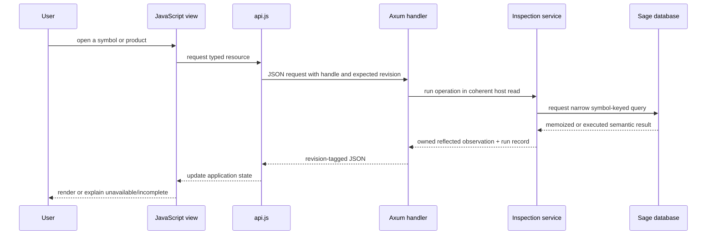

# Sub-RFD: Semantic Inspector Web Application

**Status:** Draft

**Parent:** [Semantic Inspector](./README.md)

## Purpose

This sub-RFD follows the Semantic Inspector from the visible page inward. For
each part of the [interaction mockup](./mockup.html), it explains:

1. what the user does;
2. how JavaScript assembles or updates that view;
3. which JSON request crosses the Axum boundary; and
4. which Sage/Salsa query or metadata operation supplies the response.

The important boundary is not “frontend versus backend.” It is the complete
chain from a visible fact to the semantic operation which produced it.

## The mockup

<iframe
  src="./mockup.html"
  title="Semantic Inspector interaction mockup"
  allowfullscreen
  style="width: 100%; height: 900px; border: 1px solid #dbe1dc; border-radius: 8px; background: white;"
></iframe>

Use the [full-page mockup](./mockup.html) when the embedded viewport is too
narrow.

The current mockup contains four principal regions:

```text
┌──────────────────────────────────────────────────────────────────────┐
│ session / target                                                     │
├────────────────┬───────────────────────────────────┬─────────────────┤
│ workspace      │ selected symbol                    │ execution tree  │
│ symbols        │ ┌───────────────────────────────┐ │                 │
│                │ │ identity and source           │ │                 │
│ search + tree  │ ├───────────────────────────────┤ │                 │
│                │ │ concrete / body / signature   │ │                 │
│                │ │ / diagnostics                 │ │                 │
│                │ └───────────────────────────────┘ │                 │
└────────────────┴───────────────────────────────────┴─────────────────┘
```

The destination adds a top-level **Revisions** view. It is described after the
current regions because it builds on the same product and execution records.

## One request path

All visible semantic products follow the same path:



Axum does not select symbols, interpret types, or format IR. The typed
inspection service does that work and returns an owned, renderer-neutral
observation. JSON serialization and browser rendering happen after the
database read and cannot execute additional Sage queries.

## JavaScript application shape

The precise framework is not important to the design. The examples below use
plain modules and functions to make ownership clear:

```text
api.js                 JSON requests and SSE subscription
store.js               session, revision, selection, products, runs
symbols-view.js        workspace tree and search
symbol-view.js         identity, source, products, navigation
value-tree.js          generic reflected-value renderer
execution-view.js      dynamic request tree
revisions-view.js      later revision and comparison view
```

If implementation uses React, Lit, or another framework, these become
components and stores rather than literal filenames. The state boundaries and
network demand remain the same.

The shared request helper records the revision returned by the server:

```js
async function requestJson(path, options = {}) {
  const response = await fetch(path, {
    ...options,
    headers: {
      "Accept": "application/json",
      "X-Sage-Session": store.sessionToken,
      "X-Sage-Expected-Revision": store.currentRevision,
      ...options.headers,
    },
  });

  const envelope = await response.json();
  store.observeRevision(envelope.databaseEpoch, envelope.revision);
  return envelope;
}
```

This is illustrative code, not a prescribed authentication-header spelling.
The response envelope always identifies its database epoch and revision, its
availability status, and—when analysis was performed—the corresponding run.

## 1. Session header

The header establishes which target and database the rest of the page
describes. On application startup, JavaScript fetches the session before
issuing semantic requests:

```js
const session = await api.getSession();
store.installSession(session);
renderSessionHeader(session.target, session.revision);
```

```http
GET /api/v1/session
```

The result contains the selected Cargo package/target, workspace root,
database epoch, current revision, capabilities, and retained revision range.
It comes from `InspectionHost` state. It does not enumerate symbols or execute
a body query.

The database epoch changes after a full workspace reload. The revision changes
when Salsa inputs change within that database. Both are required because a
revision number alone cannot identify data across a reconstructed database.

## 2. Workspace symbols

### Initial tree

After session bootstrap, the symbols view asks for the root branch:

```js
const branch = await api.symbolRoot();
store.symbolBranches.set(branch.owner.handle, branch);
renderSymbolBranch(branch);
```

```http
GET /api/v1/symbols/root
```

The service begins with the selected target's root local module and requests
its represented direct children. The semantic endpoint is:

```text
root ModSymbol
  -> ModSymbol::expanded_module_items(db)
  -> local_expanded_module_items(db, local_module)
```

This can parse and expand the root module. It must not request function
signatures or bodies merely to draw the tree.

Each returned `SymbolSummary` contains an opaque navigation handle, stable
display path, name, kind, provenance summary, child availability, and no
eager semantic products.

### Expanding a branch

The triangle beside `db`, `parse`, or another expandable item is lazy:

```js
async function toggleBranch(symbol) {
  if (!store.symbolBranches.has(symbol.handle)) {
    const branch = await api.symbolChildren(symbol.handle);
    store.symbolBranches.set(symbol.handle, branch);
  }
  store.toggleExpanded(symbol.handle);
}
```

```http
GET /api/v1/symbols/{symbol-handle}/children
```

The retained handle is decoded to a typed symbol. The service selects the
kind-specific membership operation:

| Symbol kind | Sage boundary |
|---|---|
| Local module | `local_expanded_module_items(db, module)` |
| Local enum | `enum_variants(db, enum_symbol)` |
| Local trait | `LocalTraitSym::items(db)` |
| Local impl | `LocalImplSym::items(db)` |
| External module/enum | `SymExt::expanded_module_items(db)` |
| External trait | `TraitSymbol::items(db)` |

External children are navigable after following an external reference, but
external symbols are never inserted into the workspace tree.

### Searching

The symbol search box must search all represented local symbols, not merely
filter branches already downloaded by the browser:

```js
symbolSearch.addEventListener("input", debounce(async event => {
  const page = await api.searchSymbols(event.target.value);
  store.searchResults = page.items;
  renderSearchResults(page);
}, 120));
```

```http
GET /api/v1/symbols/search?q=DbDropGuard&cursor=...
```

The service queries a local represented-symbol index by path/name and kind.
Constructing that index may request module and associated-item membership. It
must not request signatures or bodies. Search results carry the same opaque
symbol handles as tree nodes, so selecting a result does not resolve its
display string again.

Filtering a returned IR or execution tree is different: that is purely local
JavaScript over already-owned nodes and causes no request.

## 3. Selecting a symbol

Clicking a symbol-tree row already supplies a handle:

```js
async function selectSymbol(handle, navigationKind = "push") {
  const selected = await api.getSymbol(handle);
  store.installSelection(selected, navigationKind);
  renderSymbolHeader(selected);
  renderProductAvailability(selected.products);
}
```

```http
GET /api/v1/symbols/{symbol-handle}
```

The service recovers the retained `NavigationTarget` and constructs a
`SelectedItemSummary`: origin, kind, stable path, owner, source location,
provenance, and availability of source/concrete, signature, body, membership,
and other products. Membership and relationships remain separate requests;
selecting a symbol does not enumerate its children. Product availability is
explicit. The browser does not infer it from an empty result.

Typing an absolute path or selecting a source position uses the selector
endpoint instead:

```http
POST /api/v1/select

{ "selector": { "path": "crate::db::DbDropGuard::db" } }
```

That invokes Sage semantic path resolution and returns the same
`SelectedItemSummary` and handle as tree selection. Ambiguous and not-found
results are structured outcomes; the service does not choose by source or map
order.

The browser stores only the opaque handle in navigation history. The visible
path remains a label.

The Local/External and provenance badges come from `SelectedItemSummary`.
Completeness and diagnostic counts belong to the currently displayed semantic
product. In the mockup, Typed body is the initial active tab, so its body
response fills those badges. The selection endpoint must not request a body
merely to decorate the header; before a product loads, those badges show
“not inspected” rather than a guessed value.

The Back and Selected local symbol buttons modify the handle-based client
history and then call `selectSymbol`. They do not ask the server to reconstruct
history from display paths.

## 4. Source panel

When a local symbol is selected, the source panel requests its source product:

```js
const source = await loadProduct(selected.handle, "source");
renderSourceExcerpt(source.text, source.highlightSpan);
```

```http
GET /api/v1/symbols/{symbol-handle}/products/source
```

For `DbDropGuard::db`, the service reads the local symbol's source provenance
and absolute span, then extracts the text from the corresponding
`SourceFile::text` input. It does not parse the excerpt again. An external
symbol returns `unavailable { reason: "external-source" }`.

The source response is independent of the body product. Displaying source must
not type-check the function.

The mockup's Open source action uses the file and range already present in the
source response. Copying that location or handing it to an editor integration
does not require another Sage query. The first slice need not choose a browser
to local-editor launch protocol.

## 5. Concrete IR, Typed body, Signature, and Diagnostics

The center tabs all use one product-loading function:

```js
async function activateProduct(kind) {
  store.activeProduct = kind;

  const cacheKey = [store.databaseEpoch, store.currentRevision,
                    store.selection.handle, kind];
  let product = store.products.get(cacheKey);
  if (!product) {
    product = await api.getProduct(store.selection.handle, kind);
    store.products.set(cacheKey, product);
  }

  renderProductHeading(product);
  renderValueTree(product.value);
  showRun(product.runId);
}
```

```http
GET /api/v1/symbols/{symbol-handle}/products/{product-kind}
```

The route is shared, but `product-kind` selects a narrow service operation:

| Mockup tab | Product kind | Sage request for `DbDropGuard::db` | Returned Rust value |
|---|---|---|---|
| Concrete IR | `concrete` | tracked `LocalFnSym::cst(db)` field read | `FnCst = Stashed<Ptr<FnCstData>>` plus provenance |
| Signature | `signature` | `LocalFnSym::sig(db)` | `Stashed<Binder<FnSig>>` |
| Typed body | `body` | `LocalFnSym::body(db)` | `CheckedBody { body, diagnostics }` |
| Diagnostics | `body` | the same cached `LocalFnSym::body(db)` product | `CheckedBody::diagnostics` |

Diagnostics are a view of the body product, not a second semantic query. If
the body product is already cached in JavaScript, switching between Typed body
and Diagnostics is local. If Diagnostics is opened first, JavaScript requests
the body product and renders only its diagnostics field.

The signature response preserves the actual `Binder<FnSig>` shape. The body
response preserves `CheckedBody`, `TyBodyData`, and every
`TyExpr { data, ty, span }`. The API does not replace these with hand-written
view models such as just `receiver` and `return`.

### How Axum handles a product request

The body request illustrates the complete server path:

```text
GET .../products/body
  -> decode session and NavigationTarget handle
  -> InspectionHost::read(expected_revision, |analysis| ...)
  -> recorder.start(RunKind::Product(Body))
  -> Analysis::inspect(selected, Product::Body)
  -> selected.require_local_function()
  -> LocalFnSym::body(db)
  -> reflect CheckedBody into owned ValueTree
  -> recorder.finish()
  -> retain RunObservation under the current revision
  -> serialize response envelope
```

`LocalFnSym::body` then requests whatever semantic dependencies checking the
body actually needs, such as its own signature, selected field/signature
metadata, trait proof, or associated-type normalization. The inspection layer
does not predict or duplicate that dependency list.

### Expanding the structural tree

`renderValueTree` is generic. It switches only on the reflection schema:

```js
function renderValueNode(node) {
  switch (node.kind) {
    case "record": return recordNode(node.name, node.fields.map(renderValueNode));
    case "variant": return variantNode(node.name, node.fields.map(renderValueNode));
    case "sequence": return sequenceNode(node.items.map(renderValueNode));
    case "reference": return symbolLink(node.label, node.handle);
    case "scalar": return scalarNode(node.type, node.value);
    case "truncated": return continuationNode(node.summary, node.continuation);
  }
}
```

Opening and closing nodes, filtering, changing from tree to raw shape,
resizing, or growing a panel uses the returned tree only. A bounded collection
is the sole exception: its explicit continuation control requests more nodes
from the already captured observation.

```http
GET /api/v1/continuations/{continuation-handle}
```

The continuation must not run a new semantic operation. The server retains or
can deterministically page the owned observation created by the original
request.

## 6. Following semantic links

A reflected `Symbol`, `FnSymbol`, `TraitSymbol`, or other semantic reference
arrives as a dedicated reference node:

```json
{
  "kind": "reference",
  "label": "core::clone::Clone::clone",
  "handle": "nav:...",
  "symbol_kind": "function",
  "origin": "external"
}
```

The value-tree renderer turns that node into a link. Clicking it calls the same
`selectSymbol(handle)` used by the workspace tree. No JavaScript parses
`core::clone::Clone::clone`, and the server does not resolve the label again.

For a local target such as `crate::db::Db`, the ordinary local symbol page is
shown. Its Fields product is another narrow request:

```http
GET /api/v1/symbols/{local-struct-handle}/products/fields
```

```text
NavigationTarget::Local(LocalStructSym)
  -> LocalStructSym::fields(db)
  -> Stashed<StructFields>
```

For an external target such as `Clone::clone`, the selected-symbol response
reports source, concrete IR, and body as unavailable and exposes the metadata
products appropriate to its kind.

An external function's Signature tab issues:

```http
GET /api/v1/symbols/{external-handle}/products/signature
```

```text
NavigationTarget::External(SymExt)
  -> FnSymbol::Ext(sym_ext)
  -> FnSymbol::sig(db)
  -> external_fn_signature(db, sym_ext)
  -> authoritative keyed TcxDb metadata reads
```

An external trait's items and signature remain separate requests:

```text
products/signature -> TraitSymbol::sig(db)
products/items     -> TraitSymbol::items(db)
```

The UI therefore cannot accidentally read all associated items merely to show
a trait signature. Parent and child controls similarly request only their
relationship/membership product.

The relationship card is assembled from two sources. The selected-symbol
summary already carries an optional owner reference, so rendering the Parent
link is local. Opening Children calls the same
`GET /api/v1/symbols/{handle}/children` route used by workspace-tree branches.
Following either resulting link calls `selectSymbol` with its retained handle.

## 7. Execution tree

Every operation which can execute semantic work creates a `RunObservation`.
The product response includes its `run_id`; the execution panel fetches that
run:

```js
async function showRun(runId) {
  const run = await api.getRun(runId);
  store.runs.set(runId, run);
  renderExecutionTree(run.root);
}
```

```http
GET /api/v1/runs/{run-id}
```

This endpoint reads the owned run record. Fetching or filtering the execution
tree does not execute Sage work and is not added as a child of the run being
displayed.

The root is the product or selection request. Its children are the operations
recorded while satisfying it:

- Salsa query requests and whether they executed, were validated, or reused an
  already-current memo;
- explicit Sage semantic lookup/solver spans; and
- authoritative external metadata reads.

The recorder captures the active parent when each operation begins. The tree
is one request's dynamic call tree, not Salsa's complete persistent dependency
graph. Raw Salsa events which lack a stable projection remain visible through
an unmapped fallback.

The existing Salsa events `WillExecute` and `DidValidateMemoizedValue` do not
report every already-current memo fetch. The planned temporary Salsa fork adds
the request/return lifecycle needed to distinguish all three dispositions.
Until that exists, the UI must not label the absence of `WillExecute` as a
known cache hit.

## 8. What happens when source changes

The Axum process owns a filesystem watcher, but raw watcher events never reach
JavaScript. The backend first produces a coherent database update:

```text
filesystem events
  -> normalize and debounce an edit batch
  -> reread stable file contents
  -> classify input update versus workspace reload
  -> update existing SourceFile::text inputs through &mut Database
  -> record the actual Salsa revision(s) and input delta
  -> publish one completed-batch event
```

The current Salsa setter can advance the revision for each input write, so one
filesystem batch may cover an ordered range of Salsa revisions. The host does
not permit a read between those writes and publishes only the final coherent
revision. The history retains the individual input revisions; the frontend
treats the edit batch as one visible update.

Axum exposes a server-sent event stream:

```http
GET /api/v1/events
Accept: text/event-stream
```

```text
event: revision-advanced
id: event-42
data: {
  "database_epoch": "epoch-1",
  "revision": "R17",
  "edit_batch": "edit-9",
  "changed_inputs": ["src/db.rs:text"]
}
```

JavaScript marks old products stale and refreshes only current visible demand:

```js
events.onRevisionAdvanced(async update => {
  store.advanceRevision(update);
  store.markOlderProductsStale();

  await Promise.all([
    refreshSelectedSymbol(),
    refreshVisibleSymbolBranches(),
    ...visibleProductKinds().map(refreshProduct),
  ]);
});
```

Hidden tabs remain stale until opened. The refresh requests are ordinary runs
in the new revision, so the execution tree shows which queries were executed,
validated/backdated, or reused. The server does not eagerly evaluate every
downstream query after an input write.

Every response includes its revision. A response which finishes after the
browser has learned of a newer revision may be retained as history but is not
installed as the current panel. A deterministic `value_version` over the
complete reflected product lets the browser retain expansion state and say
“checked at R17, unchanged” when the new observation equals the old one.

A change to manifest/dependency/target state may rebuild the host instead.
Axum emits `workspace-reloaded`, changes the database epoch, and invalidates
all opaque handles. The page may restore a path as a selection hint, but it
does not claim memo reuse across the reload.

## 9. Revisions view

The Revisions view is destination work for the final incremental slice, not
part of the first browser slice. It reads history already captured by the host:

```js
const page = await api.listRevisions(cursor);
renderRevisionList(page);

const detail = await api.getRevision(revisionId);
renderInputDeltas(detail.inputDeltas);
renderRuns(detail.runs);
```

```http
GET /api/v1/revisions?cursor=...
GET /api/v1/revisions/{revision-id}
GET /api/v1/revisions/compare?from=R16&to=R17&selector=...&product=body
```

A revision detail contains two separate forms of evidence:

```text
RevisionRecord
├── input deltas
│   └── SourceFile::text: old/new hashes and retained diff
└── runs
    ├── automatic refresh of body(DbDropGuard::db)
    ├── user request for signature(DbDropGuard::db)
    └── unchanged warm rerun of body(DbDropGuard::db)
```

Advancing a Salsa revision does not itself execute queries. If the user edits
a file while no semantic product is visible or requested, the revision can
contain input deltas and zero runs. Multiple requests without another edit are
separate runs in the same revision.

Comparison aligns runs by typed selector and product operation. It can state:

- which input fields changed;
- which query/operation keys executed, validated, or were reused in each run;
- which operations newly appeared or disappeared; and
- whether the semantic product itself changed.

It cannot state “dependency edge X caused this invalidation” unless the Salsa
recorder captured that exact edge and cause. The dynamic execution tree gives
request parentage; temporal adjacency between an edit and an execution is not
by itself a persistent dependency edge.

Salsa does not retain arbitrary old values for later querying. Revision pages
therefore render bounded, backend-owned `RevisionRecord`, `RunObservation`,
input-diff, and selected product snapshots. They never ask the current database
to recompute an old revision.

## Axum host and JSON boundary

All handlers share one `InspectionHost` containing the selected Cargo target,
live Sage database, source-input registry, metadata provider, navigation-handle
table, recorder, and bounded history.

Semantic work is synchronous. Axum dispatches it to a database-owning worker
or bounded blocking executor; a handler does not hold an async mutex across
arbitrary analysis. Mutation is serialized against coherent reads. An update
which arrives during a read waits, or cancels and retries that read, but cannot
change its revision halfway through a response.

The response envelope is:

```text
database_epoch
revision
request_id
run_id (when semantic work was recorded)
status = available | unavailable | incomplete | failed | cancelled
value_version (when a value exists)
value or error
```

The API is same-origin and session-scoped. Axum binds to loopback, uses an
unguessable session token, checks request origin, applies a restrictive content
security policy, and exposes no source-mutation endpoint. Route spelling is an
internal versioned contract between assets shipped in the same binary.

## Complete implementation work

- [ ] Define owned selectors, navigation handles, product requests,
  availability, response envelopes, reflected values, and run/revision records
  below Axum.
- [ ] Implement `InspectionHost` with coherent reads, serialized mutation, one
  live Sage database, source registry, metadata provider, and bounded history.
- [ ] Implement the session, symbol root/children/search, selection, product,
  continuation, run, revision, comparison, and SSE resources described above.
- [ ] Implement the JavaScript store and the four current mockup regions using
  only those resources.
- [ ] Make symbol search server-backed and local-only while keeping tree
  expansion lazy and body-free.
- [ ] Implement the generic structural renderer, semantic links, product
  caching, history, filtering, collapse/expand, resize, and grow/restore.
- [ ] Add complete query-request/return tracing to the temporary Salsa fork and
  correlate events with explicit Sage and metadata spans.
- [ ] Implement watching, edit batching, same-database `SourceFile` updates,
  update/reload classification, SSE reconnect, and visible-demand refresh.
- [ ] Implement the later Revisions view over retained input deltas, runs,
  product versions, and observed-work comparisons.
- [ ] Add direct service tests, Axum contract tests, and browser-facing tests
  which assert both returned values and forbidden semantic demand.

## Delivery mapping

- Parent slice 1 implements session bootstrap, local symbols/search,
  selection/source, the four product tabs, structural rendering, and the run
  produced by each request. It uses a live database but does not watch files.
- Parent slice 2 implements semantic-reference navigation and local/external
  symbol pages.
- Parent slice 3 adds impl-candidate and solver-operation product views.
- Parent slice 4 completes request/return tracing and the execution tree's
  execution/reuse dispositions.
- Parent slice 5 adds file watching, automatic visible-demand refresh, retained
  revision/input/run history, and revision comparison.

## Acceptance evidence

- Loading the session and workspace tree requests no signature or body.
- Expanding one branch requests only that membership operation.
- Searching all local symbols does not fetch dependency symbols or bodies.
- Opening each center tab reaches exactly the Sage boundary documented in its
  table; Diagnostics reuses the body product.
- Expanding, filtering, resizing, and growing returned trees causes no semantic
  request.
- Clicking a nested semantic reference navigates by opaque handle even if its
  label changes.
- Fetching an external signature does not read external items or a body.
- Fetching a run or revision record does not add work to the observation being
  displayed.
- A source update refreshes visible products only and cannot install an older
  response as current.
- A revision may contain input changes and zero runs; an unchanged warm rerun
  remains a distinct run.
- Revision comparison reports observed work without inventing an invalidation
  edge.

## Deliberately unspecified

The JavaScript framework, component syntax, CSS system, Axum worker/channel
types, watcher crate, debounce duration, retention limits, and exact route
parameter encoding remain implementation choices. The visible-region to
JavaScript to JSON to Sage-query chains above are the design contract.
