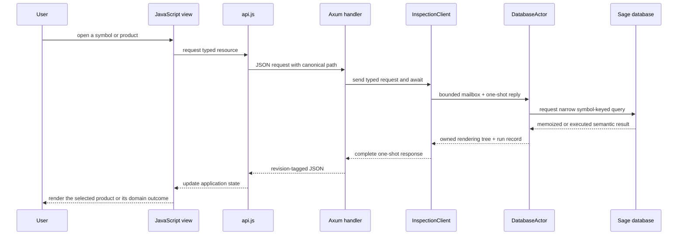

# Sub-RFD: Semantic Inspector Web Application

**Status:** Draft

**Parent:** [Semantic Inspector](./README.md)

## Purpose

This sub-RFD follows the Semantic Inspector from the visible page inward. For
each part of the [interaction mockup](./mockup.html), it explains:

1. what the user does;
2. how JavaScript assembles or updates that view;
3. which JSON request crosses the Axum boundary; and
4. which Sage/Salsa query or metadata operation supplies the response.

The important boundary is not “frontend versus backend.” It is the complete
chain from a visible fact to the semantic operation which produced it.

## The mockup

<iframe
  src="./mockup.html"
  title="Semantic Inspector interaction mockup"
  allowfullscreen
  style="width: 100%; height: 900px; border: 1px solid #dbe1dc; border-radius: 8px; background: white;"
></iframe>

Use the [full-page mockup](./mockup.html) when the embedded viewport is too
narrow.

The current mockup contains four principal regions:

```text
┌──────────────────────────────────────────────────────────────────────┐
│ session / target                                                     │
├────────────────┬───────────────────────────────────┬─────────────────┤
│ workspace      │ selected symbol                    │ execution tree  │
│ symbols        │ ┌───────────────────────────────┐ │                 │
│                │ │ identity and source           │ │                 │
│ search + tree  │ ├───────────────────────────────┤ │                 │
│                │ │ concrete / body / signature   │ │                 │
│                │ │ / diagnostics                 │ │                 │
│                │ └───────────────────────────────┘ │                 │
└────────────────┴───────────────────────────────────┴─────────────────┘
```

The destination adds a top-level **Revisions** view. It is described after the
current regions because it builds on the same product and execution records.

## One request path

All visible semantic products follow the same path:



Axum does not select symbols, interpret types, or format IR. The typed
inspection service does that work and returns an owned generic rendering tree.
JSON serialization and browser interpretation happen after the database read
and cannot execute additional Sage queries.

## JSON contract summary

The normative [`/api/v1` protocol](./protocol.md) defines route spelling,
headers, request and response DTOs, canonical-path encoding, rendering and reflected-value
variants, trace ordering, and exact fixture serialization. This section is a
walkthrough-oriented summary. If an example here disagrees with the protocol,
the protocol is authoritative and this walkthrough must be corrected.

### Resources

| Request | Resource |
|---|---|
| `GET /api/v1/revision` | current process-wide revision ID |
| `GET /api/v1/session` | selected target and server capabilities |
| `GET /api/v1/symbols` | complete detail-free represented local symbol index |
| `GET /api/v1/symbol?path=...` | selected-symbol summary, parent, and positive product list |
| `GET /api/v1/product?symbol=...&product=...` | one server-authored generic product page |
| `GET /api/v1/continuations/{handle}` | more of an already-owned bounded observation |
| `GET /api/v1/runs/{run-id}` | one retained dynamic operation tree |
| `GET /api/v1/events` | reconnectable revision and reload event stream |
| `GET /api/v1/revisions` | retained revision summaries |
| `GET /api/v1/revisions/{revision-id}` | input deltas and runs for one revision |
| `GET /api/v1/revisions/compare?...` | comparison of aligned retained runs |

Immediate parent identity is part of the selected-symbol summary. Local
children come from the complete symbol index; external fields/items can use a
server-advertised product. Fetching a run, continuation, or revision reads
retained owned data and performs no new semantic operation.

### Common responses

Every successful JSON response carries the revision which produced its value:

```text
Response<T> {
  revision_id,
  request_id,
  run_id: RunId | null,
  value: T,
}
```

`run_id` is always present so a client can distinguish “no semantic work was
recorded” without inspecting the value. Errors use HTTP status and an
`ErrorResponse` containing the same `revision_id`, `request_id`, and `run_id`
plus a stable error code and message. The event stream uses explicit event
DTOs rather than `Response<T>`.

The selected symbol's catalog lists only its valid product pages. Solver
ambiguity, overflow, diagnostics, and other semantic outcomes appear in the
server-authored rendering tree. Cancellation caused by an edit is retried
internally. The generic response layer therefore has no availability,
incomplete, failed, or cancelled status union.

### Selected symbol and product catalog

`GET /api/v1/symbol?path=...` returns the canonical path, display label,
generic presentation data, optional parent reference, and the complete ordered
list of product pages valid for that symbol:

```text
ProductDescriptor {
  id,
  label,
  href,
}
```

The catalog omits products which do not have pages for this symbol. React
creates tabs directly from the array's order and labels and uses each entry's
exact URL; it does not branch on the opaque ID, symbol kind, or origin.
Computing the catalog may use semantic identity, origin, kind, declaration
shape, metadata capabilities, and implementation coverage on the server, but
requests none of the listed products.

A representative external-function response is:

```json
{
  "revision_id": "rev_0",
  "request_id": "request-3",
  "run_id": null,
  "value": {
    "path": "external/core-1/clone/Clone/clone",
    "label": "clone",
    "display_path": "core::clone::Clone::clone",
    "presentation": {
      "eyebrow": "External associated function",
      "badges": [
        { "label": "External symbol", "tone": "accent" }
      ]
    },
    "parent": {
      "path": "external/core-1/clone/Clone",
      "label": "core::clone::Clone",
      "presentation": {
        "eyebrow": "External trait",
        "badges": []
      }
    },
    "products": [
      {
        "id": "identity",
        "label": "Identity",
        "href": "/api/v1/product?symbol=external%2Fcore-1%2Fclone%2FClone%2Fclone&product=identity"
      },
      {
        "id": "signature",
        "label": "Signature",
        "href": "/api/v1/product?symbol=external%2Fcore-1%2Fclone%2FClone%2Fclone&product=signature"
      }
    ]
  }
}
```

Reflected semantic references carry the same canonical path plus a display
label and generic presentation data. JavaScript never reconstructs that path
from the label.

### Generic rendering and reflected values

Every product page contains a generic rendering tree. It composes layout,
headings, text, code, notices, navigation, and structurally reflected values:

```text
RenderNode =
    { kind: "group", layout, children: [RenderNode] }
  | { kind: "heading", level, text }
  | { kind: "text", text }
  | { kind: "code", language, text, highlights }
  | { kind: "notice", tone, title, text }
  | { kind: "navigation", target: SymbolReference }
  | { kind: "value", value: ValueNode }
```

The embedded reflected-value variants are:

```text
ValueNode =
    { kind: "record", type_name, fields: [{ name, value: ValueNode }] }
  | { kind: "variant", enum_name, variant_name,
      fields: [{ name, value: ValueNode }] }
  | { kind: "sequence", type_name, items: [ValueNode] }
  | { kind: "scalar", type_name, value }
  | { kind: "reference", target: SymbolReference }
  | { kind: "shared", identity, value: ValueNode }
  | { kind: "shared-reference", identity }
  | { kind: "truncated", summary, continuation }
```

Product IDs never select a renderer; the returned `RenderNode` does. Options
and map entries remain ordinary record/variant/sequence structure
rather than acquiring special renderer-only shortcuts. Record fields and
sequence elements preserve semantic order. Maps which cross the protocol are
projected to explicitly ordered entry arrays rather than relying on JSON
object-key order. Stable DTO field order and one pretty-printing convention
produce the checked bytes, including one trailing newline.

The exact fixture may evolve while this RFD is Draft, but changes are reviewed
as protocol changes. Tests do not parse and reserialize an Axum response before
comparison, because doing so could hide field-order, omission, or formatting
drift.

The complete protocol contributes to [SI-A2](./README.md#si-a2),
[SI-A3](./README.md#si-a3), [SI-A4](./README.md#si-a4),
[SI-A7](./README.md#si-a7), and [SI-A8](./README.md#si-a8) at the slices shown
in the anchor matrix.

## React application shape

The first implementation uses React, TypeScript, Vite, npm with a committed
lockfile, and React Router. This choice is intended to get a usable and
well-tested application running quickly; it is not part of the service or JSON
protocol contract. The examples below omit React component syntax where plain
functions make ownership and demand clearer:

```text
api.ts                 JSON requests and SSE subscription
store.ts               session, revision, symbol index, products, runs
routes.tsx              URL-addressable semantic views
symbols-view.tsx        workspace tree and local search
symbol-view.tsx         generic selected-symbol header and product tabs
render-tree.tsx         generic product-page interpreter
value-tree.tsx          structural reflected-value interpreter
execution-view.tsx      dynamic request tree
revisions-view.tsx      later revision and comparison view
```

The exact file names are illustrative. The state boundaries and network demand
remain the same if the frontend framework is replaced later.

The shared request helper rejects any response from a revision other than the
one currently displayed:

```js
async function requestJson(path, options = {}) {
  const response = await fetch(path, {
    ...options,
    headers: {
      "Accept": "application/json",
      ...options.headers,
    },
  });

  const payload = await response.json();
  if (
    store.currentRevisionId !== null &&
    payload.revision_id !== store.currentRevisionId
  ) {
    await resetAndBootstrapFromUrl(payload.revision_id);
    throw new RevisionChanged();
  }

  if (!response.ok) throw new InspectorError(payload.error);
  return payload;
}
```

The same comparison happens before processing an error. An unresolved old path
therefore triggers a complete state reset when its error carries a newer
`revision_id`; an unresolved path in the current revision remains an ordinary
visible error. `resetAndBootstrapFromUrl` discards the old directory, products,
and response-derived caches before fetching the current revision, session, and
directory and replaying the URL.

## 1. Session header

The header establishes which target and database the rest of the page
describes. On application startup, JavaScript fetches the current revision,
installs it as the page's expected revision, and then fetches the session:

```js
const current = await api.getCurrentRevision();
store.installRevision(current.revision_id);

const session = await api.getSession();
store.installSession(session);
renderSessionHeader(session.target, current.revision_id);
```

```http
GET /api/v1/revision
GET /api/v1/session
```

The result value contains the selected Cargo package/target, workspace root,
server capabilities, and retained revision range. Both responses carry the
backend's current process-wide `revision_id`. Neither endpoint enumerates
symbols or executes a body query. If the database changes between the two
requests, the ordinary revision comparison reloads the page.

## 2. Workspace symbols

### Initial symbol index

After session bootstrap, the symbols view asks for the complete represented
local symbol skeleton:

```js
const index = await api.symbolIndex();
store.installSymbolIndex(index);
```

```http
GET /api/v1/symbols
```

The service begins with the selected target's root local module and eagerly
walks represented local membership:

```text
root ModSymbol
  -> local module membership
  -> nested module membership
  -> local trait/impl/enum associated-item membership
  -> complete SymbolSummary index
```

This can parse and expand every represented local module. It must not request
checked signatures, field types, bodies, associated values, impl candidates,
or external metadata merely to draw the tree. Fields and associated items that
are themselves represented symbols still receive summaries.

Each returned `SymbolSummary` contains a canonical path, optional parent path,
display label and path, server-authored search text and presentation, child
completeness, and no eager semantic products. Parent edges let React assemble
the complete tree without another request. The frontend displays presentation
data but never branches on a Rust kind or origin.

### Expanding a local branch

The triangle beside `db`, `parse`, or another local item only changes browser
state:

```js
function toggleBranch(symbol) {
  store.toggleExpanded(symbol.path);
}
```

External children are different: after following an external semantic
reference, opening its Children product requests the appropriate keyed
metadata operation. Those children remain in the external detail view and are
never inserted into the workspace tree.

### Searching

The symbol search box filters the already-owned complete local index:

```js
function searchSymbols(query) {
  return store.symbolIndex.filter(summary => matches(summary, query));
}
```

Search results carry the same canonical paths as tree nodes, so selecting a
result does not resolve its display string again. Search performs no HTTP or
Sage request. The filter text is reflected into the current URL with a history
replacement so reloading preserves it without creating a history entry for
every keystroke.

Filtering a returned IR or execution tree is different: that is purely local
JavaScript over already-owned nodes and causes no request.

## 3. Selecting a symbol

Clicking a symbol-tree row already supplies a canonical path:

```js
async function selectSymbol(path, navigationKind = "push") {
  const selected = await api.getSymbol(path);
  store.installSelection(selected, navigationKind);
  renderSymbolHeader(selected);
  renderProductTabs(selected.products);
}
```

```http
GET /api/v1/symbol?path={symbol-path}
```

The service traverses exact ownership segments to recover the internal symbol
and constructs a generic selected-symbol summary: canonical path, display
label, presentation, optional parent, and complete positive product list.
Fields, items, and other child enumeration remain separate products; selecting
a symbol does not enumerate them. Product tabs follow
[SI-A4](./README.md#si-a4), and the browser does not infer them from an empty
result, origin, or symbol kind.

The browser never sends search text to the backend. It filters the complete
local index, presents every matching row, and requests the chosen row's
existing canonical path. External symbols are absent from that directory and
remain reachable through paths embedded in reflected semantic references. This RFD
does not define source-position selection; an editor-facing client can add a
separate operation when there is a concrete use case.

The canonical path and opaque product ID are encoded in the React Router
location; the visible Rust path remains a label. A fresh frontend therefore
recovers the internal identity by backend ownership traversal without parsing
that label. An unresolved path returns a structured 404 carrying the backend's
current revision ID instead of resolving a similar display path. A revision
mismatch resets all response-derived state and replays the URL first.

Header eyebrows and badges come from generic server presentation data.
Completeness and diagnostic counts belong to the currently displayed semantic
product. In the mockup, Typed body is the initial active tab, so its body
response fills those badges. The selected-symbol request must not request a
body merely to decorate the header; before a product loads, those badges show
“not inspected” rather than a guessed value.

Tree rows and semantic references use ordinary routed links. Browser Back and
Forward replay those locations and trigger the same selection/product loaders;
the Selected local symbol control routes directly to its canonical path. None
asks the server to reconstruct history from display paths.

## 4. Example: Source product

When the server lists a Source product and the user selects its descriptor, the
ordinary product loader requests the descriptor's `href`:

```js
await activateProduct(sourceDescriptor);
```

```http
GET /api/v1/product?symbol={symbol-path}&product=source
```

For `DbDropGuard::db`, the service reads the local symbol's source provenance
and absolute span, then extracts the text from the corresponding
`SourceFile::text` input. It does not parse the excerpt again. It returns a
generic product page whose render tree contains a `code` node and highlights.
An external symbol's list has no Source entry, so the browser creates no Source
tab and makes no request. A forged or stale direct request returns HTTP 404
with error code `product-not-found` and the backend's current revision ID; the
server revalidates every request.

The source response is independent of the body product. Displaying source must
not type-check the function.

Any open-source navigation is another generic navigation/render node supplied
by the server. Copying its location or handing it to an editor integration does
not require another Sage query. The first slice need not choose a browser to
local-editor launch protocol.

## 5. Example product pages

Every tab uses one product-loading function which receives the descriptor, not
a known product kind:

```js
async function activateProduct(descriptor) {
  store.activeProduct = descriptor.id;
  const cacheKey = [store.currentRevision, store.selection.path, descriptor.id];
  let product = store.products.get(cacheKey);
  if (!product) {
    product = await api.get(descriptor.href);
    store.products.set(cacheKey, product);
  }

  renderProductHeading(product);
  renderNode(product.content);
  await showRun(product.runId);
}
```

```http
GET /api/v1/product?symbol={symbol-path}&product={product-id}
```

The opaque IDs happen to select these narrow server operations in the reviewed
fixture, but the frontend does not know this table:

| Mockup tab | Fixture product ID | Sage request for `DbDropGuard::db` | Reflected Rust value |
|---|---|---|---|
| Concrete IR | `concrete` | tracked `LocalFnSym::cst(db)` field read | `FnCst = Stashed<Ptr<FnCstData>>` plus provenance |
| Signature | `signature` | `LocalFnSym::sig(db)` | `Stashed<Binder<FnSig>>` |
| Typed body | `body` | `LocalFnSym::body(db)` | `CheckedBody { body, diagnostics }` |
| Diagnostics | `diagnostics` | the same cached `LocalFnSym::body(db)` query | `CheckedBody::diagnostics` |

The Body and Diagnostics pages are independent product descriptors which may
reuse the same server query. That reuse is invisible to generic JavaScript and
visible in the execution trace.

The signature response preserves the actual `Binder<FnSig>` shape. The body
response preserves `CheckedBody`, `TyBodyData`, and every
`TyExpr { data, ty, span }`. The API does not replace these with hand-written
view models such as just `receiver` and `return`.

Ordinary semantic structs and enums opt in through a custom derive:

```rust,ignore
#[derive(Reflect)]
struct FnSig<'db> {
    // Every real field is reflected recursively.
}
```

The generated implementation calls `Reflect` for every field or variant
payload. Custom implementations are reserved for semantic leaves and storage
wrappers: a `Symbol` emits a reference with its canonical path, a span emits a
stable location, `Stashed<T>` exposes its semantic root, and the reflection
context handles sharing, cycles, depth, and node limits. Product producers
compose the resulting `ValueNode` into a `RenderNode`; they do not manually
serialize the underlying Sage value. This establishes
[SI-A16](./README.md#si-a16).

### How Axum handles a product request

The body request illustrates the complete server path:

```text
GET /api/v1/product?symbol=local/.../DbDropGuard/db&product=body
  -> traverse canonical ownership path to a Symbol
  -> InspectionClient::product(...) sends actor message and awaits reply
  -> DatabaseActor receives Product message
  -> InspectionHost::analysis()
  -> recorder.start(RunKind::Product("body"))
  -> server product registry selects the body producer
  -> selected.require_local_function()
  -> LocalFnSym::body(db)
  -> recorder.enter_phase(Reflection)
  -> reflect CheckedBody into owned ValueTree
  -> assemble generic RenderNode page
  -> recorder.finish()
  -> retain RunObservation under the current revision
  -> actor completes one-shot with owned response
  -> serialize response with the producing revision ID
```

`LocalFnSym::body` then requests whatever semantic dependencies checking the
body actually needs, such as its own signature, selected field/signature
metadata, trait proof, or associated-type normalization. The inspection layer
does not predict or duplicate that dependency list. Reflection remains inside
the recorded run because expanding an interned or stashed value may read
tracked data. JSON serialization and React rendering begin only after
`recorder.finish()` and use the owned observation.

### Expanding the structural tree

`renderNode` is generic. It switches only on the rendering vocabulary and
delegates embedded structural values to `renderValueNode`:

```js
function renderNode(node) {
  switch (node.kind) {
    case "group": return group(node.layout, node.children.map(renderNode));
    case "heading": return heading(node.level, node.text);
    case "text": return text(node.text);
    case "code": return code(node.language, node.text, node.highlights);
    case "notice": return notice(node.tone, node.title, node.text);
    case "navigation": return symbolLink(node.target.label, node.target.path);
    case "value": return renderValueNode(node.value);
    default: return protocolError(`unknown RenderNode kind: ${node.kind}`);
  }
}
```

The reflected-value interpreter likewise switches only on structural nodes:

```js
function renderValueNode(node) {
  switch (node.kind) {
    case "record": return recordNode(node.type_name, node.fields.map(renderValueField));
    case "variant": return variantNode(node.enum_name, node.variant_name,
                                       node.fields.map(renderValueField));
    case "sequence": return sequenceNode(node.type_name,
                                         node.items.map(renderValueNode));
    case "reference": return symbolLink(node.target.label, node.target.path);
    case "scalar": return scalarNode(node.type_name, node.value);
    case "shared": return sharedNode(node.identity, renderValueNode(node.value));
    case "shared-reference": return sharedReferenceNode(node.identity);
    case "truncated": return continuationNode(node.summary, node.continuation);
    default: return protocolError(`unknown ValueNode kind: ${node.kind}`);
  }
}
```

The real TypeScript uses an exhaustive `never` check rather than a permissive
default. The final line above represents a visible protocol error in this
framework-neutral pseudocode; an unknown variant is never silently ignored.

Opening and closing nodes, filtering, changing from tree to raw shape,
resizing, or growing a panel uses the returned tree only. A bounded collection
is the sole exception: its explicit continuation control requests more nodes
from the already captured observation.

```http
GET /api/v1/continuations/{continuation-handle}
```

The continuation must not run a new semantic operation. The server retains or
can deterministically page the owned observation created by the original
request.

## 6. Following semantic links

A reflected `Symbol`, `FnSymbol`, `TraitSymbol`, or other semantic reference
arrives as a dedicated reference node:

```json
{
  "kind": "reference",
  "target": {
    "path": "external/core-1/clone/Clone/clone",
    "label": "core::clone::Clone::clone",
    "presentation": {
      "eyebrow": "External associated function",
      "badges": []
    }
  }
}
```

The value-tree renderer turns that node into a link. Clicking it calls the same
`selectSymbol(path)` used by the workspace tree. No JavaScript parses
`core::clone::Clone::clone`, and the server does not resolve the label again.

For a local target such as `crate::db::Db`, the ordinary local symbol page is
shown. Its Fields product is another narrow request:

```http
GET /api/v1/product?symbol={local-struct-path}&product=fields
```

```text
NavigationTarget::Local(LocalStructSym)
  -> LocalStructSym::fields(db)
  -> Stashed<StructFields>
```

For an external target such as `Clone::clone`, the selected-symbol response
lists only the metadata-backed product pages appropriate to its kind. It has a
Signature tab but no Source, Concrete IR, or Typed body tab.

An external function's Signature tab issues:

```http
GET /api/v1/product?symbol={external-symbol-path}&product=signature
```

```text
NavigationTarget::External(SymExt)
  -> FnSymbol::Ext(sym_ext)
  -> FnSymbol::sig(db)
  -> external_fn_signature(db, sym_ext)
  -> authoritative keyed TcxDb metadata reads
```

An external trait's items and signature remain separate requests:

```text
products/signature -> TraitSymbol::sig(db)
products/items     -> TraitSymbol::items(db)
```

The UI therefore cannot accidentally read all associated items merely to show
a trait signature. Parent and child controls similarly request only their
relationship/membership product.

The relationship card is assembled from two sources. The selected-symbol
summary already carries an optional owner reference, so rendering the Parent
link is local. Children of a local symbol come from the owned symbol index.
Children of an external symbol use its explicit membership product and keyed
metadata operation. Following either kind of link routes to its canonical
path.

### Deferred semantic actions

The current mockup and protocol do not expose interactive `impls`, `prove`, or
`normalize` operations. Trait solving and normalization performed while
producing an ordinary product remain visible in the execution tree. A future
protocol can add generic server-authored action nodes while retaining typed
inputs on the backend, but this RFD deliberately does not pin their routes or
fixtures.

## 7. Execution tree

Every operation which can execute semantic work creates a `RunObservation`.
The product response includes its `run_id`; the execution panel fetches that
run:

```js
async function showRun(runId) {
  const run = await api.getRun(runId);
  store.runs.set(runId, run);
  renderExecutionTree(run.root);
}
```

```http
GET /api/v1/runs/{run-id}
```

This endpoint reads the owned run record. Fetching or filtering the execution
tree does not execute Sage work and is not added as a child of the run being
displayed.

The root is the product or selection request. Its children are the operations
recorded while satisfying it:

- Salsa query requests and whether they executed, were validated, or reused an
  already-current memo;
- explicit Sage semantic lookup/solver spans; and
- authoritative external metadata reads.

The temporary Salsa fork wraps every tracked-query invocation in a balanced
tracing span before memo lookup. The span remains present when the request is
satisfied by an already-current memo and records whether it executed,
validated, or reused. Nested tracked queries inherit that span as their parent;
explicit Sage and metadata spans use the same context. The instrumentation is
generated by Salsa and requires no annotations on individual Sage queries.

The tree is one request's dynamic call tree, not Salsa's complete persistent
dependency graph. Salsa ingredients which lack a named projection remain
visible through a stable unmapped category and key; their raw debug payload is
attached only to interactive diagnostics and test-failure artifacts. Existing
`WillExecute` and `DidValidateMemoizedValue` events supply dispositions within
the invocation span but do not replace it. This establishes
[SI-A17](./README.md#si-a17).

## 8. What happens when source changes

The Axum process owns a filesystem watcher, but raw watcher events never reach
JavaScript. The backend first produces a coherent database update:

```text
filesystem events
  -> normalize and debounce an edit batch
  -> reread stable file contents
  -> classify input update versus workspace reload
  -> update existing SourceFile::text inputs through &mut Database
  -> record the actual Salsa revision(s) and input delta
  -> publish one completed-batch event
```

The current Salsa setter can advance the revision for each input write, so one
filesystem batch may cover an ordered range of Salsa revisions. The host does
not permit a read between those writes and publishes only the final coherent
revision. The history retains the individual input revisions; the frontend
treats the edit batch as one visible update.

Axum exposes a server-sent event stream:

```http
GET /api/v1/events
Accept: text/event-stream
```

```text
event: revision-advanced
id: event-42
data: {
  "revision_id": "rev_17",
  "edit_batch": "edit-9",
  "changed_inputs": ["src/db.rs:text"]
}
```

JavaScript discards response-derived state and bootstraps from the current URL
when the backend revision changes:

```js
events.onRevisionAdvanced(update => {
  if (update.revision_id !== store.currentRevisionId) {
    resetAndBootstrapFromUrl(update.revision_id);
  }
});
```

The reset preserves the semantic URL but discards the old directory, products,
and every response-derived cache. Bootstrap fetches the new revision and
complete local index, resolves the URL's canonical path, and fetches only its
selected product. Hidden products remain undemanded. These requests are
ordinary runs in the new revision, so the execution tree shows which queries
executed, validated, or were reused; the server does not eagerly evaluate every
downstream query after an input write.

Every success and error response includes its producing `revision_id`. If a
response differs from the revision the browser is displaying, the client
discards it and performs the same bootstrap instead of combining data from two
revisions.

A change to manifest/dependency/target state may rebuild the host instead.
Axum emits `workspace-reloaded` with a new process-wide `revision_id` and
rebuilds the canonical-path index. The frontend resolves the path from its URL
against the new directory or external ownership tree. If a rename, move, or
deletion makes that path invalid, it returns to the symbol directory with an
explicit message; it never reconstructs selection from a display label.

## 9. Revisions view

The Revisions view is destination work for the final incremental slice, not
part of the first browser slice. It reads history already captured by the host:

```js
const page = await api.listRevisions(cursor);
renderRevisionList(page);

const detail = await api.getRevision(revisionId);
renderInputDeltas(detail.inputDeltas);
renderRuns(detail.runs);
```

```http
GET /api/v1/revisions?cursor=...
GET /api/v1/revisions/{revision-id}
GET /api/v1/revisions/compare?from=rev_16&to=rev_17&symbol=...&product=body
```

A revision detail contains two separate forms of evidence:

```text
RevisionRecord
├── input deltas
│   └── SourceFile::text: old/new hashes and retained diff
└── runs
    ├── page-reload request for body(DbDropGuard::db)
    ├── user request for signature(DbDropGuard::db)
    └── unchanged warm rerun of body(DbDropGuard::db)
```

Advancing a Salsa revision does not itself execute queries. If the user edits
a file while no semantic product is visible or requested, the revision can
contain input deltas and zero runs. Multiple requests without another edit are
separate runs in the same revision.

Comparison aligns runs by retained symbol identity and product operation. It
can state:

- which input fields changed;
- which query/operation keys executed, validated, or were reused in each run;
- which operations newly appeared or disappeared; and
- whether the semantic product itself changed.

It cannot state “dependency edge X caused this invalidation” unless the Salsa
recorder captured that exact edge and cause. The dynamic execution tree gives
request parentage; temporal adjacency between an edit and an execution is not
by itself a persistent dependency edge.

Salsa does not retain arbitrary old values for later querying. Revision pages
therefore render bounded, backend-owned `RevisionRecord`, `RunObservation`,
input-diff, and selected product snapshots. They never ask the current database
to recompute an old revision.

## Axum host and JSON boundary

Axum application state holds a cloneable `InspectionClient`. The client sends
typed messages through a bounded mailbox to one internal `DatabaseActor` and
awaits a one-shot response. The actor exclusively owns `InspectionHost`: the
selected Cargo target, live Sage database, source-input registry, metadata
provider, canonical-path index, recorder, and bounded history. Axum never
holds a database reference or lock.

The actor runs synchronous semantic work away from Axum's executor and handles
one database message at a time. Requests invoke the relevant Salsa queries,
which validate or recompute and emit tracing events inside that request's run.
File-watcher edit batches and reloads enter the same mailbox, so an update is
ordered before or after a read and cannot change its revision midway through a
response. Reflection finishes inside the actor; only owned response values
cross back to Axum. The actor publishes completed revision and reload events
through an `InspectionClient` subscription which backs the SSE route.

Successful responses use the [common response](#common-responses). A request
for an external body which is not in that symbol's catalog returns HTTP 404
with the current `revision_id` and error code `product-not-found`; ordinary
type errors remain diagnostics in a successful body value.

Axum binds to `127.0.0.1:2442` by default and serves one inspector workspace.
If that port is unavailable, startup fails with a clear instruction to choose
another port; it does not silently select a different one. A port override is
available, and port `0` requests an operating-system-assigned loopback port for
tests. The server uses no session token or authentication layer and exposes no
source-mutation endpoint. The `/api/v1` route and DTO contract is internal to
assets shipped in the same process but is exact within that version.

## Terminal request log

The terminal running `cargo sage inspect` exposes what the browser demanded.
Each Axum request creates one structured log span containing its request ID,
route family, fixture or live provider, process-wide revision ID, status,
duration, and a small result summary. For example:

```text
request=1 resource=symbol-index provider=fixture summaries=143 status=200
request=2 resource=symbol path=local/crate/db/DbDropGuard/db provider=fixture status=200
request=3 resource=product product=signature path=local/crate/db/DbDropGuard/db provider=fixture status=200
```

The log omits source contents and complete JSON values. From slices 2–5 it is
an audit of HTTP and typed-provider demand, not a claim to show every Salsa
cache hit. Slice 1 has only the dummy server's request transcript. Slice 6
correlates the same request ID with the complete structured execution tree.

## Shared API fixture and browser evidence

One reviewed fixture bundle is the executable contract between backend and
frontend:

```text
test-fixtures/semantic-inspector/db-drop-guard/
├── source/
│   └── src/lib.rs
├── api/
│   ├── routes.json
│   └── responses/
│       ├── session.json
│       ├── symbols.json
│       ├── local-db-method.json
│       ├── local-db-signature.json
│       └── external-clone-signature.json
└── scenarios/
    └── open-local-signature.json
```

`routes.json` maps an exact method and path, including significant query
parameters, to expected status, contractual headers, and one response file.
Backend contract tests issue those requests through the actual Axum router and
use Snapbox to compare the returned bytes directly. They inject deterministic
revision IDs, request IDs, canonical paths, and ephemeral handle allocation;
they do not redact, parse and reserialize, or otherwise normalize the response.
Snapshot-update mode writes a candidate fixture for review; it never makes a
mismatch pass merely because the backend produced new output.

In slice 1 the strict dummy server consumes the fixture bundle directly; there
is no Rust transport or backend claim. In slice 2, Axum contract tests construct
independent typed scripted Rust values and serialize them through the
production DTOs. They never deserialize the expected response as the input
value under test. As a resource becomes real in slices 3–5, its contract test
constructs the database actor and its `InspectionHost` from the bundle's Rust
source, sends the actual typed client request, and replaces the scripted
response. The expected JSON stays the reviewed contract. Neither a
dummy-server test nor a scripted-value snapshot is evidence that Sage produces
a real semantic value.

Frontend tests run against a strict static fixture server which reads the same
manifest and response files. It rejects unknown requests, records consumed
routes, and fails a scenario whose required requests were not made. The UI
suite can therefore run in parallel with Rust tests while proving both its
rendered output and its demand behavior against the backend's exact contract.

The small real-process suite still launches the actual command:

```text
cargo sage inspect --fixture semantic-inspector --port 0 --no-open
  -> emit one machine-readable ready record with the assigned application URL
  -> Playwright opens that URL and performs a named navigation scenario
  -> the browser records the visible assertions for each step
  -> the command records semantic API, provider, and later Salsa/Sage events
  -> the harness emits one exact navigation transcript
```

The flag spellings are illustrative, but the default port `2442`, a port-`0`
test override, suppressed automatic browser launch, and a machine-readable
readiness handshake are required capabilities. Static asset requests and
health checks are covered by server and smoke tests but are not
semantic-demand events. This suite covers one representative flow rather than
repeating every static-server UI test.

The client gives each meaningful action a stable scenario-local identifier,
such as `bootstrap`, `select-local-db`, or `open-signature`. The test harness
records the `request_id` from every response initiated by that action and joins
those IDs with the server's structured events. A transcript can therefore
read:

```text
scenario: open-local-signature

action bootstrap
  visible:
    local symbols: [mini_redis::db::DbDropGuard, ...]
  demand:
    GET session
      provider: session
    GET symbols
      provider: local-symbol-index

action select-local-db
  route: /symbols/mini_redis%2Fdb%2FDbDropGuard%2Fdb/signature
  visible:
    selected: mini_redis::db::DbDropGuard::db
    product: signature
  demand:
    GET symbol(mini_redis/db/DbDropGuard/db)
      provider: symbol-summary(mini_redis/db/DbDropGuard/db)
    GET product(mini_redis/db/DbDropGuard/db, signature)
      provider: signature(mini_redis/db/DbDropGuard/db)
      salsa: not-recorded-before-slice-6
    GET run(run:3)
      provider: retained-run(run:3)
      semantic work: none
```

In slice 1 the transcript comes from the strict dummy server. In slice 2 it
crosses Axum and the typed scripted provider. In slices 3–5, resources are
replaced incrementally with real typed-service operations. Slice 6 replaces
the explicit `not-recorded-before-slice-6` marker with the correlated dynamic
operation tree; it does not introduce a second, disconnected evidence format.

The process writes structured events to a dedicated test sink while rendering
the same events concisely to the human terminal. Tests never parse prose log
lines, and Playwright interception is not the source of truth. Assigned test
ports, durations, raw concurrent arrival order, and raw Salsa debug keys are
retained only in failure artifacts. The checked transcript follows
[SI-A12](./README.md#si-a12): it groups requests by browser action, canonically
orders explicitly unordered siblings, and compares every included field and
rendered value by exact textual identity.

## Complete implementation work

- [ ] Define canonical symbol paths, opaque product IDs, positive product
  lists, generic rendering trees, reflected values, common responses, and
  ephemeral continuation/run/revision handles below Axum.
- [ ] Pin the `/api/v1` DTOs and routes above with one reviewed route manifest
  and exact pretty-printed JSON response bundle.
- [ ] Implement `DatabaseActor` with exclusive ownership of `InspectionHost`,
  its live Sage database, source registry, metadata provider, recorder,
  canonical-path index, ephemeral handles, and bounded history.
- [ ] Implement the cloneable typed `InspectionClient`, bounded actor mailbox,
  and one-shot owned responses used by Axum handlers and service tests.
- [ ] Implement the session, current revision, complete local symbol index,
  selected-symbol, product, external membership, continuation, run, revision,
  comparison, and SSE resources described above.
- [ ] Implement the React/TypeScript store, routes, and current mockup regions
  as a generic interpreter of only those resources.
- [ ] Build the frontend with Vite and embed the production bundle through
  `rust-embed`; keep the ordinary inspector command to one Rust process.
- [ ] Make the complete local symbol index eager and detail-free, with search
  and local disclosure entirely browser-local.
- [ ] Implement generic render-tree and structural-value interpreters,
  canonical semantic links, product caching, URL history, filtering,
  collapse/expand, resize, and grow/restore.
- [ ] Route semantic-view changes through React Router and preserve direct
  load, Back/Forward, and push-versus-replace behavior; on revision mismatch,
  discard all response-derived state and bootstrap from the current URL.
- [ ] Emit structured request/provider audit logs and make fixture demand
  directly assertable.
- [ ] Use Snapbox to compare actual Axum status, contractual headers, JSON
  bytes, and provider demand against the reviewed API bundle without response
  redaction or parse/reserialize normalization.
- [ ] Serve the same bundle through a strict static frontend test server which
  rejects unknown routes and records consumed requests.
- [ ] Add the black-box navigation harness which starts the real command on a
  port-`0` loopback listener, drives one representative flow with Playwright,
  and snapshots combined visible-result and server-owned demand evidence.
- [ ] Make the temporary Salsa fork emit a balanced span for every tracked
  query invocation, including already-current memo fetches, and correlate its
  execution/validation/reuse disposition with nested Sage and metadata spans.
- [ ] Implement watching, edit batching, same-database `SourceFile` updates,
  update/reload classification, SSE reconnect, and visible-demand refresh.
- [ ] Implement the later Revisions view over retained input deltas, runs,
  product versions, and observed-work comparisons.
- [ ] Add direct service tests, Axum contract tests, Vitest/React Testing
  Library component tests against the static fixture server, and a small
  Playwright real-process smoke suite.

## Delivery mapping

- Parent slice 1 implements all mockup interactions, protocol demand, and URL
  behavior against the reviewed bundle and strict dummy server. It has no
  Axum or Rust implementation.
- Parent slice 2 adds typed Rust DTOs, scripted service values, exact Axum
  snapshots, `rust-embed`, `cargo sage inspect`, and one real-process smoke
  flow, without constructing a live Sage database.
- Parent slice 3 replaces session and workspace-symbol scripts with a live
  host and one eager detail-free local symbol index searched entirely in the
  browser.
- Parent slice 4 adds real selected-symbol source, concrete IR, signatures,
  bodies, diagnostics, derive-driven reflection, and render-tree assembly.
- Parent slice 5 activates canonical local/external navigation and dependency
  metadata.
- Parent slice 6 lands the Salsa invocation-span fork and complete
  execution/validation/reuse evidence across the real semantic request
  surface.
- Parent slice 7 adds file watching, visible-demand refresh, retained
  revision/input/run history, and revision comparison.

## Acceptance evidence

- Actual Axum responses and provider demand match the reviewed JSON API bundle
  exactly; the frontend consumes the same bytes from a strict static server.
- Product lists determine the exact set and labels of tabs without reading any
  listed product; an invented kind and product require no frontend case.
- Loading the complete local symbol index requests no checked signature, field
  type, body, associated value, impl candidate, or external metadata.
- Expanding a local branch and searching all local symbols cause no request.
- Selecting local and external canonical paths and products updates the URL;
  Back/Forward and routed reload restore the semantic view.
- Opening each center tab reaches exactly the Sage boundary documented in its
  table; Diagnostics reuses the body product.
- Expanding, filtering, resizing, and growing returned trees causes no semantic
  request.
- Clicking a nested semantic reference navigates by canonical path even if its
  label changes.
- Fetching an external signature does not read external items or a body.
- Fetching a run or revision record does not add work to the observation being
  displayed.
- One real-process browser flow proves the embedded application and actual
  Axum routes honor the same contract without duplicating the full UI suite.
- A source update discards all response-derived client state, bootstraps the
  current URL, and cannot install an older response as current.
- A revision may contain input changes and zero runs; an unchanged warm rerun
  remains a distinct run.
- Revision comparison reports observed work without inventing an invalidation
  edge.

## Deliberately unspecified

Component syntax, CSS system, Axum worker/channel types, watcher crate,
debounce duration, retention limits, and exact route parameter encoding remain
implementation choices. React, TypeScript, Vite, npm, React Router, Vitest,
and Playwright are provisional choices and may be replaced while the Axum JSON
boundary remains stable. The visible-region to browser to JSON to Sage-query
chains above are the design contract.
