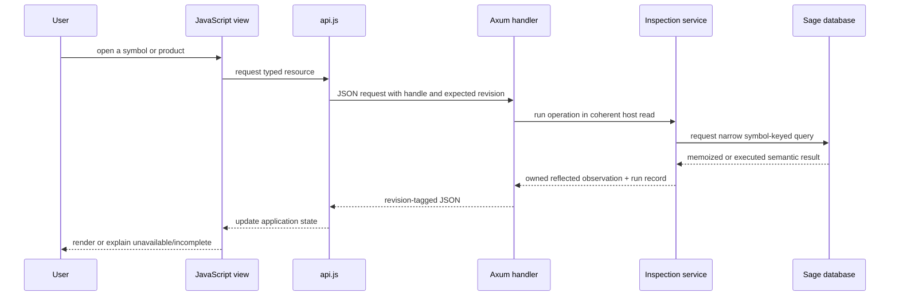

# Sub-RFD: Semantic Inspector Web Application

**Status:** Draft

**Parent:** [Semantic Inspector](./README.md)

## Purpose

This sub-RFD follows the Semantic Inspector from the visible page inward. For
each part of the [interaction mockup](./mockup.html), it explains:

1. what the user does;
2. how JavaScript assembles or updates that view;
3. which JSON request crosses the Axum boundary; and
4. which Sage/Salsa query or metadata operation supplies the response.

The important boundary is not “frontend versus backend.” It is the complete
chain from a visible fact to the semantic operation which produced it.

## The mockup

<iframe
  src="./mockup.html"
  title="Semantic Inspector interaction mockup"
  allowfullscreen
  style="width: 100%; height: 900px; border: 1px solid #dbe1dc; border-radius: 8px; background: white;"
></iframe>

Use the [full-page mockup](./mockup.html) when the embedded viewport is too
narrow.

The current mockup contains four principal regions:

```text
┌──────────────────────────────────────────────────────────────────────┐
│ session / target                                                     │
├────────────────┬───────────────────────────────────┬─────────────────┤
│ workspace      │ selected symbol                    │ execution tree  │
│ symbols        │ ┌───────────────────────────────┐ │                 │
│                │ │ identity and source           │ │                 │
│ search + tree  │ ├───────────────────────────────┤ │                 │
│                │ │ concrete / body / signature   │ │                 │
│                │ │ / diagnostics                 │ │                 │
│                │ └───────────────────────────────┘ │                 │
└────────────────┴───────────────────────────────────┴─────────────────┘
```

The destination adds a top-level **Revisions** view. It is described after the
current regions because it builds on the same product and execution records.

## One request path

All visible semantic products follow the same path:



Axum does not select symbols, interpret types, or format IR. The typed
inspection service does that work and returns an owned, renderer-neutral
observation. JSON serialization and browser rendering happen after the
database read and cannot execute additional Sage queries.

## JSON contract summary

The normative [`/api/v1` protocol](./protocol.md) defines route spelling,
headers, tagged request and result DTOs, handle encoding, reflected-value
variants, trace ordering, and exact fixture serialization. This section is a
walkthrough-oriented summary. If an example here disagrees with the protocol,
the protocol is authoritative and this walkthrough must be corrected.

### Resources

| Request | Resource |
|---|---|
| `GET /api/v1/session` | selected target, epoch, revision, and server capabilities |
| `GET /api/v1/symbols` | complete detail-free represented local symbol index |
| `GET /api/v1/symbols/{handle}` | selected-symbol summary, parent, and product catalog |
| `POST /api/v1/select` | path or source-position selection yielding the same selected-symbol shape |
| `GET /api/v1/symbols/{handle}/products/{kind}` | one source, concrete, signature, body, fields, or items product |
| `POST /api/v1/operations/impls` | relevant impl candidates and completeness for retained typed inputs |
| `POST /api/v1/operations/prove` | `Proven` result for a retained trait-goal target |
| `POST /api/v1/operations/normalize` | `Type` result for a retained alias target |
| `GET /api/v1/continuations/{handle}` | more of an already-owned bounded observation |
| `GET /api/v1/runs/{run-id}` | one retained dynamic operation tree |
| `GET /api/v1/events` | reconnectable revision and reload event stream |
| `GET /api/v1/revisions` | retained revision summaries |
| `GET /api/v1/revisions/{revision-id}` | input deltas and runs for one revision |
| `GET /api/v1/revisions/compare?...` | comparison of aligned retained runs |

Diagnostics are a client view of the `body` product and have no route.
Immediate parent identity is part of the selected-symbol summary. Local
children come from the complete symbol index; external fields/items require
their advertised product. Fetching a run, continuation, or revision reads
retained owned data and performs no new semantic operation.

### Common response envelope

Every ordinary JSON response has stable envelope fields followed by one tagged
result variant:

```text
Envelope<T> {
  database_epoch,
  revision,
  request_id,
  run_id: RunId | null,
  result:
    { status: "available", value_version, value: T }
  | { status: "unavailable", reason }
  | { status: "incomplete", reason, partial: T | null }
  | { status: "failed", error }
  | { status: "cancelled", reason }
}
```

Fields which do not belong to a tagged variant are absent rather than `null`;
`run_id` is always present so a client can distinguish “no semantic work was
recorded” without inspecting the result. HTTP status and headers remain
transport facts and are asserted separately. The event stream uses explicit
event DTOs rather than wrapping each event in `Envelope<T>`.

Every `reason` or `error` contains a stable machine-readable `code` and a
human-readable `message`. Clients branch on the code and display the message;
they do not parse message text.

### Selected symbol and product catalog

`GET /api/v1/symbols/{handle}` returns identity, origin, kind, stable display
path, optional parent reference, source/provenance summary, and a complete
catalog of the known symbol-product kinds. Each catalog entry has exactly one
availability variant:

```text
ProductDescriptor {
  kind,
  availability:
    { state: "available", href }
  | { state: "unavailable", reason }
  | { state: "not-applicable" }
}
```

The catalog array uses protocol-defined product-kind order. React may arrange
known products into its own tabs and panels, but it does not derive whether a
product exists. `available` supplies the exact URL to request;
`unavailable(reason)` is shown disabled with an explanation; and
`not-applicable` is omitted. Computing this catalog uses symbol identity,
origin, kind, declaration shape, metadata capabilities, and implementation
coverage, but requests none of the advertised products.

A representative external-function response is:

```json
{
  "database_epoch": "epoch-1",
  "revision": "R0",
  "request_id": "request-3",
  "run_id": null,
  "result": {
    "status": "available",
    "value_version": "value-selected-clone",
    "value": {
      "handle": "nav_external-clone",
      "name": "clone",
      "display_path": "core::clone::Clone::clone",
      "origin": "external",
      "symbol_kind": "function",
      "parent": {
        "handle": "nav_external-clone-trait",
        "label": "core::clone::Clone",
        "origin": "external",
        "symbol_kind": "trait"
      },
      "source_location": null,
      "provenance": {
        "kind": "external-metadata",
        "crate_name": "core"
      },
      "products": [
        {
          "kind": "source",
          "availability": {
            "state": "unavailable",
            "reason": {
              "code": "external-source-not-represented",
              "message": "Source is not represented for external symbols."
            }
          }
        },
        {
          "kind": "concrete",
          "availability": {
            "state": "unavailable",
            "reason": {
              "code": "external-concrete-not-represented",
              "message": "Concrete IR is not represented for external symbols."
            }
          }
        },
        {
          "kind": "signature",
          "availability": {
            "state": "available",
            "href": "/api/v1/symbols/nav_external-clone/products/signature"
          }
        },
        {
          "kind": "body",
          "availability": {
            "state": "unavailable",
            "reason": {
              "code": "external-body-not-represented",
              "message": "Typed IR bodies are not represented for external symbols."
            }
          }
        },
        {
          "kind": "fields",
          "availability": { "state": "not-applicable" }
        },
        {
          "kind": "items",
          "availability": { "state": "not-applicable" }
        }
      ]
    }
  }
}
```

Reflected semantic nodes may additionally carry opaque `navigation_target`
and `operation_target` handles. Navigation handles retain a symbol identity.
Operation targets retain a typed trait, goal, alias, or self-type input for the
focused operation routes; JavaScript never reconstructs those values from
display text.

### Reflected values and ordering

Available semantic products use the renderer-neutral value tree defined by
the parent RFD. Its protocol variants are:

```text
ValueNode =
    { kind: "record", type_name, fields: [{ name, value: ValueNode }] }
  | { kind: "variant", enum_name, variant_name,
      fields: [{ name, value: ValueNode }] }
  | { kind: "sequence", type_name, items: [ValueNode] }
  | { kind: "scalar", type_name, value }
  | { kind: "reference", label, navigation_target, origin, symbol_kind }
  | { kind: "operation-target", label, operation_target, operations,
      value: ValueNode }
  | { kind: "shared", identity, value: ValueNode }
  | { kind: "shared-reference", identity }
  | { kind: "truncated", summary, continuation }
```

Options and map entries remain ordinary record/variant/sequence structure
rather than acquiring special renderer-only shortcuts. Record fields and
sequence elements preserve semantic order. Maps which cross the protocol are
projected to explicitly ordered entry arrays rather than relying on JSON
object-key order. Stable DTO field order and one pretty-printing convention
produce the checked bytes, including one trailing newline.

The exact fixture may evolve while this RFD is Draft, but changes are reviewed
as protocol changes. Tests do not parse and reserialize an Axum response before
comparison, because doing so could hide field-order, omission, or formatting
drift.

The complete protocol contributes to [SI-A2](./README.md#si-a2),
[SI-A3](./README.md#si-a3), [SI-A4](./README.md#si-a4), and
[SI-A8](./README.md#si-a8) at the slices shown in the anchor matrix.

## React application shape

The first implementation uses React, TypeScript, Vite, npm with a committed
lockfile, and React Router. This choice is intended to get a usable and
well-tested application running quickly; it is not part of the service or JSON
protocol contract. The examples below omit React component syntax where plain
functions make ownership and demand clearer:

```text
api.ts                 JSON requests and SSE subscription
store.ts               session, revision, symbol index, products, runs
routes.tsx              URL-addressable semantic views
symbols-view.tsx        workspace tree and local search
symbol-view.tsx         identity, source, products, navigation
value-tree.tsx          generic reflected-value renderer
execution-view.tsx      dynamic request tree
revisions-view.tsx      later revision and comparison view
```

The exact file names are illustrative. The state boundaries and network demand
remain the same if the frontend framework is replaced later.

The shared request helper records the revision returned by the server:

```js
async function requestJson(path, options = {}) {
  const response = await fetch(path, {
    ...options,
    headers: {
      "Accept": "application/json",
      "X-Sage-Session": store.sessionToken,
      "X-Sage-Expected-Revision": store.currentRevision,
      ...options.headers,
    },
  });

  const envelope = await response.json();
  store.observeRevision(envelope.databaseEpoch, envelope.revision);
  return envelope;
}
```

This is illustrative code, not a prescribed authentication-header spelling.
The response envelope always identifies its database epoch and revision, its
availability status, and—when analysis was performed—the corresponding run.

## 1. Session header

The header establishes which target and database the rest of the page
describes. On application startup, JavaScript fetches the session before
issuing semantic requests:

```js
const session = await api.getSession();
store.installSession(session);
renderSessionHeader(session.target, session.revision);
```

```http
GET /api/v1/session
```

The result value contains the selected Cargo package/target, workspace root,
server capabilities, and retained revision range. The common envelope carries
the database epoch and current revision. It comes from `InspectionHost` state
and does not enumerate symbols or execute a body query.

The database epoch changes after a full workspace reload. The revision changes
when Salsa inputs change within that database. Both are required because a
revision number alone cannot identify data across a reconstructed database.

## 2. Workspace symbols

### Initial symbol index

After session bootstrap, the symbols view asks for the complete represented
local symbol skeleton:

```js
const index = await api.symbolIndex();
store.installSymbolIndex(index);
```

```http
GET /api/v1/symbols
```

The service begins with the selected target's root local module and eagerly
walks represented local membership:

```text
root ModSymbol
  -> local module membership
  -> nested module membership
  -> local trait/impl/enum associated-item membership
  -> complete SymbolSummary index
```

This can parse and expand every represented local module. It must not request
checked signatures, field types, bodies, associated values, impl candidates,
or external metadata merely to draw the tree. Fields and associated items that
are themselves represented symbols still receive summaries.

Each returned `SymbolSummary` contains an opaque navigation handle, optional
parent handle, stable display path, name, kind, provenance summary, child
availability, and no eager semantic products. Parent edges let React assemble
the complete tree without another request.

### Expanding a local branch

The triangle beside `db`, `parse`, or another local item only changes browser
state:

```js
function toggleBranch(symbol) {
  store.toggleExpanded(symbol.handle);
}
```

External children are different: after following an external semantic
reference, opening its Children product requests the appropriate keyed
metadata operation. Those children remain in the external detail view and are
never inserted into the workspace tree.

### Searching

The symbol search box filters the already-owned complete local index:

```js
function searchSymbols(query) {
  return store.symbolIndex.filter(summary => matches(summary, query));
}
```

Search results carry the same opaque symbol handles as tree nodes, so selecting
a result does not resolve its display string again. Search performs no HTTP or
Sage request. The filter text is reflected into the current URL with a history
replacement so reloading preserves it without creating a history entry for
every keystroke.

Filtering a returned IR or execution tree is different: that is purely local
JavaScript over already-owned nodes and causes no request.

## 3. Selecting a symbol

Clicking a symbol-tree row already supplies a handle:

```js
async function selectSymbol(handle, navigationKind = "push") {
  const selected = await api.getSymbol(handle);
  store.installSelection(selected, navigationKind);
  renderSymbolHeader(selected);
  renderProductAvailability(selected.products);
}
```

```http
GET /api/v1/symbols/{symbol-handle}
```

The service recovers the retained `NavigationTarget` and constructs a
`SelectedItemSummary`: origin, kind, stable path, owner, source location,
provenance, and the complete product catalog. The immediate parent identity is
part of this summary. Fields, items, and other child enumeration remain
separate products; selecting a symbol does not enumerate them. Product
availability follows [SI-A4](./README.md#si-a4), and the browser does not infer
it from an empty result.

Typing an absolute path or selecting a source position uses the selector
endpoint instead:

```http
POST /api/v1/select

{
  "selector": {
    "kind": "path",
    "path": "crate::db::DbDropGuard::db"
  }
}
```

That invokes Sage semantic path resolution and returns the same
`SelectedItemSummary` and handle as tree selection. Ambiguous and not-found
results are structured outcomes; the service does not choose by source or map
order.

Source-position selection uses the other tagged selector form:

```json
{
  "selector": {
    "kind": "source-position",
    "file": "src/db.rs",
    "line": 17,
    "column": 9,
    "encoding": "utf-8"
  }
}
```

Line and column are zero-based. A future LSP adapter converts UTF-16 positions
at its boundary rather than changing this DTO.

The opaque handle and selected product are encoded in the React Router
location; the visible semantic path remains a label. A URL loaded against the
same live inspector session therefore recovers the retained identity without
parsing that label. An expired or restarted session reports that its handle is
no longer valid instead of resolving the display path to a possibly different
symbol.

The Local/External and provenance badges come from `SelectedItemSummary`.
Completeness and diagnostic counts belong to the currently displayed semantic
product. In the mockup, Typed body is the initial active tab, so its body
response fills those badges. The selection endpoint must not request a body
merely to decorate the header; before a product loads, those badges show
“not inspected” rather than a guessed value.

Tree rows and semantic references use ordinary routed links. Browser Back and
Forward replay those locations and trigger the same selection/product loaders;
the Selected local symbol control routes directly to its retained handle. None
asks the server to reconstruct history from display paths.

## 4. Source panel

When a local symbol is selected, the source panel requests its source product:

```js
const source = await loadProduct(selected.handle, "source");
renderSourceExcerpt(source.text, source.highlightSpan);
```

```http
GET /api/v1/symbols/{symbol-handle}/products/source
```

For `DbDropGuard::db`, the service reads the local symbol's source provenance
and absolute span, then extracts the text from the corresponding
`SourceFile::text` input. It does not parse the excerpt again. An external
symbol's catalog marks Source unavailable, so the browser makes no request. A
direct or stale request still returns structured `unavailable` with reason code
`external-source-not-represented`; the server revalidates every operation.

The source response is independent of the body product. Displaying source must
not type-check the function.

The mockup's Open source action uses the file and range already present in the
source response. Copying that location or handing it to an editor integration
does not require another Sage query. The first slice need not choose a browser
to local-editor launch protocol.

## 5. Concrete IR, Typed body, Signature, and Diagnostics

The center tabs all use one product-loading function:

```js
async function activateProduct(kind) {
  store.activeProduct = kind;

  const descriptor = store.selection.products.find(p => p.kind === kind);
  if (descriptor.availability.state !== "available") {
    renderUnavailable(descriptor.availability);
    return;
  }

  const cacheKey = [store.databaseEpoch, store.currentRevision,
                    store.selection.handle, kind];
  let product = store.products.get(cacheKey);
  if (!product) {
    product = await api.get(descriptor.availability.href);
    store.products.set(cacheKey, product);
  }

  renderProductHeading(product);
  renderValueTree(product.value);
  await showRun(product.runId);
}
```

```http
GET /api/v1/symbols/{symbol-handle}/products/{product-kind}
```

The route is shared, but `product-kind` selects a narrow service operation:

| Mockup tab | Product kind | Sage request for `DbDropGuard::db` | Returned Rust value |
|---|---|---|---|
| Concrete IR | `concrete` | tracked `LocalFnSym::cst(db)` field read | `FnCst = Stashed<Ptr<FnCstData>>` plus provenance |
| Signature | `signature` | `LocalFnSym::sig(db)` | `Stashed<Binder<FnSig>>` |
| Typed body | `body` | `LocalFnSym::body(db)` | `CheckedBody { body, diagnostics }` |
| Diagnostics | `body` | the same cached `LocalFnSym::body(db)` product | `CheckedBody::diagnostics` |

Diagnostics are a view of the body product, not a second semantic query. If
the body product is already cached in JavaScript, switching between Typed body
and Diagnostics is local. If Diagnostics is opened first, JavaScript requests
the body product and renders only its diagnostics field.

The signature response preserves the actual `Binder<FnSig>` shape. The body
response preserves `CheckedBody`, `TyBodyData`, and every
`TyExpr { data, ty, span }`. The API does not replace these with hand-written
view models such as just `receiver` and `return`.

### How Axum handles a product request

The body request illustrates the complete server path:

```text
GET .../products/body
  -> decode session and NavigationTarget handle
  -> InspectionHost::read(expected_revision, |analysis| ...)
  -> recorder.start(RunKind::Product(Body))
  -> Analysis::inspect(selected, Product::Body)
  -> selected.require_local_function()
  -> LocalFnSym::body(db)
  -> recorder.enter_phase(Reflection)
  -> reflect CheckedBody into owned ValueTree
  -> recorder.finish()
  -> retain RunObservation under the current revision
  -> serialize response envelope
```

`LocalFnSym::body` then requests whatever semantic dependencies checking the
body actually needs, such as its own signature, selected field/signature
metadata, trait proof, or associated-type normalization. The inspection layer
does not predict or duplicate that dependency list. Reflection remains inside
the recorded run because expanding an interned or stashed value may read
tracked data. JSON serialization and React rendering begin only after
`recorder.finish()` and use the owned observation.

### Expanding the structural tree

`renderValueTree` is generic. It switches only on the reflection schema:

```js
function renderValueNode(node) {
  switch (node.kind) {
    case "record": return recordNode(node.type_name, node.fields.map(renderValueField));
    case "variant": return variantNode(node.enum_name, node.variant_name,
                                       node.fields.map(renderValueField));
    case "sequence": return sequenceNode(node.type_name,
                                         node.items.map(renderValueNode));
    case "reference": return symbolLink(node.label, node.navigation_target);
    case "scalar": return scalarNode(node.type_name, node.value);
    case "operation-target": return operationNode(node.label,
                                                   node.operation_target,
                                                   node.operations,
                                                   renderValueNode(node.value));
    case "shared": return sharedNode(node.identity, renderValueNode(node.value));
    case "shared-reference": return sharedReferenceNode(node.identity);
    case "truncated": return continuationNode(node.summary, node.continuation);
    default: return protocolError(`unknown ValueNode kind: ${node.kind}`);
  }
}
```

The real TypeScript uses an exhaustive `never` check rather than a permissive
default. The final line above represents a visible protocol error in this
framework-neutral pseudocode; an unknown variant is never silently ignored.

Opening and closing nodes, filtering, changing from tree to raw shape,
resizing, or growing a panel uses the returned tree only. A bounded collection
is the sole exception: its explicit continuation control requests more nodes
from the already captured observation.

```http
GET /api/v1/continuations/{continuation-handle}
```

The continuation must not run a new semantic operation. The server retains or
can deterministically page the owned observation created by the original
request.

## 6. Following semantic links

A reflected `Symbol`, `FnSymbol`, `TraitSymbol`, or other semantic reference
arrives as a dedicated reference node:

```json
{
  "kind": "reference",
  "label": "core::clone::Clone::clone",
  "navigation_target": "nav_external-clone",
  "symbol_kind": "function",
  "origin": "external"
}
```

The value-tree renderer turns that node into a link. Clicking it calls the same
`selectSymbol(handle)` used by the workspace tree. No JavaScript parses
`core::clone::Clone::clone`, and the server does not resolve the label again.

For a local target such as `crate::db::Db`, the ordinary local symbol page is
shown. Its Fields product is another narrow request:

```http
GET /api/v1/symbols/{local-struct-handle}/products/fields
```

```text
NavigationTarget::Local(LocalStructSym)
  -> LocalStructSym::fields(db)
  -> Stashed<StructFields>
```

For an external target such as `Clone::clone`, the selected-symbol response
reports source, concrete IR, and body as unavailable and exposes the metadata
products appropriate to its kind.

An external function's Signature tab issues:

```http
GET /api/v1/symbols/{external-handle}/products/signature
```

```text
NavigationTarget::External(SymExt)
  -> FnSymbol::Ext(sym_ext)
  -> FnSymbol::sig(db)
  -> external_fn_signature(db, sym_ext)
  -> authoritative keyed TcxDb metadata reads
```

An external trait's items and signature remain separate requests:

```text
products/signature -> TraitSymbol::sig(db)
products/items     -> TraitSymbol::items(db)
```

The UI therefore cannot accidentally read all associated items merely to show
a trait signature. Parent and child controls similarly request only their
relationship/membership product.

The relationship card is assembled from two sources. The selected-symbol
summary already carries an optional owner reference, so rendering the Parent
link is local. Children of a local symbol come from the owned symbol index.
Children of an external symbol use its explicit membership product and keyed
metadata operation. Following either kind of link routes to its retained
handle.

## 7. Focused semantic operations

Eligible reflected nodes carry server-authored operation descriptors. For
example, an alias-type node can advertise Normalize with an opaque typed
target, and a trait-goal node can advertise Prove. JavaScript renders only the
advertised actions and posts the retained handles; it never parses the node's
formatted type or constructs a solver goal.

```http
POST /api/v1/operations/normalize

{ "alias": "op_alias-17" }
```

```http
POST /api/v1/operations/prove

{ "goal": "op_goal-23" }
```

Relevant impl discovery accepts a retained trait target and an optional
retained simplified self-type head:

```http
POST /api/v1/operations/impls

{
  "trait": "op_trait-31",
  "self_head": "op_self-32"
}
```

`self_head` is `null` when the lookup is intentionally trait-only. These
handles recover typed service values; they are not serialized Salsa keys.
Normalize has no expected-type field. Prove returns `Proven` and no selected
impl. Impls returns candidate identities plus the completeness of the relevant
local and external sources.

All three responses use the ordinary envelope, reflection tree, run, and
evidence path. The exact JSON fixtures include both successful and incomplete
results, and the query trace names the public impl-discovery or solver
operation which was invoked. This establishes
[SI-A10](./README.md#si-a10).

## 8. Execution tree

Every operation which can execute semantic work creates a `RunObservation`.
The product response includes its `run_id`; the execution panel fetches that
run:

```js
async function showRun(runId) {
  const run = await api.getRun(runId);
  store.runs.set(runId, run);
  renderExecutionTree(run.root);
}
```

```http
GET /api/v1/runs/{run-id}
```

This endpoint reads the owned run record. Fetching or filtering the execution
tree does not execute Sage work and is not added as a child of the run being
displayed.

The root is the product or selection request. Its children are the operations
recorded while satisfying it:

- Salsa query requests and whether they executed, were validated, or reused an
  already-current memo;
- explicit Sage semantic lookup/solver spans; and
- authoritative external metadata reads.

The recorder captures the active parent when each operation begins. The tree
is one request's dynamic call tree, not Salsa's complete persistent dependency
graph. Salsa events which lack a named projection remain visible through a
stable unmapped category and key; their raw debug payload is attached only to
interactive diagnostics and test-failure artifacts.

The existing Salsa events `WillExecute` and `DidValidateMemoizedValue` do not
report every already-current memo fetch. The planned temporary Salsa fork adds
the request/return lifecycle needed to distinguish all three dispositions.
Until that exists, the UI must not label the absence of `WillExecute` as a
known cache hit.

## 9. What happens when source changes

The Axum process owns a filesystem watcher, but raw watcher events never reach
JavaScript. The backend first produces a coherent database update:

```text
filesystem events
  -> normalize and debounce an edit batch
  -> reread stable file contents
  -> classify input update versus workspace reload
  -> update existing SourceFile::text inputs through &mut Database
  -> record the actual Salsa revision(s) and input delta
  -> publish one completed-batch event
```

The current Salsa setter can advance the revision for each input write, so one
filesystem batch may cover an ordered range of Salsa revisions. The host does
not permit a read between those writes and publishes only the final coherent
revision. The history retains the individual input revisions; the frontend
treats the edit batch as one visible update.

Axum exposes a server-sent event stream:

```http
GET /api/v1/events
Accept: text/event-stream
```

```text
event: revision-advanced
id: event-42
data: {
  "database_epoch": "epoch-1",
  "revision": "R17",
  "edit_batch": "edit-9",
  "changed_inputs": ["src/db.rs:text"]
}
```

JavaScript marks old products stale and refreshes only current visible demand:

```js
events.onRevisionAdvanced(async update => {
  store.advanceRevision(update);
  store.markOlderProductsStale();

  await Promise.all([
    refreshSelectedSymbol(),
    refreshSymbolIndex(),
    ...visibleProductKinds().map(refreshProduct),
  ]);
});
```

The complete local index is visible demand and is requested once for the new
revision; there are no server-backed local branch resources. Its
`value_version` preserves search and disclosure state when membership and
provenance are unchanged. Hidden tabs remain stale until opened. The refresh
requests are ordinary runs in the new revision, so the execution tree shows
which queries were executed, validated/backdated, or reused. The server does
not eagerly evaluate every downstream query after an input write.

Every response includes its revision. A response which finishes after the
browser has learned of a newer revision may be retained as history but is not
installed as the current panel. A deterministic `value_version` over the
complete reflected product lets the browser retain expansion state and say
“checked at R17, unchanged” when the new observation equals the old one.

A change to manifest/dependency/target state may rebuild the host instead.
Axum emits `workspace-reloaded`, changes the database epoch, and invalidates
all opaque handles. The page may restore a path as a selection hint, but it
does not claim memo reuse across the reload.

## 10. Revisions view

The Revisions view is destination work for the final incremental slice, not
part of the first browser slice. It reads history already captured by the host:

```js
const page = await api.listRevisions(cursor);
renderRevisionList(page);

const detail = await api.getRevision(revisionId);
renderInputDeltas(detail.inputDeltas);
renderRuns(detail.runs);
```

```http
GET /api/v1/revisions?cursor=...
GET /api/v1/revisions/{revision-id}
GET /api/v1/revisions/compare?from=R16&to=R17&selector=...&product=body
```

A revision detail contains two separate forms of evidence:

```text
RevisionRecord
├── input deltas
│   └── SourceFile::text: old/new hashes and retained diff
└── runs
    ├── automatic refresh of body(DbDropGuard::db)
    ├── user request for signature(DbDropGuard::db)
    └── unchanged warm rerun of body(DbDropGuard::db)
```

Advancing a Salsa revision does not itself execute queries. If the user edits
a file while no semantic product is visible or requested, the revision can
contain input deltas and zero runs. Multiple requests without another edit are
separate runs in the same revision.

Comparison aligns runs by typed selector and product operation. It can state:

- which input fields changed;
- which query/operation keys executed, validated, or were reused in each run;
- which operations newly appeared or disappeared; and
- whether the semantic product itself changed.

It cannot state “dependency edge X caused this invalidation” unless the Salsa
recorder captured that exact edge and cause. The dynamic execution tree gives
request parentage; temporal adjacency between an edit and an execution is not
by itself a persistent dependency edge.

Salsa does not retain arbitrary old values for later querying. Revision pages
therefore render bounded, backend-owned `RevisionRecord`, `RunObservation`,
input-diff, and selected product snapshots. They never ask the current database
to recompute an old revision.

## Axum host and JSON boundary

All handlers share one `InspectionHost` containing the selected Cargo target,
live Sage database, source-input registry, metadata provider, navigation-handle
table, recorder, and bounded history.

Semantic work is synchronous. Axum dispatches it to a database-owning worker
or bounded blocking executor; a handler does not hold an async mutex across
arbitrary analysis. Mutation is serialized against coherent reads. An update
which arrives during a read waits, or cancels and retries that read, but cannot
change its revision halfway through a response.

Responses use the tagged [common response
envelope](#common-response-envelope). HTTP status is separate from semantic
availability; for example, an unavailable external body is a successful HTTP
response whose result has `status: "unavailable"`.

The API is same-origin and session-scoped. Axum binds to loopback, uses an
unguessable session token, checks request origin, applies a restrictive content
security policy, and exposes no source-mutation endpoint. The `/api/v1` route
and DTO contract is internal to assets shipped in the same binary but is exact
within that version.

## Terminal request log

The terminal running `cargo sage inspect` exposes what the browser demanded.
Each Axum request creates one structured log span containing its request ID,
route family, fixture or live provider, database epoch and revision when
applicable, status, duration, and a small result summary. For example:

```text
request=1 resource=symbol-index provider=fixture summaries=143 status=200
request=2 resource=symbol handle=l:42 provider=fixture status=200
request=3 resource=signature handle=l:42 provider=fixture status=200
```

The log omits source contents and complete JSON values. From slices 2–5 it is
an audit of HTTP and typed-provider demand, not a claim to show every Salsa
cache hit. Slice 1 has only the dummy server's request transcript. Slice 6
correlates the same request ID with the complete structured execution tree.

## Shared API fixture and browser evidence

One reviewed fixture bundle is the executable contract between backend and
frontend:

```text
test-fixtures/semantic-inspector/db-drop-guard/
├── source/
│   └── src/lib.rs
├── api/
│   ├── routes.json
│   └── responses/
│       ├── session.json
│       ├── symbols.json
│       ├── local-db-method.json
│       ├── local-db-signature.json
│       └── external-clone-signature.json
└── scenarios/
    └── open-local-signature.json
```

`routes.json` maps an exact method and path, including significant query
parameters, to expected status, contractual headers, and one response file.
Backend contract tests issue those requests through the actual Axum router and
use Snapbox to compare the returned bytes directly. They inject deterministic
database epochs, revisions, request IDs, and handle allocation; they do not
redact, parse and reserialize, or otherwise normalize the response.
Snapshot-update mode writes a candidate fixture for review; it never makes a
mismatch pass merely because the backend produced new output.

In slice 1 the strict dummy server consumes the fixture bundle directly; there
is no Rust transport or backend claim. In slice 2, Axum contract tests construct
independent typed scripted Rust values and serialize them through the
production DTOs. They never deserialize the expected response as the input
value under test. As a resource becomes real in slices 3–5, its contract test
constructs the `InspectionHost` from the bundle's Rust source and replaces the
scripted response with the actual typed service operation. The expected JSON
stays the reviewed contract. Neither a dummy-server test nor a scripted-value
snapshot is evidence that Sage produces a real semantic value.

Frontend tests run against a strict static fixture server which reads the same
manifest and response files. It rejects unknown requests, records consumed
routes, and fails a scenario whose required requests were not made. The UI
suite can therefore run in parallel with Rust tests while proving both its
rendered output and its demand behavior against the backend's exact contract.

The small real-process suite still launches the actual command:

```text
cargo sage inspect --fixture semantic-inspector --listen 127.0.0.1:0 --no-open
  -> emit one machine-readable ready record with the assigned session URL
  -> Playwright opens that URL and performs a named navigation scenario
  -> the browser records the visible assertions for each step
  -> the command records semantic API, provider, and later Salsa/Sage events
  -> the harness emits one exact navigation transcript
```

The flag spellings are illustrative, but random loopback binding, suppressed
automatic browser launch, and a machine-readable readiness handshake are
required test capabilities. Static asset requests and health checks are
covered by server and smoke tests but are not semantic-demand events. This
suite covers one representative flow rather than repeating every static-server
UI test.

The client gives each meaningful action a stable scenario-local identifier,
such as `bootstrap`, `select-local-db`, or `open-signature`. The shared request
helper attaches it to every API request initiated by that action. A transcript
can therefore read:

```text
scenario: open-local-signature

action bootstrap
  visible:
    local symbols: [mini_redis::db::DbDropGuard, ...]
  demand:
    GET session
      provider: session
    GET symbols
      provider: local-symbol-index

action select-local-db
  route: /session/.../local/l:42/signature
  visible:
    selected: mini_redis::db::DbDropGuard::db
    product: signature available
  demand:
    GET symbol(l:42)
      provider: symbol-summary(l:42)
    GET signature(l:42)
      provider: signature(l:42)
      salsa: not-recorded-before-slice-6
    GET run(run:3)
      provider: retained-run(run:3)
      semantic work: none
```

In slice 1 the transcript comes from the strict dummy server. In slice 2 it
crosses Axum and the typed scripted provider. In slices 3–5, resources are
replaced incrementally with real typed-service operations. Slice 6 replaces
the explicit `not-recorded-before-slice-6` marker with the correlated dynamic
operation tree; it does not introduce a second, disconnected evidence format.

The process writes structured events to a dedicated test sink while rendering
the same events concisely to the human terminal. Tests never parse prose log
lines, and Playwright interception is not the source of truth. Assigned ports,
session tokens, durations, raw concurrent arrival order, and raw Salsa debug
keys are retained only in failure artifacts. The checked transcript follows
[SI-A12](./README.md#si-a12): it groups requests by browser action, canonically
orders explicitly unordered siblings, and compares every included field and
rendered value by exact textual identity.

## Complete implementation work

- [ ] Define owned selectors, navigation handles, product requests,
  product catalogs and their three availability states, response envelopes,
  reflected values, operation-target handles, and run/revision records below
  Axum.
- [ ] Pin the `/api/v1` DTOs and routes above with one reviewed route manifest
  and exact pretty-printed JSON response bundle.
- [ ] Implement `InspectionHost` with coherent reads, serialized mutation, one
  live Sage database, source registry, metadata provider, and bounded history.
- [ ] Implement the session, complete local symbol index, selection, product,
  external membership, continuation, run, revision, comparison, and SSE
  resources described above.
- [ ] Implement the React/TypeScript store, routes, and four current mockup
  regions using only those resources.
- [ ] Build the frontend with Vite and embed the production bundle through
  `rust-embed`; keep the ordinary inspector command to one Rust process.
- [ ] Make the complete local symbol index eager and detail-free, with search
  and local disclosure entirely browser-local.
- [ ] Implement the generic structural renderer, semantic links, product
  caching, URL history, filtering, collapse/expand, resize, and grow/restore.
- [ ] Route semantic-view changes through React Router and preserve direct
  load, reload, Back/Forward, and push-versus-replace behavior.
- [ ] Emit structured request/provider audit logs and make fixture demand
  directly assertable.
- [ ] Use Snapbox to compare actual Axum status, contractual headers, JSON
  bytes, and provider demand against the reviewed API bundle without response
  redaction or parse/reserialize normalization.
- [ ] Serve the same bundle through a strict static frontend test server which
  rejects unknown routes and records consumed requests.
- [ ] Add the black-box navigation harness which starts the real command on a
  random loopback port, drives one representative flow with Playwright, and
  snapshots combined visible-result and server-owned demand evidence.
- [ ] Add complete query-request/return tracing to the temporary Salsa fork and
  correlate events with explicit Sage and metadata spans.
- [ ] Implement watching, edit batching, same-database `SourceFile` updates,
  update/reload classification, SSE reconnect, and visible-demand refresh.
- [ ] Implement the later Revisions view over retained input deltas, runs,
  product versions, and observed-work comparisons.
- [ ] Add direct service tests, Axum contract tests, Vitest/React Testing
  Library component tests against the static fixture server, and a small
  Playwright real-process smoke suite.

## Delivery mapping

- Parent slice 1 implements all mockup interactions, protocol demand, and URL
  behavior against the reviewed bundle and strict dummy server. It has no
  Axum or Rust implementation.
- Parent slice 2 adds typed Rust DTOs, scripted service values, exact Axum
  snapshots, `rust-embed`, `cargo sage inspect`, and one real-process smoke
  flow, without constructing a live Sage database.
- Parent slice 3 replaces session and workspace-symbol scripts with a live
  host, absolute-path selection, and one eager detail-free local symbol index.
- Parent slice 4 adds real selected-symbol source, concrete IR, signatures,
  bodies, diagnostics, structural reflection, and source-position selection.
- Parent slice 5 activates local/external navigation, dependency metadata, and
  focused impl/solver operations.
- Parent slice 6 completes Salsa request/return tracing and execution/reuse
  evidence across the real operation surface.
- Parent slice 7 adds file watching, visible-demand refresh, retained
  revision/input/run history, and revision comparison.

## Acceptance evidence

- Actual Axum responses and provider demand match the reviewed JSON API bundle
  exactly; the frontend consumes the same bytes from a strict static server.
- Product catalogs determine which views are available, unavailable, or not
  applicable without reading any advertised product.
- Loading the complete local symbol index requests no checked signature, field
  type, body, associated value, impl candidate, or external metadata.
- Expanding a local branch and searching all local symbols cause no request.
- Selecting local and external symbols and products updates the URL;
  Back/Forward and routed reload restore the semantic view.
- Opening each center tab reaches exactly the Sage boundary documented in its
  table; Diagnostics reuses the body product.
- Expanding, filtering, resizing, and growing returned trees causes no semantic
  request.
- Clicking a nested semantic reference navigates by opaque handle even if its
  label changes.
- Fetching an external signature does not read external items or a body.
- Fetching a run or revision record does not add work to the observation being
  displayed.
- One real-process browser flow proves the embedded application and actual
  Axum routes honor the same contract without duplicating the full UI suite.
- A source update refreshes visible products only and cannot install an older
  response as current.
- A revision may contain input changes and zero runs; an unchanged warm rerun
  remains a distinct run.
- Revision comparison reports observed work without inventing an invalidation
  edge.

## Deliberately unspecified

Component syntax, CSS system, Axum worker/channel types, watcher crate,
debounce duration, retention limits, and exact route parameter encoding remain
implementation choices. React, TypeScript, Vite, npm, React Router, Vitest,
and Playwright are provisional choices and may be replaced while the Axum JSON
boundary remains stable. The visible-region to browser to JSON to Sage-query
chains above are the design contract.
